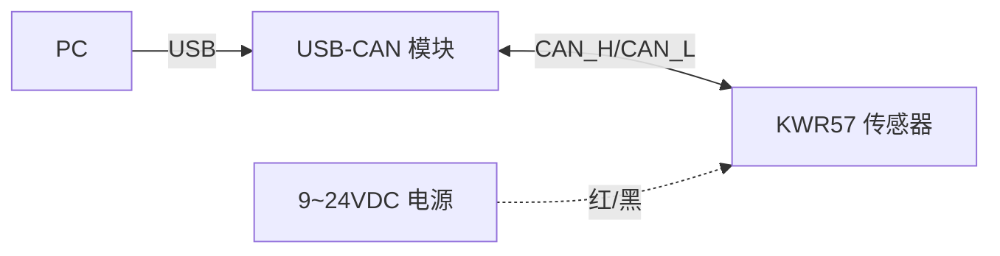

# KWR57 六轴力/力矩传感器 · CAN 通信 Python 驱动

坤维科技 **KWR57 系列**（应变式六轴力/力矩传感器，CAN 通信）的纯 Python 调用库。
通过一个 **USB 转 CAN 模块** 把 PC 与传感器相连，即可读取 `Fx/Fy/Fz/Mx/My/Mz` 六轴数据，并下发采样率、数据流、ID 修改等指令。

代码按 **协议 → 传输 → 驱动 → 应用** 四层组织，各层职责单一、可独立测试与替换。

## 1. 硬件连接
接线以实物标签为准，见手册 4.4 节。

| 序号 | 芯线颜色 | 定义 | 接到 USB-CAN 模块 |
|---|---|---|---|
| 1 | 红 | 电源 + | 外部 9~24 VDC 电源正 |
| 2 | 黑 | 电源 − | 外部电源负 / 与模块共地 |
| 3 | 绿 | CAN H | CAN_H |
| 4 | 白 | CAN L | CAN_L |
| 5 | 屏蔽 | 屏蔽 | 机壳地 / 模块 GND |

> ⚠️ **电路板无反极性保护**：上电前务必确认电源正负极正确，反接会烧毁电路（手册第 3 节）。
> 传感器供电 **9~24 VDC**（KWR57A 为 12~48 VDC），由外部电源提供，通常不由 USB-CAN 模块供电。
> CAN 总线两端需要 **120 Ω 终端电阻**；多数 USB-CAN 模块可跳线/开关启用内置终端电阻。

连接拓扑：


## 2. 通信协议（手册 4.3 节）

**CAN 比特率固定 1 Mbps，标准帧（11 位 ID）。**

### 2.1 数据输出（传感器 → 上位机）

六个通道为 **IEEE754 单精度浮点**（实测为**小端**字节序），每通道 4 字节，一个采样点分 **3 帧** 发送，用 CAN ID 区分：

| CAN ID | data[0:4] | data[4:8] |
|---|---|---|
| `0x15` | Fx | Fy |
| `0x16` | Fz | Mx |
| `0x17` | My | Mz |

### 2.2 指令（上位机 → 传感器）
默认发往 CAN ID `0x10`

| 功能 | data 字节 | 说明 |
|---|---|---|
| 开始/连续上传 | `0x8A HH LL` | `HHLL` = 上传周期(ms)，高字节在前；例 `0x8A 00 10` → 16ms |
| 停止上传 | `0x8A 00 00` | 周期为 0 即停止 |
| 设置采样率 | `0x60 NN` | `NN`：01=100 02=200 03=400 04=500 05=600 06=1000 Hz（默认 500Hz） |
| 修改 ID | `0xDE AA 主hi 主lo 从hi 从lo 0D 0A` | 主=上位机(接收)ID，从=下位机(发送)ID |
| 恢复出厂 ID | `0xDE DE DE 0D 0A` | 出厂 接收 `0x10` / 发送 `0x15`；需在 CAN ID `0x000` 下发送 |

> **单位说明**：基本规格表标注“默认数据输出单位 kg, kgm”。本库默认原样输出传感器的浮点值；如需 N / N·m 需要换算（1 kgf ≈ 9.80665 N）。


## 3. 代码结构与分层
```txt
KWR57-SDK/             纯 Python SDK（非 ROS 包）
├── kwr57_sensor/      模块文件夹
│   ├── protocol.py    协议层：常量 / 指令构造 / 数据帧解码 / 三帧组装（纯逻辑，无 I/O）
│   ├── transport.py   兼容层：复用 can_sdk.CanTransport，并提供 KWR57 默认比特率
│   ├── driver.py      驱动层：KWR57Sensor 高层 API（组合协议层 + 传输层）
│   ├── cli.py         应用层：命令行实时读取工具
│   └── __init__.py
├── examples/
│   ├── read_wrench.py  最小调用示例
│   ├── set_id.py       设置/复位设备 CAN ID（同总线挂多个设备前置步骤）
│   └── web_wrench.py   六轴 Web 可视化示例
├── setup.py / pyproject.toml   让 kwr57_sensor 可 pip 安装，并注册 kwr57-read 命令
├── requirements.txt
└── README.md
```

> **ROS2 用户**：本 SDK 是带 `COLCON_IGNORE` 的纯 Python 包，不由 colcon 构建。
> 工作区通过 `scripts/env.sh` 设置的 `PYTHONPATH` 直接导入源码，无需安装；`pip install -e .` 仅是仓库外独立使用时的可选方式。
> ROS2 封装在同一工作区的 **`kwr57_ros`** 包：
> 通用 `can_bridge_ros` 独占总线并以 `can_msgs/Frame` 收发，KWR57 设备节点订阅总线帧、过滤自己的 CAN ID 并发布 `geometry_msgs/WrenchStamped`。详见 [`../kwr57_ros/README.md`](../kwr57_ros/README.md) 与顶层 README。

- **协议层 `protocol.py`**：只做“字节 ↔ 语义”转换，不碰硬件，可脱离设备做单元测试。
  核心是 `WrenchAssembler`——把 `0x15/0x16/0x17` 三帧缓存并集齐后组装成一个 `Wrench`。
- **传输层 `transport.py`**：复用独立 [`CAN-SDK`](../CAN-SDK/README.md) 的单消费者
  `CanTransport`，本 SDK 不再重复 CANalyst-II/libusb 初始化代码。更换适配器只需改
  `interface/channel`，上层不动。
- **驱动层 `driver.py`**：`KWR57Sensor` 提供 `start_stream / stop_stream /
  set_sample_rate / read_wrench / modify_id / factory_reset_id`，并支持 `with` 自动关闭。
- **应用层 `cli.py` / `examples/`**：面向使用者的入口，演示如何调用驱动层；
  `web_wrench.py` 启动一个本地 HTTP 服务，在浏览器中显示 Fx/Fy/Fz/Mx/My/Mz
  六个条形以及合力/合力矩箭头，无需本地图形环境，适合 SSH 远程使用。

数据流：
```txt
CAN 帧 ──recv──▶ can_sdk/transport ──(id,data)──▶ WrenchAssembler ──集齐3帧──▶ Wrench ──▶ 应用
指令   ◀─send─── can_sdk/transport ◀──bytes────── protocol.build_*() ◀─────── 驱动方法
```


## 4. 安装
本库仅依赖同目录下的 `CAN-SDK`，无额外的 Python 依赖。仅在仓库外独立使用或需要命令行入口 `kwr57-read` 时安装；ROS 工作区内无需执行本节。

```sh
cd KWR57-SDK
pip install -r requirements.txt
pip install -e .
```

`requirements.txt` 会从同一仓库的 `../CAN-SDK` 安装共享 CAN 基础包及 CANalyst-II 可选依赖。安装后可在任意目录运行 `kwr57-read`。`-e` 表示以可编辑模式安装，修改源码后无需重新安装。


## 5. CAN 适配器配置

`python-can` 后端选择、CANalyst-II 的 Windows 驱动、Python 依赖、libusb、Linux udev
权限及底层错误排查已统一迁移至 [`CAN-SDK 文档`](../CAN-SDK/README.md)。

KWR57 固定使用 1 Mbps 标准帧。完成适配器配置后，在下面命令中传入相应的
`interface` 和 `channel` 即可。


## 6. 使用

### 6.1 命令行快速验证

```powershell
# CANalyst-II + Windows
kwr57-read --interface canalystii --channel 0

# CANable(slcan) + Windows COM5
kwr57-read --interface slcan --channel COM5

# 先把内部采样率设为 500Hz，再以 16ms 周期上传
kwr57-read --interface slcan --channel COM5 --rate-hz 500 --period-ms 16

# Linux SocketCAN
kwr57-read --interface socketcan --channel can0
```

也可以继续使用模块方式运行：`python -m kwr57_sensor.cli ...`

输出示例：
```
Fx=  +0.123 Fy=  -0.045 Fz=  +2.310  |  Mx=+0.0012 My=-0.0034 Mz=+0.0007  [  20.0 Hz]
```

### 6.2 可视化
`examples/web_wrench.py` 会启动一个本地 HTTP 服务，在浏览器中（默认绑定 `0.0.0.0:8765`）实时显示六个轴的数值条形图，适合 SSH 环境下查看。
```bash
# CANalyst-II
python examples/web_wrench.py --interface canalystii --channel 0
# CANable(slcan) + COM5
python examples/web_wrench.py --interface slcan --channel COM5

# 不连接硬件的预览：加 --demo
python examples/web_wrench.py --demo
```

如果条形或箭头过早顶满，可按实际量程调整显示比例：
```bash
python examples/web_wrench.py --interface canalystii --channel 0 --force-scale 50 --torque-scale 2
```

### 6.3 在代码中调用

```python
from kwr57_sensor import KWR57Sensor

# 打开总线（按你的适配器修改 interface/channel）
with KWR57Sensor.open(interface="canalystii", channel="0") as sensor:
    sensor.start_stream(period_ms=1, rate_hz=1000)  # 1ms 周期 + 1000Hz 采样，最高频率
    for _ in range(200):
        w = sensor.read_wrench(timeout=0.5)   # 集齐三帧才返回
        if w:
            print(w.fx, w.fy, w.fz, w.mx, w.my, w.mz)
    # 退出 with 时自动 stop_stream + close
```

也可复用已有的 python-can 总线，自行构造传输层：
```python
from kwr57_sensor import KWR57Sensor, CanTransport

transport = CanTransport(interface="gs_usb", channel="0")
sensor = KWR57Sensor(transport)
sensor.start_stream(period_ms=1, rate_hz=1000)
...
sensor.close()
```

### 6.4 修改 / 恢复 CAN ID（谨慎）

```python
sensor.modify_id(host_id=0x20, sensor_id=0x25)  # 会持久化，改后需同步上位机配置
sensor.factory_reset_id()                        # 恢复出厂 0x10 / 0x15
```


## 7. 常见问题排查

| 现象 | 可能原因 |
|---|---|
| `read_wrench` 一直超时返回 None | 比特率不是 1Mbps；CAN_H/CAN_L 接反；缺终端电阻；传感器未上电或未发 `start_stream` |
| 能收到帧但数值巨大/NaN | 检查是否收到完整 0x15/0x16/0x17 三帧；若原始字节异常，确认传感器型号、CAN ID 和固件配置 |
| 只收到部分轴 | 只收到 3 帧中的一部分，检查总线负载/丢帧；确认 CAN ID 为 0x15/0x16/0x17 |

适配器无法打开、底层无帧、USB 权限或后端依赖问题，请参阅
[`CAN-SDK 通用故障排查`](../CAN-SDK/README.md#通用故障排查)。
