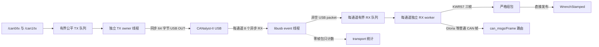

# canalystii_native_bridge
`canalystii_native_bridge` 是面向 CANalyst-II（USB VID:PID `04d8:0053`）的 ROS 2 Foxy 原生 C++ bridge。生产末端拓扑通过 `robot_bringup` 启动本包；原有 `can_bridge_ros/bridge_node` 只保留为通用 Python 调试和单设备回退入口，不能与本节点同时打开同一台适配器。

> 本包的最终目标是消除共享 CAN 链路在夹爪使能和运动时出现的长断流，并把左右两侧作为同等重要的实时数据路径。

## 为什么创建这个包
旧生产路径由 Python、PyUSB 和 python-can 共同管理一台双通道 CANalyst-II。
在双 KWR57 持续上传、双 Gloria-M 使能并接受控制后，这条路径的主动硬件实测出现了不能作为普通抖动处理的长尾：

| 实测问题 | 旧路径结果 |
|---|---:|
| 右夹爪反馈频率 | 约 10 Hz |
| 右夹爪反馈 P99 间隔 | 327 ms |
| 右夹爪最大断流 | 1.155 s |
| 双 KWR57 长尾 | 18-31 ms |

这会同时破坏三件事：力传感器最终反馈的连续性、夹爪控制与反馈的对称性，以及整机控制的故障隔离。尤其不能接受的是，一侧夹爪反馈变 stale 后，连带让只负责 Unitree 关节的整机低层输出突然停止。

把反馈超时从 `0.25 s` 调大到 `0.5 s` 或更大不能解决这个问题。它只会延后故障判定，并让系统在更长时间内继续使用 stale 状态；它不会消除 USB 所有权、Python 调度、双通道公平性和共享队列造成的长尾。因此修复必须进入适配器底层：
- 一个 C++ 进程成为 CANalyst-II 唯一 USB RX/TX 所有者；
- CAN0/CAN1 使用对称资源和公平调度，任何一侧都不能长期饿死另一侧；
- KWR57 在 C++ 内完成三帧组包并直接发布最终 `WrenchStamped`；
- Gloria-M 继续使用既有 `can_msgs/msg/Frame` ROS 契约；
- Python bridge 保留调试价值，但退出生产热路径。

## 性能目标与职责边界
共享 USB/CAN 路径使用以下两项作为生产性能验收目标：
1. 双 KWR57 最终 ROS 反馈持续稳定，左右对称，约 1 kHz，最大 gap 不超过 10 ms；不能只检查平均频率。
2. 双 Gloria-M 使能后，反馈和 100 Hz 控制持续稳定，左右频率和最大间隔处于同一量级，不再出现单侧秒级断流。

验收必须同时启用双 KWR57、双 Gloria-M 和生产 C++/ros2_control 控制路径。单侧夹爪故障后的整机行为属于 `G1TopicSystem`、`gloria_ros` 和 controller manager 共同承担的系统安全属性，应按独立安全计划验证；它不是 USB 延迟验收的通过条件，也不能替代四设备正常负载测试。

## 2026-07-23 四设备验收
最终测试在 Unitree G1 PC2 上运行 30 秒，CAN0/CAN1 各连接一台 KWR57 和一台 Gloria-M。双 KWR57 按 1 kHz 起流，双 Gloria-M 已使能，FPC active 并持续发送生产 100 Hz hold；使用默认每通道 8 个 RX transfer，`io_diagnostics:=false`，相机未启动。

| 指标 | CAN0 / 左侧 | CAN1 / 右侧 | 结论 |
|---|---:|---:|---|
| KWR57 source 最大 gap | 6.860 ms | 7.322 ms | 均不超过 10 ms |
| KWR57 ROS receive 最大 gap | 7.027 ms | 7.433 ms | 均不超过 10 ms |
| ros2_control MIT 命令平均频率 | 100.000 Hz | 100.000 Hz | 固定相位 100 Hz |
| bridge 实际 CAN TX 平均频率 | 99.999 Hz | 100.001 Hz | 100 Hz 且对称 |

这次结果通过两项生产性能目标。它只证明上述四个 CAN 设备、无相机负载下的 30 秒验收；相机并发和更长时间运行仍应按实际部署单独复测，不能由本表外推。

### 定位结论

- CANalyst-II 固件即使没有对应数量的 CAN 数据帧，也会持续返回约 `9.5k` 个 USB completion/s/通道；其中大量 64 字节包的 `packet[0] == 0`，表示合法的零 CAN 帧包。
- 旧处理会让零帧包进入 RX 队列并通知 worker，产生无效的队列锁竞争、条件变量通知和线程唤醒。当前 completion 回调仍统计这些 USB 包，但只将 `packet[0] != 0` 的包入队；协议解析器继续把 frame count 0 视为合法值。
- 把每通道 RX transfer 从 8 减到 4 的 A/B 测试更差，因此生产默认值保持 8。不要把 transfer 数量当作降低固件空包率的手段。
- 临时逐秒分层时延统计会干扰紧时延测量。同一功能配置启用诊断时曾出现 source `10.079/10.327 ms`、ROS receive `15.314/15.590 ms` 的最大 gap；关闭诊断后得到上表结果。因此生产和验收均保持 `io_diagnostics:=false`，需要排障时才短时启用基础吞吐计数。
- 不调用 `libusb_reset_device()`；本机实测 reset 可能使命令 endpoint 或固件进入不可用状态。

## 数据路径


libusb event 线程只处理 completion、重提交和关闭时取消，不执行阻塞 USB TX。每个启用通道有独立 RX worker；一个通道的组包或 ROS 回调不会占用另一个通道的处理循环。TX 在每通道内保持 FIFO，并跨通道公平调度；寄存器事务和电机安全控制帧优先。实际 USB OUT 由独立 TX owner 线程执行同步 64 字节 bulk write，因为硬件实测已证明并发异步 OUT completion 不能可靠代表 CAN 命令已经进入对应通道的发送队列。

KWR57 只有连续的 `base -> base+1 -> base+2` 才能组成一个六轴样本；乱序、缺帧或 malformed 帧会丢弃当前半包并重新同步，禁止跨采样周期拼接。启动时节点还会在短探针窗口内验证真实样本率，旧的约 16 ms 上传周期不会被误判为 1 kHz。

## ROS 接口
可执行程序为 `canalystii_native_bridge/native_bridge_node`，生产节点名保持 `/can_bridge_ros`。每条总线提供：

| 方向 | 话题 | 类型 |
|---|---|---|
| 发布 | `/<bus>/rx` | `can_msgs/msg/Frame` |
| 订阅 | `/<bus>/tx` | `can_msgs/msg/Frame` |

`rx_routes` 使用 `channel:can_id:topic` 格式，将 Gloria-M 等设备反馈路由到专属话题。未命中的普通 CAN 帧仍发布到 `/<bus>/rx`。

每台 KWR57 在同一进程内保留独立 ROS 节点及原接口：

| 接口 | 类型 | 说明 |
|---|---|---|
| 配置的 `topic` | `geometry_msgs/msg/WrenchStamped` | 最终六轴反馈 |
| `~/command` | `std_msgs/msg/String` | `start`、`stop`、`tare`/`zero`、`reset_tare`/`untare`/`clear_tare` |
| `~/start`、`~/stop` | `std_srvs/srv/Trigger` | 控制数据流 |
| `~/tare`、`~/reset_tare` | `std_srvs/srv/Trigger` | 设置或清除软件零点 |

`kwr57_device_specs` 是 KWR57 配置对象的 JSON 字符串数组，由 `robot_bringup` 从同一份设备拓扑直接生成。对象包含 `channel_id`、CAN ID、节点名、Wrench 话题、采样率、周期和起流选项；不包含 Python module、factory 或 callback。原生进程不会启动 Python 解释器。任意 Python handler 只受独立调试用 `can_bridge_ros/bridge_node` 支持。

`~/start` 和 `start` 命令只提交异步起流流程；服务返回 `success=true` 不代表采样率已经确认。最终结果以 KWR57 节点的 `stream started at requested rate` 或 `stream rate not confirmed` 日志为准。`tare` 使用下一组完整样本作为软件偏置，`reset_tare` 及其别名只清除该软件偏置。

## 节点参数

| 参数 | 默认值 | 说明 |
|---|---:|---|
| `channel_ids` | `[0]` | 启用的 CANalyst-II 物理通道，只允许 `0`、`1` 且不能重复 |
| `bus_names` | `["can0"]` | 与 `channel_ids` 一一对应的 ROS 总线名 |
| `rx_queue_depth` | `128` | 默认 RX 和专属路由 publisher 的 `KEEP_LAST` 深度 |
| `rx_routes` | `[""]` | `channel:can_id:/absolute/topic` 字符串数组；空字符串为 Foxy 类型占位符 |
| `kwr57_device_specs` | `[""]` | 内建 KWR57 配置对象的 JSON 字符串数组 |
| `io_diagnostics` | `false` | 每秒输出各通道 RX/TX packet、frame 和 RX queue drop 基础计数；生产和时延验收保持关闭 |
| `native_rx_transfers_per_channel` | `8` | 每通道并行异步 USB RX transfer 数，范围 `1..64` |
| `native_rx_queue_capacity` | `8192` | 每通道 transport RX packet 队列容量 |
| `native_tx_queue_capacity` | `2000` | 所有启用通道共享的 transport TX frame 总容量 |

`rx_queue_depth` 是 ROS publisher QoS 深度，和 transport 的 `native_rx_queue_capacity` 不是同一层队列。参数都只在节点构造时读取，运行中修改不会重建 transport、路由或 KWR57 设备。

每个 `kwr57_device_specs` 对象支持以下字段：

| 字段 | 默认值 | 说明 |
|---|---:|---|
| `channel_id` | `0` | 设备所在物理通道，必须包含在 `channel_ids` 中 |
| `node_name` | `kwr57_ft_sensor` | 进程内独立 KWR57 ROS 节点名，设备之间不能重复 |
| `cmd_id` | `0x10` | 标准 CAN 命令 ID |
| `data_base_id` | `0x15` | 三个连续数据 ID 的起点，最大 `0x7FD` |
| `topic` | `/kwr57_ft_sensor/wrench_raw` | 绝对 Wrench 话题，设备之间不能重复 |
| `frame_id` | `kwr57_ft_sensor_link` | `WrenchStamped.header.frame_id` |
| `period_ms` | `1` | 实时上传周期，范围 `0..65535` ms |
| `sample_rate_hz` | `1000` | `100/200/400/500/600/1000` Hz 之一 |
| `publish_rate` | `0.0` | `0` 表示每个完整样本都发布，否则按 steady clock 限频 |
| `use_si` | `false` | 是否按 `9.80665` 将 kgf/kgf m 换算为 N/N m |
| `autostart` | `true` | bridge 启动后是否自动配置并起流 |
| `tare_on_start` | `false` | 起流确认后是否用下一组完整样本调零 |

这些配置是 bridge 创建 KWR57 子节点时的一次性输入，不会作为每个子节点可动态修改的 ROS 参数重新声明。修改配置后必须重启 bridge；生产部署应修改 `robot_bringup` 的 `Kwr57Device` 清单，让它统一生成本数组，而不是手写 JSON。

## 与 Python 组合的兼容边界

这里的 Python 组合指 `can_bridge_ros/bridge_node` 加 `kwr57_ros`。结论是：**生产 `robot_bringup` 路径对上层 ROS 消费者基本兼容，但两个 bridge 不是参数级或调试方式上的直接替换。**

### 保持兼容的外部契约

| 能力 | 兼容情况 |
|---|---|
| `/<bus>/rx`、`/<bus>/tx` | 话题名、`can_msgs/msg/Frame` 类型及 RX BEST_EFFORT/TX RELIABLE QoS 保持一致 |
| `rx_routes` | 格式、同一 key 向多个话题扇出、命中后改发而非镜像的语义保持一致 |
| KWR57 Wrench | 话题类型、BEST_EFFORT `KEEP_LAST(32)`、字段顺序、原始值和 SI 换算保持一致 |
| KWR57 命令和服务 | 节点名、私有话题、四个 Trigger 服务及软件调零语义保持一致 |
| Gloria-M 接入 | 仍通过专属 RX `can_msgs/Frame` 和共享 `/<bus>/tx` 接入，不把 Gloria 协议复制进 bridge |

因此 Dashboard、controller 和 Web 端只要继续使用生产拓扑生成的原话题与服务，通常无需因 bridge 从 Python 换成 C++ 而修改。KWR57 的三个数据 ID 一旦注册到 `kwr57_device_specs`，会优先在进程内消费，不再发布到默认 RX 或同 ID 的 `rx_routes`；不要为生产 KWR57 同时配置两种路径。

`rx_routes` 只匹配标准、非 RTR 的普通接收帧，CAN ID 范围为 `0x000..0x7FF`。扩展帧和 RTR 帧只进入对应默认 `/<bus>/rx`。路由参数与 Python bridge 一样只在启动时解析，不能在线热更新。

### 参数不能直接照搬

| Python bridge 参数 | 原生 C++ 对应方式 |
|---|---|
| `interface` | 无对应参数；固定使用 VID:PID `04d8:0053` 的 CANalyst-II |
| `channel` | 无对应字符串；直接配置 `channel_ids`，仅支持物理通道 `0`、`1` |
| `bitrate` | 无对应参数；固件初始化固定为 `1 Mbps` |
| `receive_own_messages` | 不支持配置发送回显 |
| `channel_ids`、`bus_names`、`rx_queue_depth`、`rx_routes` | 名称和主要语义保持一致 |
| `frame_handler_specs` | 只有 KWR57 可改用 `kwr57_device_specs`；这不是通用 handler 的等价替代 |
| `rx_processing_queue_depth` | 改为每通道 `native_rx_queue_capacity`，且过载策略不同 |
| `rx_processing_batch_size`、`tx_batch_size` | 无一一对应参数；原生 transport 使用固定 USB packet 布局和公平调度 |

原生 transport 通过 `libusb_open_device_with_vid_pid()` 打开第一台匹配设备，目前没有序列号、USB 路径或设备索引参数。因此它适合当前“一台双通道 CANalyst-II”的生产拓扑；需要其他 python-can 后端、其他波特率、更多通道或从多台相同适配器中选定一台时，继续使用 Python 调试链，或先扩展原生 transport。

### 原生版没有包含的 Python 能力

1. `frame_handler_specs` 的启动时 `module:function` 工厂、任意 Python callback、`FORWARD`/`CONSUME` 返回值和辅助 ROS 节点生命周期。它不是运行期热插拔；Python bridge 和本包的路由/设备清单都需要重启才能改变。
2. `kwr57_ros/ft_sensor_node` 的独立 ROS Frame 模式。原生包只内建进程内 KWR57，不提供单独订阅 `rx_topic`、发布 `tx_topic` 的 KWR57 可执行程序。
3. Python handler 连续异常三次后的设备级熔断：旧 bridge 会禁用故障 handler，并让后续匹配帧恢复普通 ROS 路由。原生版没有通用 handler，也没有这条按设备降级路径。
4. python-can/CAN-SDK 提供的后端选择、可调波特率和 `receive_own_messages` 选项。
5. Python bridge 对 `python-can` error frame 的 `Frame.is_error` 映射。原生 CANalyst-II RX 协议当前不暴露 error-frame 标志，发布的 `Frame.is_error` 固定为 `false`，TX 也拒绝 `is_error=true` 的消息。

### 故障与过载语义不同

- 命中 KWR57 数据 ID 的标准数据帧如果 DLC 错误或三帧乱序，不会关闭 bridge；组包器丢弃当前半包、重新同步，并在退出统计中报告 `malformed` 和 `dropped_sequences`。相同 ID 的扩展帧和 RTR 帧不会进入 KWR57 组包器，而是发布到对应默认 `/<bus>/rx`。
- native RX packet 长度/布局错误、USB transfer 失败、RX transport 队列溢出或内部 frame callback 抛出异常属于 transport fatal；节点记录 `FATAL` 后关闭整个 ROS context。这里没有 Python handler 的“三次失败后只禁用该设备”降级。
- Python `LatestFrameBuffer` 过载时丢弃最旧帧并继续运行；native RX transport 队列溢出会记录 drop 后立即进入 fatal 停止，避免在未知丢帧状态下继续生产控制。
- native TX 队列满时只拒绝并记录当前发送帧，不会因为单次 TX 入队失败自动关闭进程。调用方必须把相关错误视为命令未送达。

### 原生版增加的生产能力

- CAN0/CAN1 对称异步 RX 资源、跨通道公平 TX 调度，以及寄存器事务和电机安全帧优先级；
- KWR57 起流时按请求频率执行短探针，而不是只看到少量帧就确认成功；
- 可选的 `io_diagnostics` 周期 transport 基础计数，以及退出时 transport 和每台 KWR57 的最终统计；
- 生产热路径不依赖 Python 解释器、python-can、CAN-SDK 或 KWR57 Python SDK。

### 仍可复用的调试工具

`kwr57_ros` 不需要从工作区移除：

- `ros2 run kwr57_ros wrench_echo` 和 `ros2 run kwr57_ros web_wrench` 只订阅已有 `WrenchStamped`，可以直接观察本包输出，不会争用 USB；
- `ros2 run kwr57_ros read_kwr57 ...` 会直接打开适配器，只能在停止本包后使用；
- `kwr57_ros/ft_sensor_debug.launch.py` 和 `can_bridge_ros/can_bridge_ros.launch.py` 会启动另一个 USB 所有者，不能与本包同时运行；
- 如需诊断独立 ROS Frame 路径，必须从 `kwr57_device_specs` 移除目标 KWR57，为其三个数据 ID 配置 `rx_routes`，再启动 `kwr57_ros/ft_sensor.launch.py` 连接这些 RX/TX 话题。该路径仅用于兼容和诊断，不满足当前 1 kHz 生产性能目标。

## 构建与测试
```bash
sudo apt-get install -y libusb-1.0-0-dev libyaml-cpp-dev ros-foxy-can-msgs

cd ~/Unitree_G1_Workspace
source /opt/ros/foxy/setup.bash
colcon build --symlink-install --packages-select canalystii_native_bridge
source install/setup.bash
colcon test --packages-select canalystii_native_bridge --event-handlers console_direct+
colcon test-result --verbose --test-result-base build/canalystii_native_bridge
```

当前纯软件测试结果为 `21 tests, 0 failures`，覆盖协议布局、合法零帧 USB 包、KWR57 严格组包与重同步、左右状态独立、公平 TX 队列、配置冲突和 RX route。软件测试不会打开 USB，也不能替代主动硬件验收。

## 启动与安全约束
推荐始终从夹爪失能状态启动生产双总线拓扑：
```bash
source scripts/env.sh
ros2 launch robot_bringup end_effectors_dual_bus.launch.py \
  enable_grippers_on_start:=false
```

确认双 KWR57、双夹爪反馈和服务全部在线后，再显式使能夹爪。不要同时运行 Python `can_bridge_ros/bridge_node`、任何 `*_debug.launch.py` 或第二个生产入口；一台 CANalyst-II 在任意时刻只能有一个 USB 所有者。

硬件性能验收至少包含：
1. 保持默认 `native_rx_transfers_per_channel:=8`、`io_diagnostics:=false`，同时启动双 KWR57、双 Gloria-M 和生产 C++/ros2_control 控制；
2. 连续测量左右最终 `WrenchStamped` 的 source 与 ROS receive 最大 gap，并同时检查 MIT 命令和实际 CAN TX 频率；
3. 需要验证运动链时执行双夹爪实际往返，确认位置确实跨端点并完成多次换向，而不是只统计命令数量。

单侧故障注入属于独立安全验收，不再作为上述正常负载性能测试的前置条件。

任何阶段都不得用平均频率代替最大断流检查。夹爪正常测试还应要求左右结果对称、无超过 50 ms 的反馈长尾，并绝不能触发 `0.5 s` feedback timeout。

关闭时先停止夹爪控制并显式失能双夹爪，再停止生产 launch。本包会停止 KWR57、清空 TX、回收异步 RX 并释放 libusb 接口，不调用 `libusb_reset_device()`。关闭后应确认：
```bash
lsusb -d 04d8:0053
journalctl -k --since "1 minute ago" | grep -Ei \
  'error -110|error -71|unable to enumerate|reset .*USB|04d8|0053|canalyst'
```

## 源码结构
```text
include/canalystii_native_bridge/
  protocol.hpp             CANalyst-II 布局与 KWR57 组包
  transport.hpp            libusb transport 与公平 TX 队列
  config.hpp               路由和 KWR57 配置
  native_bridge_node.hpp   通用 ROS CAN bridge
  kwr57_device_node.hpp    KWR57 rclcpp 设备节点
src/                       对应实现与 main.cpp
test/                      protocol、transport、config 测试
```
