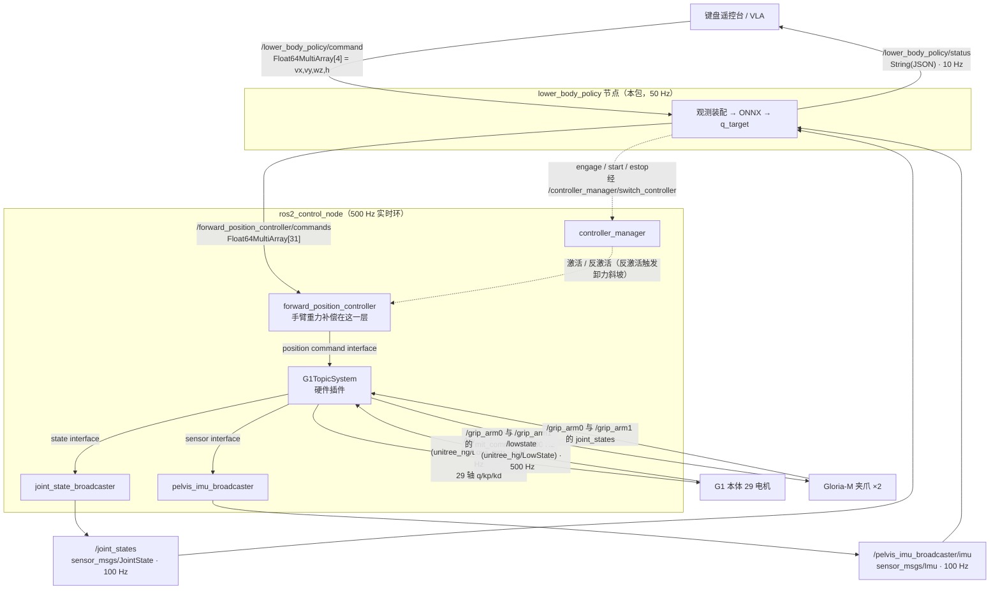

# g1_lower_body_policy —— 下肢 ONNX 策略层（真机部署交接文档）

在 `forward_position_controller`（下称 FPC）之上加的一层。
输入四个高层指令 `vx / vy / w / h`，输出 31 轴位置目标；其中下肢 15 轴由 ONNX 策略给出，上肢 14 轴和 2 个夹爪偏心轴写固定目标（默认 0）。策略的职责是**在上肢被别人（VLA）随意摆布时保持平衡并跟随速度与盆骨高度指令**。



### 输入：每一维观测从哪来

| 观测项 | 维 | 话题 | 类型 | 频率 | 发布者 | 再上游 |
|---|---|---|---|---|---|---|
| `base_ang_vel` | 3 | `/pelvis_imu_broadcaster/imu` → `angular_velocity` | `sensor_msgs/Imu` | 100 Hz | `pelvis_imu_broadcaster` | `G1TopicSystem` 从 `/lowstate.imu_state.gyroscope` 原样透传（盆骨系） |
| `projected_gravity` | 3 | 同上 → `orientation` | `sensor_msgs/Imu` | 100 Hz | `pelvis_imu_broadcaster` | `/lowstate.imu_state.quaternion`，`G1TopicSystem` 把 Unitree 的 `(w,x,y,z)` 转成 ROS 的 `(x,y,z,w)`；本节点再算 `R(q)ᵀ·[0,0,−1]` |
| `command_twist` | 3 | `/lower_body_policy/command` `[0:3]` | `std_msgs/Float64MultiArray` | 任意（建议 ≥10 Hz） | 键盘遥控台或 VLA | 超过 `command_timeout_s`(0.5 s) 无更新则速度归零 |
| `command_height` | 1 | `/lower_body_policy/command` `[3]` | 同上 | 同上 | 同上 | 节点内按 `height_rate_limit`(0.15 m/s) 限速后才进观测 |
| `phase` | 2 | 无（节点内计时） | — | 50 Hz | 本节点 | `进入 RUNNING 后的拍数 × 0.02 s`，周期 0.6 s；`‖[vx,vy,wz]‖<0.1` 时置零 |
| `joint_pos` | 15 | `/joint_states` → `position` | `sensor_msgs/JointState` | 100 Hz | `joint_state_broadcaster` | `G1TopicSystem::read()` ← `/lowstate.motor_state[i].q`（500 Hz）；本节点按名字取 15 个下肢关节再减默认位姿 |
| `joint_vel` | 15 | `/joint_states` → `velocity` | 同上 | 100 Hz | 同上 | `/lowstate.motor_state[i].dq` |
| `actions` | 15 | 无（节点内部） | — | 50 Hz | 本节点 | 上一拍策略的**原始**（未裁剪）输出 |

注意 `/joint_states` 里是**全部 31 轴**（29 本体 + 2 夹爪偏心轴），节点按 `policy_joints`
的名字取其中 15 个；名字对不上就等下一帧，不会拿错位的数据去推理。

### 输出：策略结果送到哪

| 内容 | 话题 / 服务 | 类型 | 频率 | 消费者 |
|---|---|---|---|---|
| 31 轴位置目标 | `/forward_position_controller/commands` | `std_msgs/Float64MultiArray[31]` | 50 Hz | FPC。下肢 15 槽来自策略，其余 16 槽恒等于 `passive_targets` |
| 层状态 | `/lower_body_policy/status` | `std_msgs/String`（JSON） | 10 Hz | 遥控台；要接 dashboard 也从这里取 |
| 使能 / 启动 / 急停 | `/lower_body_policy/engage`、`/start`、`/estop` | `std_srvs/Trigger` | 按需 | 遥控台或人工 `ros2 service call` |
| 控制器开关 | `/controller_manager/switch_controller` | `controller_manager_msgs/SwitchController` | 按需 | 本节点**调用**它，用来激活 / 反激活 FPC |

再往下游（不归本包管，列出来是为了知道链路终点）：FPC 把 31 个位置写进 command
interface，`G1TopicSystem::write()` 补上 `default_29dof_param.yaml` 的 kp/kd，
生成 `/lowcmd`（`unitree_hg/LowCmd`，500 Hz，前 29 轴）和左右
`/grip_arm0/mit_command` 与 `/grip_arm1/mit_command`（100 Hz，第 30/31 轴）。

---

## 启动顺序
```bash
# 1.控制栈（会把 FPC 加载成 inactive，本层在 engage 时才激活它）
ros2 launch robot_bringup all_data.launch.py scope:=whole_body topology:=dual

# 2.策略层
ros2 launch g1_lower_body_policy lower_body_policy.launch.py
#   换策略试跑：  policy_path:=/abs/path/to/policy.onnx

# 3.遥控台（需要真终端，不要用 launch 包）
ros2 run g1_lower_body_policy teleop_keyboard
```

### 遥控台按键

| 键 | 作用 |
|---|---|
| `G` | **站立**：激活 FPC，3s 内从当前实测位姿插值到策略默认位姿 |
| `Enter` | **启动策略**：站立插值走完后按，策略正式接管 |
| `空格` | **急停**：反激活 FPC → kp 斜坡降到 0（阻尼模式）→ 最后一帧 kd 归零（零力矩模式） |
| `W`/`S` | 前进 / 后退 `vx` |
| `A`/`D` | 左移 / 右移 `vy` |
| `J`/`L` | 左转 / 右转 `wz` |
| `I`/`K` | 升高 / 蹲低 `h` |
| `X` | 速度指令清零（高度保持） |
| `Q` | 退出（退出前自动急停） |

速度是"按住才走"：终端读不到抬键事件，所以超过 `hold_timeout_s`(0.4 s) 没有按键就
在 `decay_s`(0.5 s) 内衰减到零。按住 `W` 时终端自动重复会持续刷新，手感和游戏一致。
高度不衰减——它是绝对量，调到哪停在哪。

---

## 3. 状态机

照搬 `deploy/robots/g1` 官方 FSM 的 `Passive → FixStand → RLBase` 三段式，这是实机上
唯一被验证过的接管顺序。**策略绝不能从任意位姿冷启动**：训练里它只见过默认位姿附近
的开局。

```
IDLE ──~/engage──► STAND ──~/start──► RUNNING
  ▲                  │                   │
  └────────── ~/estop ┴───────────────────┘
```

| 状态 | 行为 |
|---|---|
| `IDLE` | 不发目标。FPC 处于 inactive |
| `STAND` | 激活 FPC，`stand_s`(3 s) 内 31 轴线性插值到「策略默认位姿 + `passive_targets`」，插完停在那儿等确认。对应官方 `State_FixStand` 的 `ts:[0,2]` + `qs` |
| `RUNNING` | 策略接管。进入时清零 `last_action` 与步态相位，等价于官方 `env->reset()` |
| `ESTOP` | 停止发目标 + 反激活 FPC。`G1TopicSystem::release_body()` 负责卸力斜坡：kp 在 `release_ramp_s` 内降到 0（kd 保留＝阻尼模式），最后一帧 kd 也归零（＝零力矩模式） |

分成两步（`engage` 再 `start`）而不是一步，是为了防终端按键自动重复：按住 `G` 会连发
十几次请求，一步式会直接把策略拉起来。

### 自动急停条件

| 触发 | 阈值 | 说明 |
|---|---|---|
| `/joint_states` 或 IMU 超时 | `state_timeout_s` 0.1 s | 广播是 100 Hz |
| 姿态倾覆 | `tilt_limit_rad` 1.0 rad | 与官方 `mdp::bad_orientation` 默认阈值一致（官方那份被注释掉了，这里是打开的） |
| 推理抛异常 / 输出非有限值 | — | 观测里出 NaN 也在这里被拦 |

指令超时（`command_timeout_s` 0.5 s）只把速度归零、保持高度，**不急停**——遥控手松手
不该让机器人卸力。

---

## 4. 观测与动作契约

这一节是整个部署里最要命的部分：错一位就是错一个策略。层内的 `policy_runtime.py` 把关节顺序、默认位姿、动作缩放**全部从 ONNX 的 metadata 里读**，不在代码里抄第二份；启动时再和 `config/lower_body_policy.yaml` 的 `policy_joints` 逐个比对，对不上直接拒绝启动。

### 观测（57 维，顺序即拼接顺序）

| # | 项 | 维 | 实机来源 | 训练侧对应 |
|---|---|---|---|---|
| 0 | `base_ang_vel` | 3 | `/pelvis_imu_broadcaster/imu.angular_velocity` | `robot/imu_ang_vel`（gyro@`imu_in_pelvis`） |
| 1 | `projected_gravity` | 3 | 同上的 `orientation`，`R(q)ᵀ·[0,0,-1]` | `projected_gravity_b` |
| 2 | `command_twist` | 3 | `[vx, vy, wz]` | `generated_commands("twist")` |
| 3 | `command_height` | 1 | `[h]` | `generated_commands("height")` |
| 4 | `phase` | 2 | `[sin, cos]`，`period=0.6 s`；`‖[vx,vy,wz]‖<0.1` 时置零 | `mdp.phase` |
| 5 | `joint_pos` | 15 | `q_meas - q_default` | `joint_pos_rel` |
| 6 | `joint_vel` | 15 | `dq_meas` | `joint_vel_rel` |
| 7 | `actions` | 15 | 上一拍策略**原始**（未裁剪）输出 | `last_action` |

归一化已经在导出时折进 ONNX 图里（`Sub`/`Div`），**不要**在外面再减均值。

`G1TopicSystem` 已经把 Unitree 的四元数 `(w,x,y,z)` 转成 ROS 的 `(x,y,z,w)`，陀螺仪
原样透传，所以这一层拿到的和 `deploy/include/unitree_articulation.h` 里官方用的是同
一份数。

### 动作（15 维）

```
q_target = default_joint_pos + action_scale * action
q_target = clip(q_target, target_lower_limits, target_upper_limits)   # 见下，不是关节行程
```

**目标位置故意不按关节行程裁剪。** 底层是 PD：`tau = kp*(q_target - q) - kd*dq`，关节靠到
行程边上还想要力，就只能把目标顶到行程之外。mjlab 建 `<position>` 执行器时显式设了
`ctrllimited=False` + `inheritrange=0`，源码注释原文：

> *clamping ctrl to the joint range would produce zero force when the joint is at its limit*

官方 `deploy/robots/g1` 的 `deploy.yaml` 里 `JointPositionAction.clip` 同样是 `null`。

用 CPU MuJoCo 把这个策略闭环重跑一遍，目标位置**超出硬 `jnt_range`** 的比例：

| 场景 | 越 0.9 软限位 | 越硬 `jnt_range` | 越 `ctrlrange` |
|---|---|---|---|
| 站立 h=0.74 | 8.0% | 2.0% | **0%** |
| 前进 0.5 m/s | 17.8% | 9.8% | **0%** |
| 前进 1.0 m/s | 24.0% | 18.6% | **0%** |
| 蹲行 0.3 m/s h=0.62 | 18.0% | 10.2% | **0%** |
| 原地转 1.0 rad/s | 6.2% | 1.8% | **0%** |

越界最多的正是 `waist_roll`、`ankle_roll`、`ankle_pitch`——撑平衡最吃力的那几个。
`waist_roll` 的目标能到 −0.763 rad，而行程只有 ±0.520。**按行程裁剪等于把这几个关节
在最需要出力的时刻掐掉。**

所以实际裁的是 MuJoCo 自己算的 informational `ctrlrange`，即
`jnt_range ± effort_limit / stiffness`：越过它力矩已经饱和，再大的目标也换不来额外的力，
裁在这儿物理上是空操作（上表越界率 0%），纯粹用来拦真正跑飞的输出。

关节顺序正好是真机电机索引 0..14：

```
 0..5   left  hip_pitch / hip_roll / hip_yaw / knee / ankle_pitch / ankle_roll
 6..11  right 同上
12..14  waist_yaw / waist_roll / waist_pitch
```

`action_scale = 0.25 × effort_limit / stiffness`：

| 关节 | scale | 关节 | scale |
|---|---|---|---|
| hip_pitch / hip_yaw / waist_yaw | 0.548 | hip_roll / knee | 0.351 |
| ankle_pitch / ankle_roll / waist_roll / waist_pitch | 0.439 | | |

### PD 增益

训练用的 kp/kd 就是 `unitree_g1_ros2_control/config/default_29dof_param.yaml`
（ONNX metadata 里的 `joint_stiffness/joint_damping` 与之逐项相同：腿 40.2/99.1/28.5，
腰 40.2/28.5/28.5）。硬件侧由 `G1TopicSystem` 从同一个文件加载，**两边天然一致，
不需要额外配置**。

### 频率

训练是 sim dt 0.005 × decimation 4 = **50 Hz**，实机必须一致——这个频率同时决定步态
相位的推进速度。FPC 和硬件仍在 500 Hz 上跑，两拍之间的保持由 FPC 负责。单拍推理实测
**0.084 ms**，占 20 ms 预算的 0.4%。

---

## 5. 参数速查（`config/lower_body_policy.yaml`）

| 参数 | 默认 | 说明 |
|---|---|---|
| `policy_path` | `package://g1_lower_body_policy/config/policy.onnx` | 换策略只要覆盖这个文件 |
| `policy_joints` | 15 个下肢关节 | 必须与 ONNX metadata 的前 15 项完全一致 |
| `passive_targets` | 16 × 0.0 | 14 臂 + 2 夹爪偏心轴，见下方风险提示 |
| `target_lower/upper_limits` | MuJoCo `ctrlrange` | **不是关节行程**，见第 4 节；物理上是空操作，只拦跑飞 |
| `command_limits` | `vx[-0.3,0.5] vy[-0.3,0.3] wz[-0.5,0.5] h[0.62,0.76]` | **首次上机的保守子集**，训练分布见下 |
| `height_rate_limit` | 0.15 m/s | 不是"可选的平滑"，见下方 |
| `linear/angular_accel_limit` | 1.5 / 3.0 | 纯安全项，训练里速度指令是允许阶跃的 |
| `initial_height` | 0.74 | 进入 `RUNNING` 时的高度指令 |
| `stand_s` | 3.0 | 官方 `FixStand` 是 2 s，这里多 1 s 是因为还要把手臂收到 `passive_targets` |
| `control_rate_hz` | 50.0 | **不要改**，会改变步态相位速度 |
| `tilt_limit_rad` | 1.0 | 同官方 `bad_orientation` |

`joints`（FPC 的 31 轴顺序）由 launch 从
`unitree_g1_ros2_control/config/forward_position_controller.yaml` 读进来后注入，本包
不抄第二份——两份不同步就是左右腿指令互换级别的事故。

### 训练分布（调稳之后可以逐档放开到这里）

| 量 | play 模式训练分布 | 当前实机默认 |
|---|---|---|
| `vx` | [-0.5, 1.0] | [-0.3, 0.5] |
| `vy` | [-0.5, 0.5] | [-0.3, 0.3] |
| `wz` | [-0.5, 0.5] | [-0.5, 0.5] |
| `h` | [0.55, 0.76] | [0.62, 0.76] |

### 为什么高度必须限速

训练里高度指令由 `BaseHeightCommandCfg.max_rate = 0.15 m/s` 缓变，**策略从没见过高度
阶跃**。遥控每按一下 `↑` 是 1 cm 的阶跃，不限速就是分布外输入。速度指令则相反：训练
里每 3~8 s 重采样一次是真阶跃，所以那两档限速纯粹是安全冗余，可以放宽。

---

## 6. 首次上机检查清单

### 6.1 上机之前（不需要机器人）

```bash
# ① 训练仓库里：CPU 闭环重跑整条部署链路（观测装配 → ONNX → 目标位置 → MuJoCo）
#    换了策略一定要先跑这个。不占 GPU，训练在跑也能用。
#    --arms limp（默认）不给手臂加力矩、自然下垂；--arms hold 才是复现 passive_targets。
#    --video 需要 MUJOCO_GL=egl。
cd ~/unitree_rl_mjlab
python scripts/check_deploy_policy.py Unitree_G1_Workspace/src/g1_lower_body_policy/config/policy.onnx
MUJOCO_GL=egl python scripts/check_deploy_policy.py --video /tmp/check.mp4

# ② ROS 工作区里：假状态源 + 假 controller_manager，把状态机从头走一遍
#    （engage → stand → start → 急停 → 看门狗），24 项检查
python3 src/g1_lower_body_policy/test/smoke_no_robot.py

# ③ 纯逻辑单测
cd src/g1_lower_body_policy && PYTHONPATH=$PWD python3 -m pytest test/test_policy_runtime.py -q
```

### 6.2 上机（吊架上做，按顺序）

1. **不接策略层**，先确认控制栈本身正常：`ros2 topic hz /joint_states` 应该 ~100 Hz，
   `/pelvis_imu_broadcaster/imu` 同理。
2. 起策略层，看日志里 `策略已加载: policy.onnx obs=57 act=15 @ 50 Hz`。
   对不上会直接抛异常退出，不会带病启动。
3. `ros2 topic echo /lower_body_policy/status` 确认 `state: idle`。
4. 按 `G` → 观察机器人**缓慢**走到默认位姿（腿微屈：hip_pitch −0.1、knee +0.3、
   ankle_pitch −0.2；手臂垂下）。**这一段完全不涉及神经网络**，如果这一步就抖，
   问题在控制栈不在策略。
5. **确认 Gloria-M 夹爪没有蹭到大腿**（见下方风险提示）。
6. 按 `空格`，确认卸力：kp 斜坡降到 0 后手能推动关节。这一步要在放策略之前先验一遍，
   急停必须是可靠的。
7. 再 `G` → `Enter`，零指令下站着。观察是否有高频抖动。
8. 小幅 `W` 试走，随时准备按空格。

---

## 7. 已知风险与取舍

### 手臂目标写 0 与自碰撞

需求是"手臂的目标位置设置为 0"，`passive_targets` 因此默认全 0。但训练时手臂是被随机
摆在 `elbow ∈ [0.3, 1.6]`、`shoulder_roll ∈ ±[0.25, 1.20]` 的——这个下界是量出来的，
目的就是**避开细长的 Gloria-M 夹爪撞大腿**（`elbow` 下界 0.0 时随机位姿自碰撞率 11%，
0.3 时降到 7.5%）。`elbow=0` 且 `shoulder_roll=0` 落在那个区间之外。

第 5 步务必目视确认。CPU 闭环重跑里手臂写 0 并**没有**让下肢站不住（0.5/1.0 m/s 前进、
蹲行三个场景都没摔，速度还比“训练分布中值”的手臂位姿略高一点），所以主要风险是几何
干涉而不是平衡。要更保险就把 `passive_targets` 换成：

```yaml
passive_targets: [0.0, 0.25, 0.0, 0.5, 0.0, 0.0, 0.0,
                  0.0, -0.25, 0.0, 0.5, 0.0, 0.0, 0.0,
                  0.0, 0.0]
```

顺序是 `joints` 里除去 15 个策略关节后剩下的顺序，即
左臂 7 轴 → 右臂 7 轴 → 左右夹爪偏心轴。


### 策略当前水平

训练还在跑（写这份文档时第 5500/8800 轮）。训练脚本每 100 轮存档时会重新导出
`policy.onnx`，直接覆盖 `config/policy.onnx` 就能换新策略。

**包里装的不是最新的那个，是 `logs/rsl_rl/g1_gloria_lower_body/2026-07-30_07-09-08/`
（约第 2800 轮）**，因为最新的那个前进速度跟随已经塌掉了。用
`scripts/check_deploy_policy.py` 在 CPU 上闭环重跑（手臂不加力矩、自然下垂），
同样的 8 个场景：

| 场景 | iter≈2800（**包里这个**） | iter≈5500（最新） |
|---|---|---|
| 前进 0.5 m/s | **+0.35** m/s（70%） | −0.00 m/s（0%） |
| 前进 1.0 m/s | **+0.67** m/s（67%） | −0.05 m/s（0%） |
| 后退 0.3 m/s | −0.29 m/s（97%） | −0.25 m/s（83%） |
| 侧移 0.3 m/s | +0.10 m/s（33%） | +0.10 m/s（33%） |
| 蹲行 0.3 m/s h=0.62 | **+0.18** m/s（60%） | +0.03 m/s（10%） |
| 原地转 1.0 rad/s | +0.12 rad/s（12%） | +0.20 rad/s（20%） |
| 站立漂移 | −0.02 m/s | −0.00 m/s |
| 高度跟随误差 | 0.007~0.035 m | 0.005~0.024 m |
| 摆动占比（每只脚） | 23~36% | 33~37% |
| 摔倒 | 0/8 | 0/8 |

两个都有正常的交替步态（摆动占比 25~35% 是健康的步态占空比），高度跟随、站立、
抗摔都没问题；差别全在**前进速度**：新的那个在原地踏步。训练日志里
`track_linear_velocity` 从第 2950 轮的 0.81 一路掉到第 5650 轮的 0.27，和这里对得上——
上肢扰动课程在 2600/3700 轮拉到满档（手臂力矩 5 N·m、外力 30 N）之后，策略拿前进速度
换了抗扰动，越来越保守。

**已知不足**（两个版本都有）：

* 横移和转向的跟随增益都很低（30% 和 15%），实机上会表现为"横着挪不动、转得慢"。
* 策略**没有航向反馈**。`wz=0` 的含义是"不要主动转"，不是"保持航向"；实测 12 s 直行
  会侧偏 2.6 m。航向环得由操作员或 VLA 在外面闭。

视频在 `logs/deploy_check/`（训练仓库里）：`iter2800.mp4` / `latest.mp4` 是 8 个场景
的跟拍，`forward_compare.mp4` 是固定机位的前进对比（上=2800，下=最新）。

### 没做的事

* 没有做 `/cmd_vel`(Twist) 接口。VLA 侧接进来时直接发
  `/lower_body_policy/command`（`Float64MultiArray`，`[vx, vy, wz, h]`）即可，节点内部
  的限幅、限速、超时保护对任何指令源都一视同仁。
* 只在平地策略上验证过。粗糙地形的变体训练侧还没做。

---

## 8. 故障排查

| 现象 | 原因 |
|---|---|
| 启动即抛 `ONNX 的关节顺序和配置不一致` | 换了策略但 `policy_joints` 没跟着改。**不要绕过这个检查**，它拦的正是左右腿互换 |
| 启动即抛 `观测项不匹配` | 这个 ONNX 不是下肢任务导出的（metadata 里 `observation_names` 对不上） |
| `~/engage` 返回 `/joint_states 超时` | 控制栈没起，或 `scope:=whole_body` 忘了写 |
| `~/engage` 返回 `switch_controller 拒绝激活` | FPC 被别的东西占着（IKT Pose Commander / JTC / dashboard），先把它们停掉 |
| `~/start` 返回 `站立插值还没走完` | 等满 `stand_s` 再按 `Enter` |
| 跑着跑着莫名急停、原因是 `/joint_states 超时` | Jetson 上负载高时广播确实会抖。把 `state_timeout_s` 从 0.1 提到 0.2——仍然小于硬件自己的 `state_timeout_s`(0.25 s)，不会削弱保护 |
| 急停后机器人还硬着 | 看日志有没有 `卸力失败`。有的话立刻用手柄断电——这条路径失效说明 controller_manager 没响应 |
| 站立位姿正常但一放策略就抖 | 先确认 `/joint_states` 的 `velocity` 字段非空（观测第 6 项全 0 会让策略瞎跑）：`ros2 topic echo /joint_states --field velocity --once` |

---

## 9. 文件导航

```
g1_lower_body_policy/
├── config/
│   ├── lower_body_policy.yaml   # 节点参数，每一项都有注释
│   └── policy.onnx              # 策略权重（自带元数据：关节顺序/默认位姿/动作缩放）
├── g1_lower_body_policy/
│   ├── policy_runtime.py        # 观测装配 + 推理 + 契约校验，不依赖 ROS
│   ├── policy_node.py           # ROS 节点 + 状态机 + 看门狗
│   └── teleop_keyboard.py       # 键盘遥控台
├── launch/lower_body_policy.launch.py
└── test/
    ├── test_policy_runtime.py   # 13 个纯逻辑用例，pytest
    └── smoke_no_robot.py        # 无真机联调，24 项检查，直接 python3 跑
```
