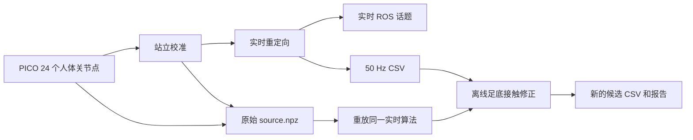
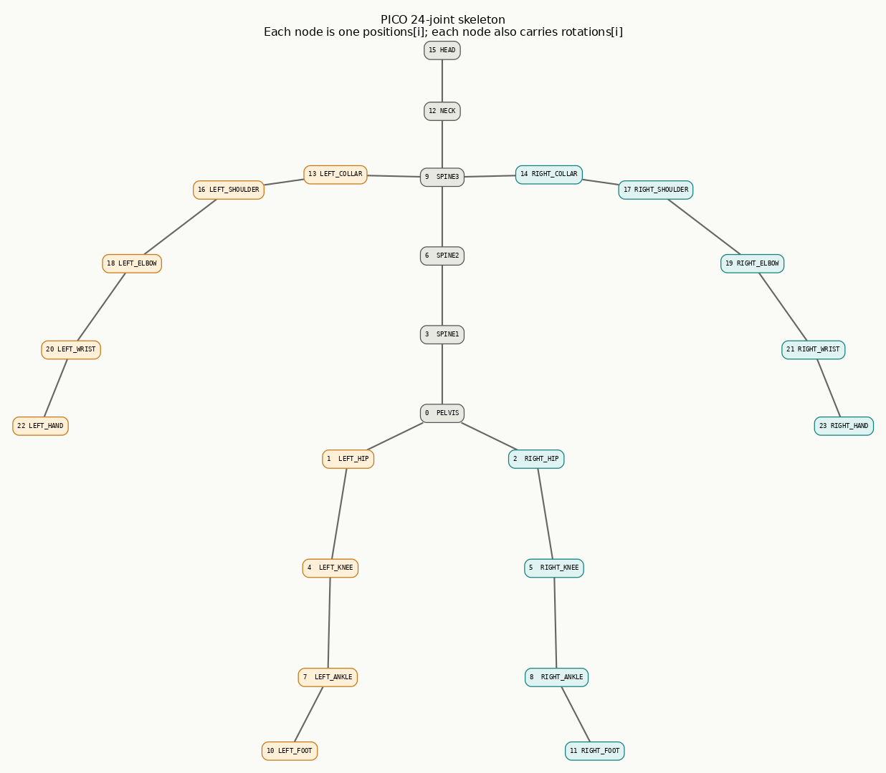
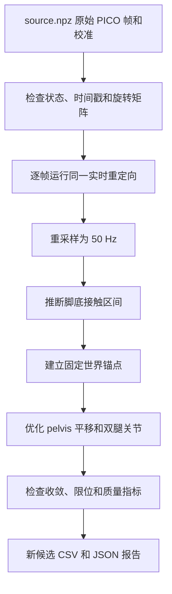

# 实时重定向与离线后处理

本文解释 PICO 动捕数据如何变成 G1 动作，以及录制结束后为什么还要做足底接触修正。
不要求读者了解机器人运动学；第一次阅读时，只看“整体流程”“实时重定向”和“离线后处理”三节即可。

## 先说结论

系统包含两个职责不同的阶段：

1. **实时重定向**回答“人的身体现在是什么姿势，G1 应该摆成什么姿势”。它逐帧运行，强调低延迟和动作贴合。
2. **离线后处理**回答“这段已经录完的动作里，哪些时候脚应该踩住地面，怎样减少滑脚和穿地”。它能看到完整片段，但不能用于实时控制。

两者不能互相替代。实时重定向即使准确，也不保证机器人的脚在世界坐标中静止；离线后处理即使把脚锁得很好，也不代表动作仍然贴合真人，更不代表机器人一定能保持平衡。



## 系统拿到的输入

### PICO 每一帧提供什么

PICO 每一帧给出同一副 24 关节人体骨架的两种数据：

| 数据 | 网络报文 shape | 进入重定向器后的 shape | 含义 |
| --- | --- | --- | --- |
| `positions` | `(24, 3)` | `(24, 3)` | 每个关节原点在世界坐标中的 XYZ 位置，单位米 |
| `rotations` | `(24, 4)` | `(24, 3, 3)` | 每个关节局部坐标系相对世界坐标系的朝向；网络中是 `xyzw` 四元数，代码中转为旋转矩阵 |



图中的连线表示人体骨架的父子连接，不表示额外关节；每个框同时对应
`positions[i]` 和 `rotations[i]`。橙色是被跟踪者自己的左侧，青色是右侧，灰色是骨盆、
脊柱、颈部和头部。图中姿态只是为了展示拓扑，不代表必须采用的校准站姿。可编辑源文件是
[`docs/pico_24_joint_skeleton.dot`](docs/pico_24_joint_skeleton.dot)。

录制到 `.source.npz` 后只是在最前面增加帧数 $N$：位置是 `(N, 24, 3)`，朝向字段
`orientations` 是 `(N, 24, 3, 3)`。

#### positions：关节在哪里

`positions[i] = [x, y, z]` 表示第 $i$ 个人体关节点在世界中的位置。例如左髋、左膝、
左踝三个位置相减，就能得到两根骨骼向量：

```python
upper = positions[LEFT_KNEE] - positions[LEFT_HIP]   # 大腿方向和长度
lower = positions[LEFT_ANKLE] - positions[LEFT_KNEE] # 小腿方向和长度
```

由位置最直接得到的是：

- 骨盆和躯干朝向；
- 大腿、小腿、上臂、前臂朝哪个方向；
- 膝和肘弯了多少；
- 脚尖和手部指向哪里。

因此，`positions` 是解析几何解的主体输入。

#### rotations：关节自身的坐标轴朝哪里

“关节朝向”不是“这个关节转了多少度”，也不是“从这个关节指向下一个关节的方向”。它表示
PICO 给每个人体关节附着的一套**局部坐标系**，这套坐标系当前相对世界坐标系如何旋转。

对第 $i$ 个关节，旋转矩阵 $R_i=\texttt{rotations[i]}$ 的三列分别是该关节局部 X、Y、Z 轴
在世界坐标中的方向。若局部坐标中有一个向量 $v_{local}$，转换到世界坐标就是：

$$
v_{world}=R_i v_{local}
$$

例如实测约定中，膝关节局部 `-X` 是膝的铰链轴，那么左膝铰链当前在世界中的方向为：

```python
knee_axis_world = rotations[LEFT_KNEE] @ np.array([-1.0, 0.0, 0.0])
```

这个矩阵描述的是 PICO 人体关节局部坐标架，不是 G1 的关节坐标，也不能直接分解后复制成 G1 关节角。PICO 没有公开所有局部轴的完整语义，其中的固定零位偏差由站立校准吸收。

`rotations` 主要补充位置无法唯一确定的信息：

- 腿接近伸直时，大腿与小腿的叉积接近零，单靠位置无法稳定确定膝朝哪边弯；此时读取膝局部轴。
- 手臂接近伸直或摆到身后时，肘轴也可能只靠位置变得不稳定；此时读取校准过的肘局部轴。
- 绕前臂或小腿自身长轴旋转时，关节位置几乎不变；腕 roll 和踝 roll 通过相邻关节的相对朝向补出。

末端自转使用的是两个关节朝向之差，而不是单个世界朝向。例如：

```python
relative = rotations[LEFT_KNEE].T @ rotations[LEFT_ANKLE]
```

它表示左踝局部坐标系相对左膝局部坐标系转了多少，从中只提取沿小腿轴的自转分量。站立时这个相对朝向里的固定偏差会进入 `joint_bias`，运行时保留的是相对校准姿势的变化。


### G1 模型提供什么

G1 URDF 可以理解为机器人的几何说明书，它提供：

- 29 个关节的名字、顺序、旋转轴和限位；
- 各连杆之间的长度和安装方向；
- 给定关节角后，各连杆会在哪里，也就是正运动学（FK）；
- 关节角轻微变化时，连杆位置会怎样变化，也就是 Jacobian。

默认使用 `g1_29dof_mode_15.urdf`。重定向、录制和后处理必须使用同一套模型，否则同一组关节角会对应不同的身体几何。

## 为什么开始前要站立校准

人的自然站姿不等于 G1 的默认站姿，跟踪器局部坐标也存在固定偏差。校准记录人与机器人之间的对应关系。

自然站直并触发校准后，系统主要保存四类信息：

1. **尺度**：根据双腿长度估计人体位移到 G1 位移的缩放比例。
2. **骨盆和躯干方向修正**：消除人体体型及跟踪坐标定义带来的固定姿态偏差。
3. **站姿映射**：记下人体校准姿势解出的 `joint_bias`，并把它映射到 G1 的 `joint_target`，也就是配置中的默认站姿。
4. **肘轴参考**：记录双臂肘部转轴在跟踪器局部坐标中的方向，减少手臂接近伸直或摆到身后时的翻转。

因此，后续跟踪的是**相对校准站姿的动作变化**。例如一个人的自然外八不会被原样压到 G1 髋关节上，而会被站姿映射吸收。

校准必须在自然站直、跟踪状态完整时进行。校准姿势错误会成为整段动作共同的参考误差，后处理无法可靠地补救。

## 实时重定向如何工作

实时路径对每个 PICO 帧独立计算，主要分为两层。

### 第一层：解析几何解

“解析解”是指用向量、夹角和旋转矩阵直接算出关节角，不从一个初值开始反复搜索。下面以
**左腿**为完整例子。它从 PICO 取四个点：

```text
LEFT_HIP  -> LEFT_KNEE -> LEFT_ANKLE -> LEFT_FOOT
  H             K             A             F
```

先构造三根向量：

$$
u = K-H,\qquad v = A-K,\qquad f = F-A
$$

- $u$ 是大腿，从髋指向膝；
- $v$ 是小腿，从膝指向踝；
- $f$ 是脚，从踝指向脚尖。

代码中的对应部分是：

```python
proximal, mid, distal, tip = (point(name) for name in spec.smpl)
upper = mid - proximal       # u，大腿或上臂，shape (3,)
lower = distal - mid         # v，小腿或前臂，shape (3,)
tip_dir = _unit(tip - distal)  # f 的单位方向，shape (3,)
```

#### 1. 先建立骨盆和躯干坐标系

世界坐标中的向量只能说明“朝世界哪个方向”，而髋关节角应该描述“大腿相对骨盆朝哪个方向”。
因此系统先给骨盆建立一套前、左、上坐标轴：

- 左右髋连线给出骨盆的左方向；
- `PELVIS -> SPINE1` 给出大致向上方向；
- 将向上方向与左方向正交化，再用叉乘得到前方向。

躯干同理，使用左右肩连线和 `SPINE3 -> NECK`。腰部姿态就是躯干坐标系相对骨盆坐标系
的旋转，再按 G1 腰部的 `yaw -> roll -> pitch` 关节顺序分解：

```python
rot_pelvis, rot_torso = self._body_frames(positions)
rot_pelvis = rot_pelvis @ calib.pelvis_fix
rot_torso = rot_torso @ calib.torso_fix

yaw, roll, pitch = _decompose_zxy(rot_pelvis.T @ rot_torso)
```

这里的 `pelvis_fix` 和 `torso_fix` 来自站立校准，用来扣除人体骨架定义和自然站姿中的固定偏差。

#### 2. 由两段夹角求膝关节

先用点积求大腿与小腿的夹角：

$$
\alpha_{human}=\arccos\left(\frac{u\cdot v}{\lVert u\rVert\lVert v\rVert}\right)
$$

但这个夹角不能直接当作 G1 膝关节角。G1 膝关节在 URDF 中有自己的旋转方向、安装偏置和
零位几何，所以 `angle_for()` 会把人体段夹角映射为对应的 G1 铰链角：

```python
hinge = geom.hinge.angle_for(_angle_between(upper, lower))
angles[self._slot['left_knee_joint']] = hinge
```

同一个过程也用于手臂，只是求出的是肘关节角。

#### 3. 由“大腿方向 + 膝轴”求髋关节三轴

只知道大腿方向 $u$ 还不够确定髋的 3 个角。把一根笔指向前方后，仍可让它绕自身旋转；
这种旋转不会改变笔的指向。系统还需要第二个方向，也就是膝关节的弯曲轴。

正常情况下，左膝 tracker 的朝向矩阵把其局部 `-Y` 轴变换到世界坐标，得到稳定的膝轴。
如果当前帧没有朝向，才退回位置叉乘构造的轴。这样，即使腿接近伸直，`u` 与 `v` 的叉积
几乎为零，也不会让髋部旋转突然翻转。

接下来同时对齐两组方向：

```text
G1 零位大腿方向  -> 人体当前大腿方向 u
G1 膝关节轴      -> PICO 当前膝轴
```

两根不共线的方向能唯一确定一个三维旋转 `rot_ball`。再把这个旋转变换到 G1 髋关节自身的
局部坐标，按 G1 的 `pitch -> roll -> yaw` 关节顺序分解，并扣除 URDF 关节安装偏置：

```python
axis = self._hinge_axis(...)
rot_ball = _rotation_between(
  geom.proximal_dir, self._rest_axis(spec, geom, turned),
  _unit(upper), axis)
local = geom.ball.pre.T @ rot_pelvis.T @ rot_ball
hip_pitch, hip_roll, hip_yaw = (
  np.array(_decompose_yxz(local)) - geom.ball.offsets)
```

这一步得到左髋的 3 个角。肩关节也使用同样的“近端段方向 + 肘轴”方法。

这里有一个容易被忽略的表示问题：`asin` 返回的 roll 主值只在 $[-90^\circ,90^\circ]$。
人体连续抬腿跨过 $90^\circ$ 时，同一个旋转会从 $(pitch,roll,yaw)$ 切到 $(pitch+180^\circ,180^\circ-roll,yaw+180^\circ)$；姿态没有跳，三个欧拉角却会一起跳。实时求解器会同时考虑这两组等价解，选离上一帧最近的一组；在 roll 极接近 $\pm90^\circ$、pitch 和 yaw 无法分别观测时，则保留上一帧附近的分配，只修正矩阵仍能确定的组合角。重新校准或头显重连时会清空这份历史。

#### 4. 由脚尖方向和朝向求踝关节

已知髋和膝之后，系统可以算出 G1 小腿末端的局部坐标系。把人体脚尖方向 $f$ 变换到这个
局部坐标系，就能用 `atan2` 求踝 pitch。脚绕自身长轴的旋转不会改变 $f$，所以踝 roll
不能由位置推出来，改用 PICO 膝到踝的相对朝向提取。

手臂同理：手部方向给出腕 pitch/yaw，绕前臂自身的 wrist roll 来自关节相对朝向。

#### 5. 应用关节限位和站姿映射

到这里得到的 `raw_angles` 是“人体当前姿态按解析几何放进 G1 结构”后的角度，但其中仍包含
人体自然站姿和 PICO 局部坐标的固定偏置。系统先按 URDF 限位裁剪，再做：

```python
raw_angles = np.clip(angles, lower, upper)
angles = np.clip(
  raw_angles - calibration.joint_bias + calibration.joint_target,
  lower, upper)
```

可以把它理解为：先减去“这个人站直时解析出来的角度”，再加上“希望 G1 站直时采用的默认角度”。
所以输出主要保留的是相对站立校准的动作变化，而不是人体与机器人之间没有意义的一一角度复制。

#### 解析解为什么还不够

如果人体和机器人都是“髋部三个旋转轴严格交于一点、膝部一个轴、两段长度只差固定比例”的
理想骨架，上面的解析解就足够了。但真实 G1 有以下差异：

- 髋和肩是多个串联关节，三个旋转轴之间有实际的机械位移，并不严格共点；
- URDF 中部分关节 origin 自带旋转，零位连杆也不一定与人体站姿平行；
- `raw_angles - joint_bias + joint_target` 是在关节角空间搬运动作，而 FK 是非线性的；同样的
  角度增量从另一个默认姿态出发，不一定产生同样的肢体方向变化；
- 人体关节中心与 G1 link 原点不是相同的解剖位置。

因此解析解是一个速度很快、语义清楚的**种子姿态**，但经过 G1 FK 检查后，大小腿和上下臂
的实际方向仍可能偏离目标。DLS 的工作就是在 G1 的真实几何上修正这部分残差。

### 第二层：两步肢体方向 DLS 校正

DLS 是“阻尼最小二乘”的缩写。它不是平滑滤波，也不是为了让动作看起来更自然。它有一个
明确目标：

> 在保留 G1 默认站姿和自身骨长的前提下，让 G1 的大腿、小腿、上臂、前臂尽可能复现
> PICO 相对校准站姿产生的**方向变化**。

这里特意匹配“方向变化”，而不是绝对端点位置：人的臂长、腿长和肩髋宽度与 G1 不同，直接
要求 G1 的膝、踝、肘、腕到达人体的世界坐标既不合理，也经常不可达。段方向表达了抬腿、
屈膝、摆臂等动作内容，同时保留 G1 自己的连杆长度。

下面仍以左腿为例，解释目标到底怎样产生。

#### 1. 准备三种 G1 姿态

算法先对三个 29 轴姿态分别做 G1 FK：

| 名称 | 代码 | 含义 |
| --- | --- | --- |
| 校准参考 | `calib.joint_bias` | 人站直时，解析层在 G1 几何中解出的姿态 |
| 当前原始姿态 | `raw_angles` | 当前 PICO 帧经过解析层、尚未做站姿映射的姿态 |
| G1 目标站姿 | `calib.joint_target` | 希望校准帧对应的 G1 默认姿态 |

`_limb_vectors()` 从每个姿态取髋、膝、踝三个 G1 link 位置，并相减得到大腿和小腿两个向量：

```python
positions = self._kin.key_body_pos(angles, limb_frames)
upper = positions[knee] - positions[hip]   # shape (3,)
lower = positions[ankle] - positions[knee] # shape (3,)
```

四条肢体一起返回时 shape 是 `(4, 2, 3)`：4 表示左右腿和左右臂，2 表示每条肢体的近端段
和远端段，3 表示 XYZ。

#### 2. 把“校准到当前”的旋转搬到 G1 默认站姿

对左大腿，记：

- $r$：`joint_bias` 下的 G1 大腿向量；
- $c$：`raw_angles` 下的 G1 大腿向量；
- $t$：`joint_target` 下的 G1 默认大腿向量。

先求把 $r$ 的单位方向转到 $c$ 的单位方向所需的最小旋转 $R$。这个旋转表达了“PICO 当前帧
相对校准帧让大腿改变了多少方向”。然后把它施加到 G1 默认大腿 $t$ 上：

$$
d = R(r\rightarrow c)\,t
$$

$d$ 就是 DLS 要追踪的左大腿目标向量。因为旋转不会改变长度，所以 $\lVert d\rVert=\lVert t\rVert$，
目标天然使用 G1 自己的大腿长度。小腿和另外三条肢体各自做同样处理。

举一个简化例子：校准时人的左大腿竖直向下，当前帧向前抬了 30 度，那么 $R$ 就表示这次
“向前转 30 度”的动作。G1 默认站姿可能本来就略微屈髋，算法不会要求它先变成人的绝对站姿，
而是从 G1 自己的默认大腿方向出发，同样向前转 30 度。这样保留的是“抬腿 30 度”这个动作，
而不是强迫不同体型、不同零位的人和机器人在世界坐标中摆出完全相同的端点位置。

实际代码是：

```python
reference = self._limb_vectors(calib.joint_bias)   # shape (4, 2, 3)
current = self._limb_vectors(raw_angles)           # shape (4, 2, 3)
target = self._limb_vectors(calib.joint_target)    # shape (4, 2, 3)

desired = np.array([
  [self._transfer_direction(reference[limb, segment],
                current[limb, segment],
                target[limb, segment])
   for segment in range(2)]
  for limb in range(4)
])  # shape (4, 2, 3)
```

注意，DLS 的目标不是 PyRoki 输出，也不是预设的前倾角；它仍来自当前 PICO 帧，只是通过
解析层转换成了适用于 G1 的相对方向变化。

#### 3. 比较目标方向和 G1 当前实际方向

站姿映射后的解析种子记作 $q_{seed}$。对左腿做 FK 后得到当前大腿、小腿向量
$a_1(q),a_2(q)$，与目标 $d_1,d_2$ 相减：

$$
e =
\begin{bmatrix}
d_1-a_1(q)\\
d_2-a_2(q)
\end{bmatrix}
\in\mathbb{R}^{6}
$$

误差有 6 个数，因为两根三维向量各有 XYZ 三个分量。左腿允许调整的只有：

```text
left_hip_pitch, left_hip_roll, left_hip_yaw, left_knee
```

也就是 4 个变量。踝关节不参与这一步，因为大小腿方向在踝之前已经确定；保留踝角还能避免
DLS 破坏解析层从脚尖方向和 PICO 朝向得到的脚部语义。

#### 4. Jacobian 告诉求解器关节应该往哪里转

位置 Jacobian 的含义是：“某个关节增加一个很小的角度，某个 link 的 XYZ 会变化多少”。
髋、膝、踝三个点各有一个 `(3, 4)` Jacobian。两个段向量是点位置之差，所以段向量的
Jacobian 也直接相减：

```python
actual = np.r_[knee_pos - hip_pos,
         ankle_pos - knee_pos]       # shape (6,)
jacobian = np.vstack((knee_jac - hip_jac,
            ankle_jac - knee_jac)) # shape (6, 4)
error = desired_left_leg.ravel() - actual   # shape (6,)
```

在当前姿态附近，小修正 $\Delta q$ 与方向变化近似满足：

$$
a(q+\Delta q)\approx a(q)+J\Delta q
$$

所以需要寻找一个 $\Delta q$，让 $J\Delta q$ 尽量接近 $e$。由于 6 个误差约束只有 4 个关节
变量，通常不存在逐项完全相等的解，因此使用最小二乘。同时加入阻尼和回到解析种子的倾向，
避免接近伸直等奇异姿态时算出过大的关节变化：

$$
\underset{\Delta q}{\operatorname{minimize}}\quad
\lVert J\Delta q-e\rVert^2
+\lambda\lVert q+\Delta q-q_{seed}\rVert^2
$$

对应的单步解是：

$$
\Delta q = (J^T J + \lambda I)^{-1}
\left[J^T e + \lambda(q_{seed} - q)\right]
$$

#### 5. 为什么恰好做两步

Jacobian 只是当前位置附近的一阶近似。更新一次关节角后，机器人的位置和 Jacobian 都会变化，
所以代码重新做 FK/Jacobian，再校正一次：

```python
refined = seed.copy()
for _ in range(2):
  positions, jacobians = kin.key_body_position_jacobians(refined, frames)
  # 四条肢体分别构造 actual、J、error，并求 step
  step = np.linalg.solve(J.T @ J + 4e-4 * I,
               J.T @ error + 4e-4 * (seed - refined))
  refined[limb_joints] += np.clip(step, -0.08, 0.08)
  refined = np.clip(refined, lower, upper)
```

第一步消除大部分误差，第二步修正线性近似留下的残差。固定两步有两个好处：每帧计算量稳定，
不会因某一帧姿态困难而突然迭代很久；真实数据上第二步又确实能显著降低尾部误差。当前参数为
阻尼 `4e-4`，每一步每个关节最多变化 `0.08 rad`，每步后重新执行 URDF 关节限位。

四条肢体独立求解，每条只改自己的球窝 3 轴和铰链 1 轴。它不修改 pelvis、腰部，也不重新
解释踝和腕的末端自转。最终效果可以概括为：**解析层负责把人体动作快速翻译成一套完整、
有语义的 G1 姿态；DLS 再拿 G1 的真实 FK 检查四肢方向，并做小范围几何纠偏。**

### 实时输出是什么

每帧最终产生：

- G1 pelvis 的世界位置和朝向；
- 29 个关节角；
- 下游需要的关键刚体位置和锚点姿态。

实时节点把结果发布到 `/mocap/frame` 等 ROS 话题。录制节点使用同一个 `Retargeter.solve()`，所以实时预览、实时跟踪和录制 CSV 的姿态算法一致。

### 实时阶段解决了什么，没有解决什么

真实 810 帧录制重放的结果如下：

| 算法 | 四肢段方向误差 p50 | p95 | 单帧耗时 p50 | p95 |
| --- | ---: | ---: | ---: | ---: |
| 只用解析解 | 2.764 mm | 23.030 mm | 0.781 ms | 0.813 ms |
| 解析解 + 两步 DLS | 0.193 mm | 0.742 mm | 2.686 ms | 2.734 ms |

90 Hz 输入每帧约有 `11.1 ms`，所以当前算法仍可实时运行。这里的耗时是重定向函数本身，不包含 WiFi 传输、ROS 排队、下游控制器和机器人执行延迟。

实时 DLS 改善的是**当前姿态与人体动作的贴合**，不是地面接触。除上一帧只用于选择等价欧拉分支外，它没有动作滤波或完整未来接触区间，也没有接触力或动力学模型，所以实时输出仍可能滑脚或轻微穿地。当前实录中，实时轨迹最坏支撑段滑移约 `231 mm`；这正是离线阶段要解决的问题。

## 录制文件分别有什么用

一次成功录制会同时保存两个同名文件：

```text
locomotion_walk_forward_001.csv
locomotion_walk_forward_001.source.npz
```

### CSV

CSV 是实时算法已经算好的 50 Hz 结果。每行 36 个数：

```text
pelvis 位置 3 + pelvis 四元数 4 + G1 关节角 29
```

它可以直接预览和回放，但已经不含完整的人体 24 点骨架。因此只有 CSV 时，后处理只能在现有机器人动作上修脚，不能用以后改进的重定向算法重新理解人体动作。

### source.npz

sidecar 保存原始 PICO 位置、朝向、时间戳、跟踪状态和本次站立校准。版本 2 还保存录制时的 `landmark_iterations`，保证离线重放使用同样的实时算法参数；旧版本 1 按两步 DLS 兼容重放。

它是将来重新运行重定向算法的原始依据。它不包含校准按钮按下之前的站立帧，所以可以重放已保存的校准，但不能凭空换一种需要重新采集站姿的校准语义。

## 离线后处理如何工作

推荐的完整路径是：



### 第一步：从原始数据重放实时算法

使用 `--source` 时，程序会严格检查：

- sidecar 版本和 24 个关节的顺序；
- 时间戳有限且严格递增；
- 所有录制帧均为有效跟踪；
- 位置和朝向没有非有限值；
- 旋转矩阵正交且行列式接近 1。

随后恢复录制时的校准，按时间顺序对每个原始 PICO 帧调用同一个 `Retargeter.solve()`，并把上一帧结果传给下一帧做等价分支选择，再用线性插值和四元数 SLERP 生成 50 Hz 轨迹。这保证“离线重新重定向”和“当前实时算法”共用一套核心实现。

不传 `--source` 时，程序不会自动寻找同名 sidecar，而是直接把输入 CSV 当作重定向结果，从下一步开始处理。这条兼容路径不能获得新的实时 DLS 收益。

### 第二步：找出脚什么时候踩地

程序用 G1 URDF 的真实足底碰撞几何计算每只脚的多个接触点，然后观察每个点的：

- 离地高度；
- 垂直速度；
- 前一帧是否已经处于接触状态。

进入接触和退出接触使用不同阈值，这叫“滞回”，作用类似不会在临界位置快速抖动的开关。高度还会先经过 3 帧中值滤波。少于 3 帧的短接触会被丢弃，但真正的腾空区间不会被填成接触。

接触开始和结束处不会突然从“完全自由”切到“完全锁死”，而是用一段平滑置信度逐渐增加或减小约束，最长为 25 帧。

### 第三步：为支撑脚建立世界锚点

如果一只脚正在稳定支撑，那么它在地面上的位置应该近似不动。程序为每个连续支撑区间建立固定锚点：

- 水平位置取该区间足底轨迹的中位位置，降低异常帧影响；
- 高度对齐到地面附近；
- 有完整脚掌接触证据时，用支撑期间的脚朝向建立刚性脚掌目标；
- 只有脚尖或脚跟接触时，不强行把整只脚压平。

这里约束的是真实足底碰撞点，不只是脚踝 link 的原点。

### 第四步：逐帧调整 root 和双腿

每一帧允许优化 15 个变量：

- pelvis 世界位置 XYZ，共 3 个；
- 左右腿各 6 个关节，共 12 个。

pelvis 朝向、腰部和全部上肢保持输入轨迹不变。优化器同时权衡四件事：

1. 支撑点靠近固定锚点，减少滑脚；
2. 足底不要低于地面，减少穿地；
3. 不要无必要地偏离原始动作；
4. 当前帧修正量不要与上一帧相差太大，减少抖动。

接触跟踪权重由置信度 $c$ 决定：

$$
w = 1 + 999c^2
$$

非接触点权重为 1，完全稳定的支撑点权重为 1000。root 每个方向最多偏离原轨迹 `0.25 m`，腿关节始终受 URDF 限位约束。

优化变量混合了“米”和“弧度”，数值尺度差异很大。求解器先根据 Jacobian 自动缩放变量；若某帧没有收敛，再从同一个初值使用单位尺度重试。只有成功收敛的解才会被接受，存在失败帧时整次命令报错且不导出候选。

## 实时与后处理的区别

| 项目 | 实时重定向 | 离线后处理 |
| --- | --- | --- |
| 主要问题 | 人现在怎么动，G1 应摆什么姿势 | 支撑脚如何少滑、少穿地 |
| 可见数据 | 当前 PICO 帧和校准 | 完整录制片段 |
| 运行频率 | PICO 原始 72/90 Hz | 录制后处理 50 Hz 轨迹 |
| 修改内容 | pelvis 姿态/位置和 29 轴姿态求解 | 只改 pelvis XYZ 和双腿 12 轴 |
| 保持不变 | 不额外锁脚或做动力学控制 | pelvis 朝向、腰和上肢 |
| 主要方法 | 解析几何 + 两步 Jacobian DLS | 接触检测 + 带限位非线性最小二乘 |
| 能否控制实时机器人 | 能作为下游实时参考 | 不能，只生成新文件 |
| 是否保证平衡 | 否 | 否 |

后处理一定会在“严格锁脚”和“完全保留逐帧人体腿部方向”之间折中。评价候选时不能只看脚是否静止，还要一起看动作方向误差、关节速度、加速度、抬脚幅度、穿地和真机可跟踪性。

## 怎样运行

### 实时跟踪

```bash
source /workspace/install/setup.bash
ros2 launch g1_mocap mocap.launch.py
```

默认在 `config/mocap.yaml` 中启用：

```yaml
landmark_iterations: 2
```

设置为 `0` 可关闭 DLS，仅保留解析解，适合诊断 A/B。修改参数后需要重启实时节点；dashboard 只是订阅并显示结果，本身不执行重定向。

### 推荐的离线统一链路

```bash
source /workspace/install/setup.bash
python3 -m g1_mocap.contact_refine \
  /path/to/locomotion_walk_forward_001.csv \
  --source /path/to/locomotion_walk_forward_001.source.npz \
  --output-dir /path/to/output \
  --urdf /path/to/g1_29dof_mode_15.urdf
```

程序另存新的递增编号，不覆盖输入 CSV。JSON 报告会记录输入哈希、是否从原始数据重放、求解收敛情况，以及修正前后的滑移、穿地、速度和最大改变量。

### 只有旧 CSV 时

```bash
python3 -m g1_mocap.contact_refine \
  /path/to/old_motion.csv \
  --output-dir /path/to/output \
  --urdf /path/to/g1_29dof_mode_15.urdf
```

这只会修正旧 CSV 的足底接触，不会重新运行当前实时重定向算法。

## 如何判断结果是否更好

建议按以下顺序验收：

1. **数据有效**：全部帧有限、四元数有效、关节不越限、求解全部收敛。
2. **动作贴合**：四肢方向、躯干动作和抬脚幅度是否仍对应真人原动作。
3. **接触质量**：支撑段滑移、支撑点水平速度和最大穿地是否下降。
4. **动态连续性**：关节速度和加速度的 p95、max 是否出现尖峰。
5. **视觉回放**：检查接触切换、转身、深蹲和大幅摆臂等统计量不容易表达的问题。
6. **真机验收**：从低风险条件开始验证下游策略能否跟踪。运动学指标不能替代平衡和安全验证。

当前 810 帧步行实录中，统一链路候选相对旧 CSV 后处理候选：四肢方向误差 p50 从 `6.760 mm` 降到 `0.825 mm`，p95 从 `32.560 mm` 降到 `27.739 mm`；最坏支撑段滑移从 `5.469 mm` 降到 `4.976 mm`。最大穿地从 `1.096 mm` 小幅增加到 `1.125 mm`，说明结果仍是多目标折中，而不是所有指标都会同时变好。

## 常见误解

### “实时 DLS 是不是平滑滤波？”

不是。它没有对输出做时间低通，也不依赖前后帧；它用当前帧的人体动作目标和 G1 Jacobian 修正空间方向误差。

### “后处理是不是重新做了一次全身重定向？”

带 `--source` 时，前半段确实会先重放当前实时重定向；但接触优化本身只调整 pelvis XYZ 和双腿，上肢、腰和 pelvis 朝向不动。

### “脚锁住了，动作就一定更真实吗？”

不一定。过强的锁脚可以用扭曲腿部动作换取漂亮的接触指标，所以必须同时比较原始 PICO 动作贴合误差和动态连续性。

### “输出没有穿地，就能直接上机器人吗？”

不能。当前算法是运动学修正，没有质量、惯量、接触力、摩擦锥、力矩限制或稳定裕度约束。最终仍需下游控制和真机安全验收。

## 对应代码

- 实时解析解与两步 DLS：`g1_mocap/retarget.py`
- G1 FK 与解析 Jacobian：`g1_mocap/kinematics.py`
- 原始 sidecar 保存：`g1_mocap/capture_stream.py`
- 原始数据重放：`g1_mocap/source_replay.py`
- 足底接触优化与指标：`g1_mocap/contact_refine.py`
- 实时参数：`config/mocap.yaml`
