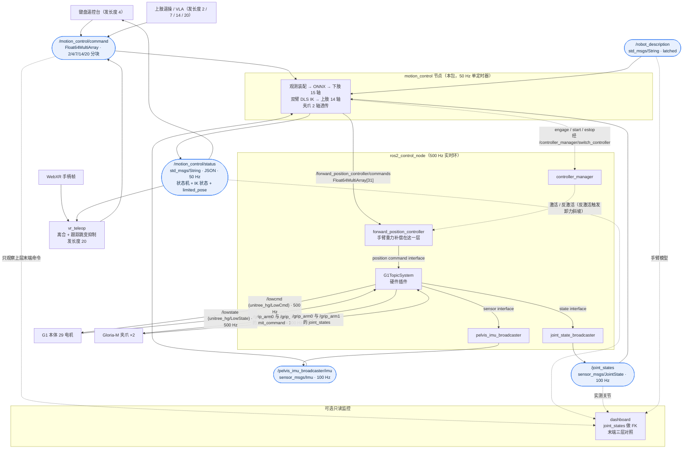

# g1_motion_control —— 整机 31 轴运动控制层（真机部署交接文档）

在 `forward_position_controller`（下称 FPC）之上加的**唯一一层**。一个 50 Hz 定时器算齐 31 轴：

| 段 | 轴数 | 来源 |
|---|---|---|
| 下肢（12 腿 + 3 腰） | 15 | ONNX 策略 |
| 上肢双臂 | 14 | 双臂 IK，输入两个末端位姿（`*_gripper_base` 相对 `torso_link`） |
| 夹爪偏心轴 | 2 | 直接透传，只按 URDF 行程裁剪 |

不分层、不加第二个定时器、不加第二个发布者。手臂**始终开启**，没有开关参数也没有服务。
策略的职责是在上肢被遥操 / VLA 随意摆布时站稳。**它吃不吃下肢指令由装载的权重决定**：
当前包里的站立策略不吃（`~/command` 的速度/高度块仍然被收下并在 `~/state` 里回显，但不
传给推理），换回原来的速度跟踪策略就吃——只需换 `config/policy.onnx`，代码不用改。见第 4 节。



> **圆角浅色框 = ROS 话题**（只画有多个发布者或订阅者的那几个），矩形 = 进程或节点，
> 一对一的话题直接写在边上。虚线 = 可选或按需路径。

### 各层职责与接口

| 层 | 输入 | 输出 | 明确不做 |
|---|---|---|---|
| 键盘 / VR / VLA | 各自设备输入；VR 另读 `limited_pose` 当离合锚点 | `/motion_control/command`，长度只允许 2/4/7/14/20 | IK、关节限位、直接写 FPC |
| `motion_control` | 统一命令、`/joint_states`、IMU、`/robot_description`、状态机服务 | FPC 31 轴目标；10 Hz `~/status` | 区分命令来自谁；任务级语义 |
| dashboard（可选） | 统一命令、`~/status`、`/joint_states`、`/robot_description` | HTTP 页面；**不发任何 ROS 消息、不调服务** | 控制机器人；在后端重复做 FK；电机底层字段（看 `robot_bringup`） |
| ros2_control / 硬件 | 31 轴位置目标、增益与传感器 | `/lowcmd`、夹爪命令、`/joint_states`、IMU | 上层任务与末端规划 |

## 1. 指令话题契约：`~/command` 按长度分块

上下肢共用**一个**话题。全量 20 值的布局如下，其余合法长度都是它的**连续子块**：

```
下标  0   1   2   3 | 4 ....... 10 | 11 ...... 17 | 18   19
     vx  vy  wz  h  | 左臂位姿（7）  | 右臂位姿（7）  | 左夹爪 右夹爪
```

| 长度 | 内容 | 典型发布者 |
|---|---|---|
| 2 | `[左夹爪, 右夹爪]` | 抓取逻辑（手不动只开合） |
| 4 | `[vx, vy, wz, h]` | `teleop_keyboard.py`、下肢 VLA |
| 7 | 右臂位姿 `[x, y, z, qx, qy, qz, qw]` | 单臂遥操 |
| 14 | 双臂位姿（先左后右） | 双臂遥操 |
| 20 | 以上全部 | VR、全身 VLA |

**只覆写本次带来的字段，其余保持**，所以多个发布者可以同时存在且互不干扰。
不在 `{2, 4, 7, 14, 20}` 里的长度、含非有限值、四元数模长不在 `(0.5, 2.0)` —— **整帧丢弃**，
上一帧的目标继续生效。模长合法的四元数会先归一化再用。

> 订阅队列 depth = 4（不是 1）。**多发布者并存时 depth=1 会让同一个执行器周期内
> 后到的消息挤掉先到的**，下肢和上肢的指令互相吞。

### 输入：数据从哪来

| 话题 | 类型 | 频率 | 再上游 |
|---|---|---|---|
| `/pelvis_imu_broadcaster/imu` | `sensor_msgs/Imu` | 100 Hz | `G1TopicSystem` ← `/lowstate.imu_state`。陀螺仪原样透传（盆骨系）；四元数已从 Unitree 的 `(w,x,y,z)` 转成 ROS 的 `(x,y,z,w)` |
| `/joint_states` | `sensor_msgs/JointState` | 100 Hz | `G1TopicSystem::read()` ← `/lowstate.motor_state[i].q/dq`（500 Hz） |
| `~/command` | `std_msgs/Float64MultiArray` | 任意（建议 ≥10 Hz） | 键盘遥控台 / VR / VLA。超 `command_timeout_s`(0.5 s) 无更新则速度归零 |
| `/robot_description` | `std_msgs/String`（latched） | 一次 | 建 IK 缩减模型用 |

每一维观测怎么从这些话题装配出来，见第 4 节。注意 `/joint_states` 里是**全部 31 轴**
（29 本体 + 2 夹爪偏心轴），节点按 ONNX 里声明的观测关节名单取其中一部分（站立策略取 29 个，
原速度策略取 15 个）；名字对不上就等下一帧，不会拿错位的数据去推理。

上肢的**指令**不进观测，直接驱动 IK（但手臂的**实测位姿**是进观测的，见第 4 节）：`~/command` 的臂位姿块是 `*_gripper_base` 相对
`torso_link` 的 `[x,y,z,qx,qy,qz,qw]`；夹爪块直接透传到槽位 29/30，只按 `gripper_limits` 裁剪。

上肢指令**不设超时**：没人发就保持上一个位姿目标。手臂停在原地才是安全行为，
归零或回零位都不是。

### 输出：结果送到哪

| 内容 | 话题 / 服务 | 类型 | 频率 | 消费者 |
|---|---|---|---|---|
| 31 轴位置目标 | `/forward_position_controller/commands` | `std_msgs/Float64MultiArray[31]` | 50 Hz | FPC。下肢 15 槽来自策略，上肢 14 槽来自 IK，夹爪 2 槽透传 |
| 层状态 | `/motion_control/status` | `std_msgs/String`（JSON） | 50 Hz | 遥控台；要接 dashboard 也从这里取 |
| 使能 / 启动 / 急停 | `/motion_control/engage`、`/start`、`/estop` | `std_srvs/Trigger` | 按需 | 遥控台或人工 `ros2 service call` |
| 控制器开关 | `/controller_manager/switch_controller` | `controller_manager_msgs/SwitchController` | 按需 | 本节点**调用**它，用来激活 / 反激活 FPC |

`~/status`（JSON）字段：`state / ready_to_start / command / reason / stale`，
加上 `ik_ready`、`ik_pos_err`（IK 解本身的最大位置残差）、`ik_ms`、
`grip` 与 `limited_pose`。`limited_pose` 是 **IK 解经过 `arm_rate_limit` 后真正下发的
关节目标之正解**；它是可达、无编码器静差的末端指令，**不是实测末端**。真正的实测末端
只能从 `/joint_states` 做 FK，dashboard 在浏览器已有的关节树上直接完成，不让控制层重复算。
它跟着控制环发（而不是更慢的固定速率），因为 VR 离合接合拿它当锚点，那一下要求位移恒为 0。

再往下游（不归本包管）：FPC 写 command interface → `G1TopicSystem::write()` 补上
`default_31dof_param.yaml` 的 kp/kd → `/lowcmd`（500 Hz，前 29 轴）与
`/grip_arm{0,1}/mit_command`（100 Hz，第 30/31 轴）。

---

## 2. 启动顺序
```bash
# 1.控制栈（会把 FPC 加载成 inactive，本层在 engage 时才激活它）
ros2 launch robot_bringup all_data.launch.py scope:=whole_body topology:=dual

# 2.策略层
ros2 launch g1_motion_control motion_control.launch.py
# 换策略试跑：policy_path:=/abs/path/to/policy.onnx

# 3.遥控台（需要真终端，不要用 launch 包）
ros2 run g1_motion_control teleop_keyboard
```

### 遥控台按键

遥控台**只发长度 4**，只管下半身；上肢保持在接管时的姿态不动。完整键位启动时会打印，
关键的三个：

| 键 | 作用 |
|---|---|
| `G` | **站立**：激活 FPC，`stand_s`（2.5 s）内从当前实测位姿插值到策略默认位姿。**插完手臂就能用了** |
| `Enter` | **启动下肢策略**：站立插值走完后按。只调手臂就别按它 |
| `空格` | **急停**：反激活 FPC → kp 斜坡降到 0（阻尼）→ 最后一帧 kd 归零（零力矩） |

其余：`W`/`S`/`A`/`D` 走、`J`/`L` 转、`I`/`K` 升降、`X` 清零速度、`Q` 退出（自动急停）。

速度是"按住才走"：终端读不到抬键事件，所以超过 `hold_timeout_s`(0.4 s) 没按键就在
`decay_s`(0.5 s) 内衰减到零。高度不衰减——它是绝对量，调到哪停哪。

### VR 头显遥操（可选，代替键盘）

WebXR 采集页由 `vr_teleop` 节点**自己托管**（内嵌 aiohttp），头显直连节点。节点
**同时**听明文口和 TLS 口，两条接入路径并存：`https://<机器人IP>:8443`（自签证书，
不经过 adb）和 `http://localhost:8000`（需 `adb reverse`）。WebXR 只在安全上下文里
可用，所以只有这两种进法；`adb reverse` 的规则会**静默失效**，所以两条都开着。

```bash
ros2 run g1_motion_control make_vr_cert     # 签自签证书，只需一次
ros2 launch g1_motion_control vr_teleop.launch.py
```

完整上机流程、证书、排查清单见 [vr/README.md](vr/README.md)。已验证 Meta Quest 2/3、
PICO 4；手柄读的是 `xr-standard` 标准映射。
| VR 输入 | 机器人 |
|---|---|
| **左摇杆** | 水平速度 `vx` / `vy` |
| **右摇杆** | 转向 `wz`（左右）与盆骨高度 `h`（前后，绝对量，松手不回弹） |
| **squeeze** 按住 | 该侧手臂跟随手柄的位移**与转角**；松开即冻结在最后一帧。两种 delta 的参考系故意不同，见下 |
| **trigger** | 夹爪：0 = 完全打开，1 = 夹紧 |
| **双手同时 B/Y** | 推进状态机：站立 → 启动策略 → 急停（戴着头显摸不到终端） |

几个必须知道的点：

* **只在策略层报 `arms_live` 之后才发指令**，播种与接管原点取 `~/status` 里的
  `limited_pose`（IK + 关节限速后的可达指令）。`arms_live` 在**站立插值走完那一刻**就置真，
  所以顺序是先站立 → 就轮到 VR 动手臂了，**不必先启动下肢策略**。
* **离合接合瞬间位移与转角恒为 0**（手柄位置、手柄姿态、末端位姿三个原点一起锁），
  松开即冻结在最后一帧。
* **WebXR tracking 失效不等于通信掉线**：`emulatedPosition` 期间冻结目标但保留离合，
  恢复时只有跨帧位移超过 0.1 m 才无跳变重锚。一律重锚会按比例吞掉手部运动（实测
  1/2 抖动下手走 900 mm 而目标走 0 mm）——实测数字在 `vr_teleop.py` 的
  `_update_arms` 注释里。
* **一次按住期间是绝对映射，允许越界**：手伸到可达域外时末端停在边界上，要让它
  重新动起来必须把越界那一段**原样空推回去**；想省掉就松开 squeeze 再按一次，
  重新接合拿当前 `limited_pose` 做锚点，越界那段作废。**别拿可达性反馈去修锚点**：
  那样够不着的位移会被吸进锚点、把整个映射平移，实测前推 80 cm 再原路收回接合点，
  手臂停在接合点**后方 383 mm**。细节见 `vr_teleop.py` 的 `_update_arms` docstring。
* **帧超时（`frame_timeout_s` 0.3 s）或退出 VR 会话**：速度归零、双臂冻结、夹爪保持。
  不卸力——要卸力用策略层的 `~/estop`。
* **站立插值走完那一刻夹爪会弹到全开**（trigger 松开 = 0 = 完全打开）。手里有东西就先扣
  住 trigger 再 `~/engage`。
* **两种 delta 脱掉的东西不一样**，这是两件事，别合并：

  | delta | 脱掉什么 | 怎么施加 | 输入系 → 输出系 |
  |---|---|---|---|
  | 平移 | 接合瞬间的**偏航**（仅偏航） | 加到锚点位置 | 摆正后的 local-floor → 躯干 |
  | 转角 | 接合瞬间的**整个握姿** | **右乘**到锚点姿态 | 接合瞬间的 grip → `gripper_base` 自身 |

  两者都只算相对量，所以**彻底不需要方向标定**：站哪、面朝哪、参考空间朝哪都不
  进入映射，转个身接着用也不用退出重进 VR。转角若改成世界系左乘就成了“绕基座的
  轴转”，夹爪一偏开，同一个手腕动作就不再是绕自己的轴。平移只脱偏航不脱滚转俯仰，
  因为 `local-floor` 重力对齐、竖直方向本来就准。
* **转角的轴怎么对上的**：采集页给每个手柄画了立方体加一根 15 cm 朝向线，线画在
  **grip −Z** 上（`vr/index.html`）；URDF 里 `wrist_yaw → kwr57b` 的 `rpy="π/2 0 π/2"`
  让 **`gripper_base` +Z 成为伸出方向、+X 成为张合方向**。“绕线滚手腕 = 夹爪绕自身滚”
  就是 grip −Z → gripper +Z；定死 Z 后 det=+1 还剩 X/Y 一对符号，实机试出来是
  `_TOOL_AXIS_MAP = '-x +y -z'`（另一个 `'+x -y -z'` 转向相反）。

  | 你对着那根线做 | 夹爪 |
  |---|---|
  | 绕线滚 | 绕伸出轴 `+Z` 自转 |
  | 上下摆（绕 grip +X） | 绕 `gripper_base` −X（张合轴）摆 |
  | 左右摆（绕 grip +Y） | 绕 `gripper_base` +Y（侧向）摆 |

  平移的 `_BASE_AXIS_MAP = '-y +z -x'` 就是把摆正后的 local-floor 换成躯干轴（右→−Y、
  上→+Z、后→−X）。两个矩阵都必须是 `x/y/z` 排列且 **det=+1**，否则导入就报错。

### 双臂监控页（可选）

看「指令要它去哪 vs 它实际到了哪」。浏览器打开 `http://<机器人IP>:8181/`：

```bash
ros2 launch g1_motion_control dashboard.launch.py
#   换端口：  bind_port:=8182      只收本机：bind_host:=127.0.0.1
```

| 画面元素 | 是什么 |
|---|---|
| 手臂网格 | `/joint_states` 的**实测位形** |
| 绿色实心球 + 坐标轴 | 统一 `/motion_control/command` 里的上层末端命令（VR / VLA） |
| 黄色菱形 + 坐标轴 | `status.limited_pose` —— IK + 关节限速后的末端指令 |
| 橙色空心环 + 坐标轴 | 直接挂在实测模型的 `*_gripper_base` 上 |
| 右上表格 | 上层→限速、限速→实测两段位置差；超过 10 mm 标红 |

电机的力矩、电压、两路温度和 `motorstate` 故障码不在这页，看 `robot_bringup` 的底层监控页：
`ros2 launch robot_bringup lowlevel_dashboard.launch.py`（`http://<机器人IP>:8210/`）。

**这是个独立的只读进程**，不在控制链路上：不发指令、不调服务，不开就是零开销。
控制栈没起来时页面只会一直等 `/robot_description`，不影响别的东西。

几个刻意的取舍（细节见 `dashboard_node.py` 的模块 docstring）：正运动学在浏览器里算，
后端不碰 pinocchio，`/api/state` 每次只回约 1 KiB；没人看页面就退订 100 Hz 的
`/joint_states`；只保留 `base_frame` 之下含可动关节的分支，头、相机、雷达那些 fixed
分支自动剪掉；没有新数据就不 `render()`。

> `/mesh` **只认 `package://`**。它的参数来自网络而节点默认听 `0.0.0.0`，放开任意路径
> 就是一个任意文件读。`control.launch.py` 在发 `/robot_description` 前已经把裸相对路径
> 统一改写成 `package://`，所以真机上不会漏 mesh。

---

## 3. 状态机

照搬 `deploy/robots/g1` 官方 FSM 的 `Passive → FixStand → RLBase` 三段式，这是实机上
唯一被验证过的接管顺序。**策略绝不能从任意位姿冷启动**：训练里它只见过默认位姿附近
的开局。

```
IDLE ──~/engage──► STAND ──~/start──► RUNNING
  ▲                  │                   │
  └───────── ~/estop ┴───────────────────┘
```

| 状态 | 行为 |
|---|---|
| `IDLE` | 不发目标。FPC 处于 inactive |
| `STAND` | 激活 FPC，分两段插值到「策略默认位姿 + `passive_targets`」：前 `stand_clear_s` **只把 shoulder_roll 往外张**（腿不动），剩下的时间再全身走到位。对应官方 `State_FixStand` 的 `ts:[0,2]` + `qs`，多出来的第一段是为了避开夹爪扫大腿。**插值一走完，手臂 14 轴与夹爪就交给 IK 和透传**，下肢停在站立位姿等确认（插值那几秒里手臂仍走 `passive_targets`，IK 还没接管） |
| `RUNNING` | 在已经接管的手臂之外，**再把下肢交给策略**。进入时清零 **GRU 隐状态**与步态相位（等价于官方 `env->reset()`）；**手臂目标一个字节都不动** |
| `ESTOP` | 停止发目标 + 反激活 FPC。`G1TopicSystem::release_body()` 负责卸力斜坡：kp 在 `release_ramp_s` 内降到 0（kd 保留＝阻尼模式），最后一帧 kd 也归零（＝零力矩模式） |

分成两步（`engage` 再 `start`）而不是一步，是为了防终端按键自动重复：按住 `G` 会连发
十几次请求，一步式会直接把策略拉起来。

> `~/start` 在 IK 未就绪时会**拒绝**（返回“手臂 IK 未就绪，在等 /robot_description”）。
> 手臂始终开启，没有降级成“只跑下肢”的静默路径 —— 宁可拒绝接管，不带病启动。

### 只调手臂：engage 之后不按 start

手臂能不能用**不绑在下肢策略上**。只想调手臂、跑 IK 或验证末端轨迹时，`~/engage`
之后等 `stand_s` 插值走完就行了，**不要再按 `~/start`**：下肢与腰锁在站立位姿不动，
手臂和夹爪已经完全归 IK 与透传管，`limited_pose` 照常发布，VR / 键盘 / VLA 都能直接发上肢指令。
状态里的 `arms_live` 就是这个开关，上层全部看它而不是看 `state == running`。

> **这个用法下机器人必须被吊起来或另行支撑。** 下肢只是被位置环钉在站立位姿，
> 没人在平衡。同理，吊着调手臂时**别随手再按一次 B/Y** —— 那会真的把步态策略拉起来。

先动手臂、再启策略也是安全的：`~/start` **不会**重新播种手臂目标，所以策略接管
那一帧手臂停在你刚刚摆的位姿上，不会跳回实测位。

### 自动急停条件

| 触发 | 阈值 | 说明 |
|---|---|---|
| `/joint_states` 或 IMU 超时 | `state_timeout_s` 0.2 s | 广播是 100 Hz；容忍短时调度抖动 |
| 姿态倾覆 | `tilt_limit_rad` 1.0 rad | 与官方 `mdp::bad_orientation` 默认阈值一致（官方那份被注释掉了，这里是打开的） |
| 推理抛异常 / 输出非有限值 | — | 观测里出 NaN 也在这里被拦 |

指令超时（`command_timeout_s` 0.5 s）只把速度归零、保持高度，**不急停**——遥控手松手
不该让机器人卸力。

**上肢的任何问题都不急停**：够不着、不收敛、求解抛异常，都只保持上一帧手臂目标并打
节流告警。正在平衡的下肢不该被上肢拖下水。

---

## 4. 下肢观测与动作契约

这一节是整个部署里最要命的部分：错一位就是错一个策略。层内的 `policy_runtime.py` 把关节顺序、默认位姿、动作缩放**全部从 ONNX 的 metadata 里读**，不在代码里抄第二份；启动时再和 `config/motion_control.yaml` 的 `policy_joints` / `arm_joints` 逐个比对，对不上直接拒绝启动。

**观测布局也是从 metadata 读的**，照着 `observation_names` 逐项装配，不写死在代码里。于是换策略 = 换 `config/policy.onnx`，代码一行不用动，两套契约可以随时互换：

| | 速度跟踪（原策略） | 站立（`G1-Gloria-Stand`） |
|---|---|---|
| 观测维度 | 57 | 79 |
| 指令项 | `command_twist` + `command_height` + `phase` | **无** |
| 观测关节 | 下肢 15 轴 | 全身 29 轴（下肢 15 + 手臂 14） |
| 动作关节 | 下肢 15 轴 | 下肢 15 轴 |

`~/command` 两套都照收、照限速、照在 `~/state` 里回显；站立那套只是 `observation_names` 里没有指令项，于是压根不会被拼进观测向量。节点侧的调用代码两套完全一样。上肢 IK 与指令块也完全不受影响。

目前 `policy_runtime` 认识的项，遇到不认识的名字直接拒绝加载：

| 项 | 维 | 实机来源 | 训练侧对应 |
|---|---|---|---|
| `base_ang_vel` | 3 | `/pelvis_imu_broadcaster/imu.angular_velocity` | `base_ang_vel` |
| `projected_gravity` | 3 | 同上的 `orientation`，`R(q)ᵀ·[0,0,-1]` | `projected_gravity_b` |
| `command_twist` | 3 | `~/command` 的 `[vx, vy, wz]` | `generated_commands("twist")` |
| `command_height` | 1 | `~/command` 的 `[h]` | `generated_commands("height")` |
| `phase` | 2 | `[sin, cos]`，`period=0.6 s`；`‖[vx,vy,wz]‖<0.1` 时置零 | `mdp.phase` |
| `joint_pos` | len(观测关节) | `q_meas - q_default` | `joint_pos_rel` |
| `joint_vel` | len(观测关节) | `dq_meas` | `joint_vel_rel` |
| `actions` | len(动作关节) | 上一拍策略**原始**（未裁剪）输出 | `last_action` |

**站立那 29 轴 = `policy_joints`（15）+ `arm_joints`（14），不包含两个夹爪轴。** 手臂由 VR IK 自顾自地驱动，它摆到哪儿直接决定质心落在哪儿，所以必须让下肢看得到；训练侧的事件会把手臂在整个可达范围内摆起来，这 14 维在训练分布里是有方差的。夹爪相反：训练里它恒为 0，观测归一化学到的标准差接近零，真机上一开合就会被除成巨值盖掉平衡信号（实测夹爪偏 0.2 rad 造成的动作扰动是左膝偏同样角度的 5 倍），所以它只以物理扰动的形式进入。

观测关节名单和动作关节名单是 metadata 里**两份独立的名单**（`obs_joint_pos_joint_names` / `action_joint_names`），不能互相代用，也不能靠截 `joint_names` 前 N 个去猜——模型里 `left_eccentric_joint` 夹在左右臂中间。

归一化已经在导出时折进 ONNX 图里（`Sub`/`Div`），**不要**在外面再减均值。

### 动作（15 维）

```
q_target = default_joint_pos + action_scale * action
q_target = clip(q_target, target_lower_limits, target_upper_limits)   # 不是关节行程
```

**目标位置故意不按关节行程裁剪。** 底层是 PD：`tau = kp*(q_target - q) - kd*dq`，关节靠到
行程边上还想要力，就只能把目标顶到行程之外——mjlab 建 `<position>` 执行器时显式设了
`ctrllimited=False` + `inheritrange=0`，原因同此。实际裁的是 MuJoCo 算的 informational
`ctrlrange`（`jnt_range ± effort_limit / stiffness`）：越过它力矩已饱和，裁在这儿物理上是
空操作，纯粹用来拦跑飞的输出。**五个场景的越界率实测见 `config/motion_control.yaml`
里 `target_lower_limits` 上方的注释块**，那里也写了换权重后怎么重算这组数。

关节顺序正好是真机电机索引 0..14：

```
 0..5   left  hip_pitch / hip_roll / hip_yaw / knee / ankle_pitch / ankle_roll
 6..11  right 同上
12..14  waist_yaw / waist_roll / waist_pitch
```

`action_scale = 0.25 × effort_limit / stiffness`，当前权重是：

| 关节 | scale | 关节 | scale |
|---|---|---|---|
| hip_pitch / hip_yaw / waist_yaw | 0.548 | hip_roll / knee | 0.351 |
| ankle_pitch / ankle_roll | 0.439 | waist_roll / waist_pitch | 0.219 |

### PD 增益与频率

前 29 个本体关节的 kp/kd 来自
`unitree_g1_ros2_control/config/default_31dof_param.yaml`（ONNX metadata 里的
`joint_stiffness/joint_damping` 与其前 29 项逐项相同），硬件侧从同一个文件加载，
**两边天然一致**；最后两项分别用于左右夹爪。

训练是 sim dt 0.005 × decimation 4 = **50 Hz**，实机必须一致——这个频率同时决定步态
相位的推进速度。单拍推理实测 p50 **0.052 ms** / p99 0.079 ms，占 20 ms 预算的 0.3%。

---

## 5. 上肢 IK

### 模型：锁掉腰和腿的 14 轴缩减模型

`/robot_description` 到达后建一次，用 `pin.buildReducedModel` 把 14 个手臂关节以外的**全部**
关节锁死，得到 `nq == 14` 的模型。两个直接好处：

* **求解规模就是 14**，雅可比 6×7、线性方程 6×6，没有整机 95 维的开销。
* **`torso_link` 在模型世界系里是个常量位姿**，构造时算一次 `oMb` 就够。求解时完全
  不必关心策略把腰摆到了哪儿 —— 这正是参考系选 `torso_link` 而不是 `pelvis` 的理由。

建模要几百毫秒，放在 `ReentrantCallbackGroup` 里跑，避开控制环所在的互斥组。
`ArmIK.joint_names` 由缩减模型自己报出，节点按它反查 31 轴槽位，不假设“左 7 + 右 7
正好是 15..28”。

### 求解：定阻尼 DLS + 零空间软偏好，无线搜索、无 SVD、迭代数硬上限

每次迭代（误差与雅可比均在 `LOCAL_WORLD_ALIGNED`）：

```
e   = [p_target - p_cur,  log3(R_target · R_curᵀ)]     # 6 维，先按 max_step_* 限幅
J   = 该末端的 6×7 雅可比
dq  = Jᵀ(J Jᵀ + λ²I)⁻¹ e                             # 任务项
dq += (I - J# J)(-k ⊙ (q - q_ref))                   # 零空间软偏好
q  ← clip(q + dq, URDF 下限, URDF 上限)
```

加了 `λ²I` 之后矩阵恒正定，`np.linalg.solve` 不会奇异，所以**不需要 SVD、不需要奇异值
判据、也不需要线搜索**。

阻尼项写在任务空间（6×6 比 7×7 快），恒等于对**步长**的 L2 正则
`min ||J dq - e||² + λ²||dq||²`（push-through 恒等式，实测 500 组随机 J 两种写法差 3.8e-12）。
注意它惩罚的是 `dq` 不是 `q - q_ref`，所以冗余那一维**没有回中力、完全从种子继承** ——
这既是“解天然连续”的来源，也是热启动会一路漂进坏解支的根因。

#### 零空间软偏好（`ik_null_gain` / `ik_null_target` / `ik_null_gate`）

对启用的关节统一使用软偏好梯度 `b = -k(q-q_ref)`：

```
dq = J# e + (I - J# J) b        # J# = Jᵀ(J Jᵀ + λ²I)⁻¹
```

偏好必须经过 `(I-J#J)`，不能直接加入任务步。非零 `ik_null_target` 是持续、无门限的
参考值；零参考轴使用 `ik_null_gate`，只在偏离较大时介入。当前配置让每臂第 2 轴
`shoulder_roll` 以 0.05 朝镜像的 `±0.34 rad` 靠近，让 `shoulder_yaw`、`elbow`、
`wrist_roll` 以 0.20 朝 0 靠近。参考值不是约束：零空间允许多少就移动多少，投影为 0
就不动，也不影响 IK 的成功判据。

#### 收敛判据按侧算

没有显式参考值时，已经到位的那一侧当轮**完全不碰**。有 `ik_null_target` 的一侧会再尝试
一次零空间软偏好；没有出现在本次指令里的另一侧仍不动，符合第 1 节“只覆写本次字段”的契约。

**不插值**；**够不着就尽力而为**（到迭代上限直接返回当前值，不抛异常）。
限速不在 `ArmIK` 里，在节点的出口（`arm_rate_limit`，见下）。

#### 误差幅值上限：够不着时防止步长爆炸

DLS 的步长**正比于误差**（`dq = Jᵀ(JJᵀ+λ²I)⁻¹e`，最坏增益 `1/(2λ)`，λ=0.05 时是 10 rad/m）。
目标够不着时误差永远不收敛，步长就会大到把关节顶穿限位、裁剪后再弹回来 —— 表现是
**手臂高频抖动**（实测不限幅时稳态每帧抖 1.77 rad，限幅后是 1e-14 量级，残差反而更小）。

**这不是精度参数。** 正常跟随每帧才走 ~2 mm，远在上限之下，加不加限幅指标完全相同；
也别调太小，0.02 m 时冷启动根本够不到。具体数字与排除过的其它假设见
`config/motion_control.yaml` 的 `ik_max_step_pos` 注释。

### 种子、解支陷阱与出口限速

这三件事必须放在一起看，因为它们是同一个权衡的三个面。

#### 多解支是这台机器人的固有属性

同一个末端位姿，从不同种子解出来的关节位形**最大能差 2.67 rad**，差异几乎全在腕三轴。
所以"种子选谁"不是收敛速度问题，是**手臂摆成什么样**的问题。

| 种子 | 后果 |
|---|---|
| **上一帧已发布的目标（热启动）** | 解天然连续；但坏位形会过夜，一路累积进解支陷阱 |
| 固定位形（每帧重开） | 没有跨帧状态、不会卡死；但**相邻两帧可能落在不同解支**，手腕会疯狂翻 180° |
| 实测位形 | 最差：闭环把编码器噪声灌回求解器，实测单帧 5.76 rad（热启动 1.77） |

现在用的是**热启动**，跨解支的跳变交给出口限速堵，卡死交给下面两道堵。

#### 陷阱一：肘的伸直奇异点（靠收限位堵）

G1 的肘角**不是"0 伸直、越大越弯"**——实测肩到夹爪的距离：

| `elbow` | −1.047 | 0 | 0.5 | **1.571** | 2.094 |
|---|---|---|---|---|---|
| 肩→夹爪 | 173.9 mm | 355.0 mm | ~418 mm | **467.4 mm** | 445.8 mm |

**1.571 rad（90°）才是完全伸直**，也是奇异点，而 URDF 行程 `[-1.047, 2.094]` 把它**夹在中间**。
热启动时目标够不着会把肘一路推过 1.571 顶到 2.094 —— 手臂**看上去是直的** ——
想回来必须再穿一次奇异点，那里雅可比在伸展方向失秩、DLS 步长趋零，于是**永久卡死**
（实测反复"推远 → 拉回"8 轮卡死 **4/8**，卡在肘 = 2.0944、残差 39 mm，再迭代多久都出不来）。

`ik_limit_upper` 把肘收到 **1.4**（留 0.17 rad 余量）之后 0/8，代价只有 0.3 mm 可达半径。
1.5 / 1.6 都**不够**（仍 4/8），1.2 会白丢 4 mm。

#### 陷阱二：肩的镜像解支（靠逃生种子堵）

收肘只堵住了肘那条路。肩上还有一条同类的：热启动被推远之后会翻进

```
shoulder_pitch ≈ +2.41   shoulder_roll 顶死 ±2.252（限位）   shoulder_yaw ≈ −1.57
```

也就是**手臂翻到了肩后**。从那儿连回原位都够不着，残差 70 mm 且永不恢复；更糟的是落进去
之后**正常跟随也一起崩**（±8 cm 有界轨迹的跟随 p50 从 33 mm 恶化到 138 mm）。

收肩的限位治不好，还白丢举手过头的行程；固定种子治得好但会招来手腕翻转。所以那一道
放在**节点**里，是个纯粹的逃生出口：

```python
solved, pos_err, _, _ = ik.solve(上一帧目标, poses)      # 热启动，正常路径
if pos_err > ik_rescue_err:                              # 残差大到不像"只是够不着"
    alt, alt_pos, _, _ = ik.solve(站立位形, poses)        # 换个从不落陷阱的种子重解
    if alt_pos < pos_err - ik_rescue_err:                # 明显更好才采纳
        solved = alt
```

60 轮“推远 → 拉回”的五档对比、阈值不敏感区间、正常跟随下的 0.00% 触发率，都在
`config/motion_control.yaml` 的 `ik_rescue_err` 注释里。

#### 出口限速：`arm_rate_limit`

IK 解出来之后**不直接发**，而是按 `arm_rate_limit`（10 rad/s，50 Hz 下 = 0.2 rad/帧）
往目标方向走。这是防“手腕突然翻 180 度”**唯一**的根治手段 —— 跨解支的跳变是在 IK
**内部**产生的，堵在发布者那一侧没用。顺带把 `~/start` 接管那一下也管住了：实测位形和
IK 首解不一致时不再是跳变，而是按这个速率走过去。

四档限速的单帧最大跳变与跟随代价见 `config/motion_control.yaml` 的 `arm_rate_limit` 注释。

#### 接管

手臂在**站立插值走完那一刻**接管，不等 `~/start`。播种取的是插值终点的**指令值**
（恒等于「策略默认位姿 + `passive_targets`」）而不是实测位形：实测带着 PD 的重力静差，
拿它播种会让交接那一帧的命令流踩一个台阶。交接后**没人发上肢指令时手臂就停在那个位姿**，
首帧跳变恒为 0。这个正解放在**控制线程**里做：`ArmIK` 内部有 pinocchio 的 `data` 缓存，
只让一个线程碰它就不需要额外加锁。

`~/start` **不重新播种手臂**。它一旦重播种，你在 STAND 里摆好的位姿就会在策略接管
那一帧被丢掉、手臂跳回实测位。

### 关节限位

除了肘，全部直接取 URDF 的 `<limit lower/upper>`：

```
shoulder_pitch [-3.089, 2.670]   shoulder_roll   左[-1.588, 2.252] 右[-2.252, 1.588]
shoulder_yaw   [-2.618, 2.618]   elbow           [-1.047, 2.094] -> 收到 [-1.047, 1.400]
wrist_roll     [-1.972, 1.972]   wrist_pitch/yaw [-1.614, 1.614]
夹爪偏心轴     [0, 2.7638]
```

`ik_limit_upper` 与 URDF **取交集、只收不放**，写错了最多让手臂可用范围变小，不会把关节
送出真实行程。不想收紧的轴写 `+.inf`；别抄 URDF 数值，小数位对不齐会变成"收紧了 2e-5"的噪声。

> 这和下肢的 `target_lower/upper_limits` 是**两回事**。下肢故意裁在 MuJoCo 的
> `ctrlrange` 而不是行程（原因见第 4 节）。

### 实测性能（aarch64，50 Hz = 20 ms 预算）

| 场景 | 迭代 | 双臂耗时 | 占预算 |
|---|---|---|---|
| 稳态（目标不动） | 0 | 0.11 ms | 0.6% |
| 跟随（末端 0.1 m/s，每帧 2 mm） | 1 | 0.38 ms | 1.9% |
| 冷启动（从零位解到 0.3 rad 位形） | 5 | 1.36 ms | 6.8% |
| **最坏（双侧不可达，跑满上限）** | 10 | **2.52 ms** | **12.6%** |

位置残差：厘米级小步跟随 p50 = 0.45 mm、max = 1.0 mm。上限由 `ik_max_iters` 硬保证，
不存在“某一帧突然算很久”的可能。

---

## 6. 参数速查（`config/motion_control.yaml`）

| 参数 | 默认 | 说明 |
|---|---|---|
| `policy_path` | `package://g1_motion_control/config/policy.onnx` | 换策略只要覆盖这个文件 |
| `policy_joints` | 15 个下肢关节 | 必须与 ONNX metadata 的 `action_joint_names` 逐项一致 |
| `passive_targets` | `shoulder_roll ±0.6`，其余 0 | 14 臂 + 2 夹爪偏心轴。**只在 STAND 的插值那几秒生效**；插值一走完上肢就改由 IK 与透传接管，不必等 RUNNING |
| `target_lower/upper_limits` | MuJoCo `ctrlrange` | **不是关节行程**，见第 4 节；物理上是空操作，只拦跑飞。**换权重后要重算** |
| `command_limits` | `vx[-0.5,0.8] vy[±0.5] wz[±1.5] h[0.50,0.78]` | 基本开到训练分布（`vx[-0.5,1.0] vy[±0.5] wz[±1.57] h[0.52,0.78]`），只把 vx 上界留在 0.8 |
| `height_rate_limit` | 0.15 m/s | 不是"可选的平滑"，见下方 |
| `linear/angular_accel_limit` | 1.5 / 3.0 | 纯安全项，训练里速度指令是允许阶跃的 |
| `initial_height` | 0.74 | 进入 `RUNNING` 时的高度指令 |
| `stand_s` | 2.5 | 总时长。官方 `FixStand` 是 2 s，多出来的半秒是因为还要把手臂收到 `passive_targets` |
| `stand_clear_roll` | 0.7 (40°) | STAND 第一段把 `shoulder_roll` 往外张到这个角度（**只张不收**）。防的是关节空间直线扫过大腿，见第 8 节实测。设 0 退回单段直插 |
| `stand_clear_s` | 0.4 | 第一段的时长，**包含在 `stand_s` 里**（必须小于它，否则拒绝启动） |
| `control_rate_hz` | 50.0 | **不要改**，会改变步态相位速度。上肢 IK 共用这一个定时器 |
| `tilt_limit_rad` | 1.0 | 同官方 `bad_orientation` |

### 上肢参数

| 参数 | 默认 | 说明 |
|---|---|---|
| `arm_joints` | 14 个手臂关节 | 先后顺序不重要：真正的 q 顺序由缩减模型自己定 |
| `gripper_joints` | `[left_eccentric_joint, right_eccentric_joint]` | 不进 IK 模型，直接透传 |
| `gripper_limits` | `[0.0, 2.76377]` | 取自 URDF 的 `<limit>`；透传前只做这一道裁剪 |
| `base_frame` | `torso_link` | 末端位姿的参考系。选它而不是 `pelvis`，IK 链里就没有腰 |
| `left/right_tip_frame` | `*_gripper_base` | 求解的末端帧，帧名不存在会在建模时报错并列出可用帧 |
| `ik_max_iters` | 10 | **硬上限**。它决定了最坏耗时（2.52 ms） |
| `ik_damping` | 0.05 | 任务步 DLS 的 λ。调大更稳但收敛慢；调小会放大近奇异处的跳变（0.01 时实测跳 1.79 rad） |
| `ik_tol_pos` / `ik_tol_ori` | 0.001 m / 0.0035 rad | **按侧**判断，两者都满足那一侧当轮就不再动 |
| `ik_max_step_pos` / `ik_max_step_ori` | 0.1 m / 0.5 rad | 喂给 DLS 的误差幅值上限。**稳定性参数，不是精度参数**：够不着时防止步长爆炸导致手臂抖动，见第 5 节实测。设 0 关掉 |
| `ik_limit_upper` | 肘 1.4，其余 `+.inf` | 关节上限收紧（长度同 `arm_joints`，与 URDF **取交集、只收不放**）。肘必须挡在伸直奇异点之前（`shoulder_yaw` 与 `wrist_roll` 两根自转轴在 1.571 处共线，雅可比最差点在 1.44），否则热启动会把解推过去再也回不来。留空 = 全用 URDF。见第 5 节 |
| `ik_rescue_err` | 0.01 m | 逃生阈值：热启动解的位置残差超过它就换站立位形当种子重解一次，新解至少好这么多才采纳。**防"手臂回不来"的那一道**，正常跟随下触发率 0.00%。见第 5 节 |
| `ik_null_gain` | 第二轴 0.05，三根自转轴 0.20，其余 0 | 零空间软偏好增益（长度同 `arm_joints`）。每轮形成 `-gain·(q-q_ref)` 再投影；全填 0 = 关闭。见第 5 节 |
| `ik_null_target` | 左右第二轴 `+0.34/-0.34 rad`（约 ±20°），其余 0 | 零空间参考角（长度同 `arm_joints`）。非零参考轴是无门限软偏好；只取可用投影，不要求最终到达参考角。见第 5 节 |
| `ik_null_gate` | `[0.6, 1.2]` rad | 只作用于未显式设置参考值的原三根自转轴：某轴 `\|q\|` 低于开始角不介入，高于全开角施加完整增益。非零 `ik_null_target` 轴不经过此门控。见第 5 节 |
| `arm_rate_limit` | 10.0 rad/s | 手臂关节目标的变化率上限（在 IK **出口**限）。**防"手腕突然翻 180 度"的那一道**。嫌快调 5，别超过 20。见第 5 节 |
| `robot_description_topic` | `/robot_description` | latched（TRANSIENT_LOCAL），正常只进来一次 |

`joints`（FPC 的 31 轴顺序）由 launch 从
`unitree_g1_ros2_control/config/default_31dof_param.yaml` 读进来后注入，本包
不抄第二份——两份不同步就是左右腿指令互换级别的事故。

### 为什么高度必须限速

训练里高度指令由 `BaseHeightCommandCfg.max_rate = 0.15 m/s` 缓变，**策略从没见过高度
阶跃**。遥控每按一下 `↑` 是 1 cm 的阶跃，不限速就是分布外输入。速度指令则相反：训练
里每 3~8 s 重采样一次是真阶跃，所以那两档限速纯粹是安全冗余，可以放宽。

---

## 7. 已知风险与取舍

### 手臂在 STAND 阶段的自碰撞：撞的是**路上**，不是终点

STAND 是**关节空间直线插值**，而直线不避障。用 `final.urdf` 的碰撞体实测
（pinocchio + coal 算最小距离，肘以下 vs 同侧腿）：

| `shoulder_pitch` | −60° | 0° | +30° | **+60°** | +90° |
|---|---|---|---|---|---|
| 夹爪离腿最小距离 | 294 mm | 145 mm | 80 mm | **0.0 mm（穿模）** | 112 mm |

**+60° 附近有一条碰撞带**（`gripper_base` ↔ `hip_pitch_link`）。手臂被摆到背后再摆
回来必然穿过它，现场表现就是"夹爪被腿拦着不让到前面"。

**终点是安全的**（手臂全 0 垂下有 145 mm 余量），所以改 `passive_targets` 救不了：实测从
“手臂在背后 +75°”起步、把终点分别换成 `roll±0.25/elbow0.5`、`roll±45°`、
`roll±0.35/elbow0.5`，**全部仍在路径 5~7% 处干涉** —— 撞发生在一开始。

解法是**先侧开再走**，即现在的两段式 STAND（`stand_clear_roll` / `stand_clear_s`）。
同一组实测（腿最弯的最坏姿态下）：

| 张开角 | 0° | 15° | 20° | 25° | 30° | **40°（默认）** | 45° |
|---|---|---|---|---|---|---|---|
| 最小距离 | 4 mm | 27 mm | 32 mm | 43 mm | 54 mm | **~80 mm** | 98 mm |

默认 40°（`stand_clear_roll: 0.7`）：既留足余量，又落在训练时手臂的随机区间
`shoulder_roll ∈ ±[0.25, 1.20]` 内。按**当前配置**用节点真实的插值公式验证全程最小间距：

| 起始位姿 | 改动前 | 改动后 |
|---|---|---|
| 手臂在背后 +75° | **干涉** | 39 mm |
| 背后且屈肘 +75°/elbow 1.0 | **干涉** | 29 mm |
| 手臂在前 −60° | 145 mm | 145 mm（不变） |
| 自然下垂 0° | 103 mm | 103 mm（不变） |
| 手臂已张开着在背后 | 75 mm | 75 mm（不变，**只张不收**生效） |

> ⚠️ **按 `G` 的那一刻手臂就已经卡在腿上的话，没有任何插值策略救得了**——它已经在碰。
> 此时这个方案是最快的脱离路径：实测从 +60° 起步 0.25 s 内脱开、0.5 s 到 42 mm、
> 1 s 到 113 mm。真遇到先手动把手臂拨开再按 `G`。

### 手臂停在 `passive_targets`：分布外开局，不是碰撞

`passive_targets` 现在只把 `shoulder_roll` 张到 ±0.6，其余 14 项是 0。上面已确认这个
**终点位姿本身不碰**，但训练时手臂被随机摆在 `elbow ∈ [0.3, 1.6]`、
`shoulder_roll ∈ ±[0.25, 1.20]`，`elbow = 0` 落在区间之外（下界取 0.3 是为了避开细长的
Gloria-M 夹爪：下界 0.0 时随机位姿自碰撞率 11%，0.3 时降到 7.5%）。进 RUNNING 后上肢由
IK 接管、起点就是 STAND 的终点，所以这是个**分布外开局**问题。想让开局也落进训练分布，
就把肘也抬起来（顺序：左臂 7 轴 → 右臂 7 轴 → 夹爪 2 轴），例如照抄 ONNX metadata 里
`default_joint_pos` 的手臂段（`shoulder_pitch 0.35 / roll ±0.25 / elbow 0.87`）。
CPU 闭环重跑里手臂写 0 并**没有**让下肢站不住，所以这一项优先级不高。

### 策略当前水平

包里装的是 `G1-Gloria-LowerBody-Flat-GRU` 的导出权重（循环策略，42 维观测 + `(1,1,32)`
隐状态）。训练侧每次存档都会重新导出 `policy.onnx`，直接覆盖 `config/policy.onnx` 就能换。

**换权重时必须一起确认两件事**，它们不在 metadata 里、节点也校验不了：

1. `config/motion_control.yaml` 的 `target_lower/upper_limits` —— 它按
   `jnt_range ± action_scale/0.25` 算，`action_scale` 一变这组数就过期了。
2. `passive_targets` 的手臂段还落不落在新权重的手臂随机区间里。

**已知不足**：

* 横移和转向的跟随增益偏低，实机上表现为"横着挪不动、转得慢"。
* 策略**没有航向反馈**。`wz=0` 是"不要主动转"，不是"保持航向"；实测 12 s 直行会侧偏
  2.6 m。航向环得由操作员或 VLA 在外面闭。

### 没做的事

* 没有 `/cmd_vel`(Twist) 接口。VLA 直接向 `~/command` 发对应长度的 `Float64MultiArray`
  即可，节点内部的限幅、限速、超时保护对任何指令源一视同仁。
* **上肢没有笛卡尔轨迹规划**。上层目标应连续；策略层只在 IK 出口用 `arm_rate_limit`
  限制关节目标单帧变化，它不能替代避障或完整轨迹规划。
* **没有自碰撞检测**。IK 只管关节限位，不知道两只手会不会撞到一起、会不会撞腿。
* **没有指令级臂角（arm-angle）控制**。`ik_null_gain` 是固定部署参数，
  调用方仍不能在每帧指令里指定“肘朝哪边”。
* 只在平地策略上验证过。

---

## 8. 故障排查

| 现象 | 原因 |
|---|---|
| 启动即抛 `ONNX 的关节顺序和配置不一致` | 换了策略但 `policy_joints` 没跟着改。**不要绕过这个检查**，它拦的正是左右腿互换 |
| 启动即抛 `观测项不匹配` | 这个 ONNX 不是下肢任务导出的（metadata 里 `observation_names` 对不上） |
| 启动即抛 `arm_joints + gripper_joints 必须正好是策略之外的全部关节` | yaml 里这两项的并集和 `joints − policy_joints` 对不上。拦的是“漏了一轴没人写” |
| `~/start` 返回 `手臂 IK 未就绪` | 没收到 `/robot_description`。确认控制栈起了：`ros2 topic echo /robot_description --once`；或看日志里有没有 `手臂 IK 建模失败` |
| 日志报 `URDF 缺少坐标帧 *_gripper_base` | `/robot_description` 里没有夹爪链（起控制栈时漏了 Gloria-M），或把 `left/right_tip_frame` 改成了不存在的帧 |
| 上肢没反应，日志刷 `丢弃非法指令：长度 N 不在 [2, 4, 7, 14, 20] 里` | 发布者的数组长度不对。参照第 1 节的分块表 |
| 上肢没反应，日志刷 `四元数模长 … 异常` | 发了全零四元数。注意顺序是 **xyzw**，单位四元数是 `[0,0,0,1]` |
| 手臂到不了位，`ik_pos_err` 一直很大 | 目标不可达或被 URDF 限位挡住。这是设计行为（尽力而为），不会急停；看 `ik_ms` 是不是顶到了 `ik_max_iters` 对应的耗时 |
| 手臂在不可达目标上**高频抖动** | `ik_max_step_pos` / `ik_max_step_ori` 被调成 0 或太大。DLS 步长正比于误差，不限幅时关节会被顶穿限位再弹回来（实测 1.77 rad/帧）。恢复成 0.1 / 0.5 即可，见第 5 节 |
| **手臂伸直了、肘不弯，怎么都回不来** | 肘越过了伸直奇异点（1.571 rad）。确认 `ik_limit_upper` 里肘那两位是 1.4（不是 `+.inf`）。见第 5 节 |
| **手臂老是伸得直直的、肘长期顶在 1.4** | 目标长期够不着（前伸 20 cm 就到极限）。确认 `ik_null_gain` 三根自转轴是 0.20 而不是 0，`ik_null_gate` 是 `[0.6, 1.2]`。它只能改善不能根治 —— 跟随目标本身就得收到可达域内。见第 5 节 |
| **手臂翻到了肩后、后续怎么发指令都跟不上** | 落进了肩的镜像解支（`shoulder_pitch≈+2.41`、`shoulder_roll` 顶死限位）。确认 `ik_rescue_err` 没被设成 0；应该是 0.01。看 `~/status` 的 `ik_pos_err` 是不是长期 > 0.01 但不下降。见第 5 节 |
| **手腕突然翻 180 度** | `arm_rate_limit` 被调得太大或没生效。多解支是固有属性（同一末端位姿不同种子差 2.67 rad），只能靠限速摊开。改回 10，嫌快就 5。见第 5 节 |
| `~/engage` 返回 `/joint_states 超时` | 控制栈没起，或 `scope:=whole_body` 忘了写 |
| `~/engage` 返回 `switch_controller 拒绝激活` | FPC 被别的控制节点占着（IKT Pose Commander / JTC），先把它们停掉；只读 dashboard 不占控制器 |
| `~/start` 返回 `站立插值还没走完` | 等满 `stand_s` 再按 `Enter` |
| 跑着跑着莫名急停、原因是 `/joint_states` 或 IMU 超时 | 默认 `state_timeout_s` 已取 0.2 s，用于容忍 Jetson 上的短时广播/回调调度抖动；它仍小于硬件自己的 `state_timeout_s`(0.25 s) |
| 急停后机器人还硬着 | 看日志有没有 `卸力失败`。有的话立刻用手柄断电——这条路径失效说明 controller_manager 没响应 |
| 站立位姿正常但一放策略就抖 | 先确认 `/joint_states` 的 `velocity` 字段非空（观测第 6 项全 0 会让策略瞎跑）：`ros2 topic echo /joint_states --field velocity --once` |

---

## 9. 文件导航

```
g1_motion_control/
├── config/
│   ├── motion_control.yaml   # 节点参数，每一项都有注释
│   └── policy.onnx              # 策略权重（自带元数据：关节顺序/默认位姿/动作缩放）
├── g1_motion_control/
│   ├── policy_runtime.py        # 下肢：观测装配 + 推理 + 契约校验，不依赖 ROS
│   ├── arm_ik.py                # 上肢：缩减模型 + DLS 求解，不依赖 ROS
│   ├── policy_node.py           # ROS 节点 + 状态机 + 看门狗 + 指令分块
│   ├── teleop_keyboard.py       # 键盘遥控台（只发长度 4，只管下半身）
│   ├── vr_teleop.py             # VR 桥接（内嵌 WebXR 服务，发长度 20，上下肢全管）
│   ├── dashboard_node.py        # 双臂监控页后端（只读，不在控制链路上）
│   └── make_vr_cert.py          # 签局域网自签证书，兼作证书路径/端口的唯一定义
├── launch/
│   ├── motion_control.launch.py
│   ├── vr_teleop.launch.py
│   └── dashboard.launch.py
├── vr/                          # WebXR 采集页 + 监控页（装到 share/）+ adb 守护脚本
│   └── README.md                # VR 上机流程、证书、排查清单
├── dashboard/                   # 双臂监控页前端（装到 share/），vendor 里是 three.js
└── test/
    ├── test_policy_runtime.py   # 观测拼接 / 隐状态回喂与清零 / 契约校验，pytest
    ├── test_arm_ik.py           # 正逆往返 / 不可达不抖 / 单侧求解 / 零空间偏置与门控 / 整条管线不卡死不跳变
    ├── test_vr_teleop.py        # 离合 / tracking 防跳 / 领先量夹紧 / 畸形帧 / 轴映射 / 偏航基准 / 夹爪
    ├── test_dashboard.py        # URDF 裁剪 / mimic 单遍解算 / 路径容纳
    ├── smoke_no_robot.py        # 无真机联调，直接 python3 跑
    └── smoke_dashboard.py       # 监控页联调，直接 python3 跑
```

> 数据（`config/*`、`vr/*.html`）走 `data_files` 装到 `share/`，运行时用
> `get_package_share_directory` 解析；代码在模块目录里。**别把页面挪进模块目录**——
> 那样 `Path(__file__).parent` 在 `--symlink-install` 下能跑通、在干净安装下会 404，
> 是个只在部署机上暴露的坑。

### 上机前的自检

```bash
# 假状态源 + 假 controller_manager，把状态机从头走一遍
python3 src/g1_motion_control/test/smoke_no_robot.py

# 监控页联调（假 URDF / joint_states / status，逐个打 HTTP 口）
python3 src/g1_motion_control/test/smoke_dashboard.py

# 纯逻辑单测
cd src/g1_motion_control && PYTHONPATH=$PWD:$PYTHONPATH python3 -m pytest test/ -q
```

换了策略还要在训练仓库里跑 `scripts/check_deploy_policy.py`（CPU 闭环重跑整条部署
链路，不占 GPU）。跑完确认没有残留进程：上一轮的节点会在同一个 `ROS_DOMAIN_ID` 上
继续发 `status`，下一轮会读到旧状态。
