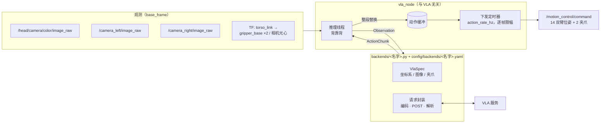

# g1_vla_bridge

VLA 推理服务与 `g1_motion_control` 之间的桥。**流程是固定的，VLA 是可换的**：

```
采观测 → backend.infer() → 重锚 → 逐帧限幅 → /motion_control/command
```

节点只认三样东西，全部定义在 [vla_backend.py](g1_vla_bridge/vla_backend.py)：

| | 是什么 | 表示在哪个系 |
|---|---|---|
| `Observation` | 图像 + 双臂末端位姿 + 夹爪 + 头部相机外参 + 任务指令 | `base_frame`（默认 `torso_link`） |
| `ActionChunk` | N 个 waypoint 的末端位姿 + 夹爪 | `base_frame` |
| `VlaSpec` | 这家 VLA 的**规格**：坐标系原点在哪、要几张什么图、夹爪怎么换算 | — |

**模型系的换算不在节点里做**，由 backend 拿 `spec.frame` 完成，所以 [vla_node.py](g1_vla_bridge/vla_node.py)
里没有任何一家 VLA 的协议细节，换 VLA 不会把坐标系的坑扩散到执行侧。



推理和下发是两条线程：推理线程背靠背跑（一轮几百毫秒且抖动大，放回调里会堵死执行器），
下发定时器按 `action_rate_hz` 逐个取 waypoint，缓冲走完就停在最后一个上（不是回中）。
任何一轮推理失败都只是这一轮作废，手臂保持当前目标，`retry_delay_s` 之后重试。

## 接一个新的 VLA

加两个同名文件，把 `vla_backend` 指过去。**`vla_node.py` 一行都不用改。**

```
g1_vla_bridge/backends/<名字>.py     # SPEC + PARAMETERS + create(params)
config/backends/<名字>.yaml          # 参数值，launch 按 vla_backend 自动挂上
```

配置分层，两边的键不许重叠（[test_config_layout.py](test/test_config_layout.py) 机械核对）：

| | 装什么 |
|---|---|
| 代码里的 `PARAMETERS` | 默认值 |
| `config/vla_bridge.yaml` | 与 VLA 无关：话题、坐标系名、下发速率、限幅 |
| `config/backends/<名字>.yaml` | 这家的：服务地址、坐标系标定、图像预处理 |
| launch 的 arg | 现场临时改的那几个 |

```python
SPEC = VlaSpec(
    name='<名字>',
    frame=FrameSpec(
        origin_in_base=(...),        # VLA 坐标系原点落在 base_frame 的哪里
        rotation_rpy=(...),          # VLA 坐标系相对 base_frame 的朝向
        tool_offset=(...),           # 我方 tip frame -> VLA 末端 frame
        tool_rotation_rpy=(...)),
    images=ImageSpec(slots=('head', 'left_wrist', 'right_wrist'), height=240),
    gripper=GripperSpec(model_open=0.0, model_closed=1.0,             # VLA 侧
                        robot_open_rad=2.76377, robot_closed_rad=0.0),  # 我方关节
    horizon=30,
    action_semantics='absolute')     # 'absolute' 才允许开 delta 重锚

PARAMETERS = {...}          # 要节点替它 declare 的 ROS 参数及默认值
def create(params): ...     # -> VlaBackend 子类，实现 infer(Observation) -> ActionChunk
```

**接入清单**——下面这些必须逐条问清楚，猜不得：

| 要问的 | 落到哪 | 猜错的后果 |
|---|---|---|
| **动作/state 在哪个系，原点在机器人的什么位置** | `frame.origin_in_base` | 绝对模式下整段偏掉 |
| 那个系相对地面是不是水平的、朝向如何 | `frame.rotation_rpy` | **delta 也救不了**，「往前」会走成别的方向 |
| 末端参考点是法兰还是夹爪、姿态轴怎么定 | `frame.tool_*` | 姿态整个反过来 |
| 要几张图、顺序、分辨率、预处理 | `ImageSpec` + backend 的编码 | 模型不报错，只是变傻 |
| 训练相机的内参/畸变/分辨率 | backend 常量（重投影用） | 同一物体尺度对不上 |
| 夹爪的取值范围与方向 | `GripperSpec` | 该松手时夹紧 |
| 输出是绝对位姿还是增量、N 是多少 | `action_semantics` / `horizon` | 重锚逻辑用错 |
| 训练 episode 里真实的相机外参 4×4 | 喂给 `calibrate_frame` | 见下面「灵敏度」 |

一致性由 [test_vla_backend.py](test/test_vla_backend.py) 兜底，接新 VLA 先跑它。

## 运行

前置：`motion_control` 已 `~/engage`（`/motion_control/status` 里 `arms_live=true`）；
三路相机在发图；能连到推理服务。本包只发目标，不做使能、不碰控制器切换。

| 槽位 | 话题 | 编码 |
|---|---|---|
| `head` | `/head/camera/color/image_raw` | rgb8, 424x240 |
| `left_wrist` | `/camera_left/image_raw` | bgr8, 640x360 |
| `right_wrist` | `/camera_right/image_raw` | bgr8, 640x360 |

```bash
# 先决条件
ros2 launch robot_bringup all_data.launch.py scope:=whole_body topology:=dual
ros2 launch g1_motion_control motion_control.launch.py
ros2 launch head_sensors head_camera.launch.py

# 服务在电脑 B 的局域网里时，先从 B 开反向 SOCKS：ssh -N -R 1080 user@<本机>
ros2 launch g1_vla_bridge vla_bridge.launch.py proxy:=socks5h://127.0.0.1:1080

ros2 topic pub --once /vla_bridge/task std_msgs/msg/String "{data: 'Pick up the pink bowl using the left arm.'}"
ros2 service call /motion_control/engage std_srvs/srv/Trigger
ros2 service call /vla_bridge/start std_srvs/srv/Trigger
ros2 topic echo /vla_bridge/status          # backend / running / infer_ms / cursor / error
ros2 service call /vla_bridge/stop  std_srvs/srv/Trigger
ros2 service call /motion_control/estop std_srvs/srv/Trigger
```

启动日志会打出这次用的规格摘要（原点、图像、语义），现场先核这一行。
`~/stop` **只是停止下发新目标**，手臂保持在最后一帧；卸力走 `/motion_control/estop`。

## 安全边界

| 机制 | 参数 | 作用 |
|---|---|---|
| 单帧限速 | `max_step_pos` / `max_step_ori` | 笛卡尔空间逐帧夹紧，**现在唯一的运动限制** |
| 图像新鲜度 | `image_timeout_s` | 任一路图过期就不推理，不拿旧图决策 |
| 接管检查 | — | `arms_live` 掉了自动 `stop` |
| 只记录不拦截 | `~/status` 的 `jump` / `lead` | 首点距实测、指令领先实测 |

整段准入门（首点离实测太远就丢整段）**已删**：标定没定死之前首点总在 0.3 m 上下，它会
把每一段都拒掉。单帧限速在 `motion_control` 的 IK 限幅**之上**，不冲突——那个管的是数值
稳定性，管不住「目标本身给错了」。

## 坐标系与标定

`frame.origin_in_base` 的定义只有一句：**`base_frame` 里的这个点，在 VLA 系里就是原点。**

模型的空间感全部来自图像，对「东西在哪」的判断由**它自己的相机内外参**建立，与手臂长度
无关——所以**相机才是锚点，不是手臂**。整条链路只有一个式子：

```
T_model←base = T_model←cam · (T_base←cam)⁻¹
```

- `T_model←cam` = 训练侧的 `head_camera_in_world`
- `T_base←cam` = 我方 TF 的 `torso_link -> camera_color_optical_frame`

```bash
# 首选：对面给了训练 episode 里真实的 head_camera_in_world（4x4 JSON 或文件）
ros2 run g1_vla_bridge calibrate_frame --camera-in-world train_cam.json

# 备选：对面只给关节值，用训练机的 URDF + 头部外参自己反算
ros2 run g1_vla_bridge calibrate_frame --lift 0.28 --body-pitch 0.5236 --head-pitch 0

# 控制栈没起来时，我方相机位姿也可以手工给：--camera-in-base our_cam.json
```

它打印两套参数：

```
[A] 只对位置：模型系保持水平朝前，原点挪到两台相机重合   <- 现在用这个
[B] 完整六自由度：位置和朝向都重合，但模型系被掰斜
```

**A2D 这个模型泛化很差、对相机位置极敏感**，所以原点不按几何真值取，而是取 `[A]`——让
我们的相机落到训练相机那个位置上。`rotation_rpy` 保持 0：掰了坐标系两台相机的朝向也能
对上，但重力方向就错了、末端 state 跟着歪。代价是俯角仍差 17.8°，这是物理视角差，
`head_reproject` 只改得了焦距和畸变，改不了它。推导过程写在
[config/backends/a2d_omnipicker.yaml](config/backends/a2d_omnipicker.yaml) 里。

**灵敏度：`head_pitch` 每 0.1 rad 让原点变 0.047 m；`body_pitch` 从 0 转到 55° 让原点的
x 差 38 cm。** 务必用真实采样，别拿猜的关节值凑。改了 `origin_in_base` 却没重跑标定，
`test_vla_backend.py` 会拦下来。

## delta 模式（`delta_position` / `delta_rotation`，默认关）

标定不准时可以只取模型整段的**形状**，重锚到当前指令值：

```
out[k].p = anchor.p + (poses[k].p − poses[0].p)
out[k].R = poses[k].R · poses[0].Rᵀ · anchor.R
```

| | 绝对 | delta |
|---|---|---|
| `model_origin_in_base` / `tool_offset` | 必须准 | **相减时抵消** |
| `model_rotation_rpy` | 必须准 | **仍然必须准**（`Δp_model = R · Δp_base`，方向不抵消） |
| `tool_rotation_rpy` | 必须准 | 抵消 |
| 误差累积 | 无 | 指令是累积的，跟不上时会一路往前堆 |

原点对齐好之后一般走绝对模式——delta 会把原点减掉，对齐就白做了。夹爪不走 delta，
它是开合量不是位姿。

**锚点必须是「上一段留下的指令值」，不是实测值**（2026-08-17 踩过，锚在实测上机器人只
在原地抖）：推理一轮约 250 ms，30 Hz 下只播得完 30 个 waypoint 里的前 8 个，实测在这
250 ms 里几乎没动，锚回去就把走过的一截抹掉，再叠上模型噪声就是以约 4 Hz 抖 ±4 cm。
代价是指令可能跑在实测前面，`~/status` 的 `lead` 就是这个领先量。与 `vr_teleop` 的离合
锚点同一套取舍：**绝不拿可达性反馈去修锚点**。

`test_delta_mode.py` 钉死了「偏置必须抵消」「旋转必须不抵消」「进度必须累积」。

## 已知坑

- **坐标系必须和 `motion_control` 一致。** `base_frame: torso_link` 是因为它的 IK 就是
  相对 `torso_link` 解的。改它要同步核对 `motion_control.yaml`——两边不一致不会报错，
  只会让手臂去错地方。
- **相机没订阅者时根本不拉流**，所以刚起来的头 1~3 秒会因图像过期跳过几轮推理，属正常。
- **头部相机默认就是 424x240**，正好是模型要的高度，不会被重采样。别把
  `head_camera.launch.py` 的 `color_profile` 改成 `320x240`：那是从 16:9 横向裁的，
  水平 FOV 会从 69.74° 掉到 55.48°。
- **`head_reproject`** 把我们的图重采样到训练相机内参上（焦距差 1.42 倍，同一物体在我们
  图里大 42%），代价是画布只填得满约 49%、其余靠边缘外推——**那本身也是分布偏移**。用
  `smoke_preflight.py` 做 A/B。修正只做**输入侧**：焦距失配是角度误差不是三维相似变换，
  输出侧再乘系数是双重修正。
- **畸变顺序**：厂商 JSON 给 `k1 k2 k3 p1 p2`，OpenCV/ROS 要 `[k1,k2,p1,p2,k3]`。抄错
  不报错，只会悄悄画歪。
- `RemoteDisconnected` / curl exit=52 → 服务端不回数据。`ssh -R` 的反向 SOCKS 是**乐观
  应答**（关闭的端口也回 "request granted"），拿对照端口分不出「服务挂了」还是「路由断
  了」，只能去 B 上 curl。
- 打不通时先看 `/vla_bridge/status` 的 `error` 字段，那里是原始异常。

## 测试

```bash
python3 -m pytest src/g1_vla_bridge/test -q
python3 -m pycodestyle --max-line-length=120 \
    src/g1_vla_bridge/g1_vla_bridge src/g1_vla_bridge/test src/g1_vla_bridge/launch
```

`test_*.py` 不依赖 ROS 和网络。`test/smoke_preflight.py` 不是单测（`smoke_` 前缀不会被
pytest 收），是**起飞前检查**，要实机 + 网络、**只读不发指令**，走的是和节点完全同一条
路径（同一个 backend、同一份 `Observation`）：

```bash
python3 src/g1_vla_bridge/test/smoke_preflight.py --rounds 6 --task "Pick up the cup"
```

它逐项报图像/内参/TF/`arms_live` 是否齐、两台相机的 FOV，存下实际发出的 JPEG，然后对
开/不开重投影各打 N 次推理，报首点距实测的距离和两个变体的差异是否超过模型噪声。
