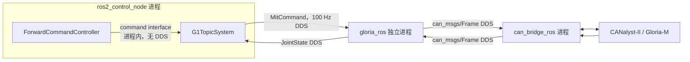

# gloria_ros

Gloria-M 夹爪的 ROS 2 设备驱动。

> 简单理解：上层发送 `MitCommand` 或 PV 目标，`gloria_ros` 补齐模式与量程语义、执行安全检查并编码为 CAN Frame；反馈帧则被解码为 `JointState` 和诊断信息。

本包负责夹爪协议、模式切换、量程确认、使能和反馈超时，不负责独占 USB-CAN，也不生成机器人轨迹。物理 CAN 由 bridge 统一管理；本包只复用 Gloria-M-SDK 的协议与量程定义，不打开其串口适配器。硬件接口、寄存器和标定方法见 [`HARDWARE.md`](HARDWARE.md)。

## 功能
- 支持 MIT 阻抗/扭矩命令与 PV 位置速度命令，不实现缺少完整公开帧定义的 VEL 和 TORQUE_POS 模式。
- 使能前写入并回读控制模式，可选校验固件 PMAX、VMAX、TMAX，避免主机与设备缩放不一致。
- 校验非有限值、增益、速度和力矩，按 `safe_position_min/max` 限制目标位置，并在反馈超时或节点退出时请求失能。
- 发布 `sensor_msgs/JointState` 和 `/diagnostics`，兼容状态反馈使用 `feedback_id`、`command_id` 或 CAN ID `0x000` 的固件。
- 提供独立 Web 调试台，覆盖 MIT/PV 命令、设备服务、状态、诊断和自动 PV 往返测试。

## 架构


`gloria_ros` 负责协议、状态机与安全校验，`can_bridge_ros` 独占物理适配器并完成 CAN 收发；完整系统应由 bringup 为每台夹爪配置专属 RX 路由，避免夹爪节点处理无关的高频总线帧。

### 接入 ros2_control 后
接入统一控制体系没有把 Gloria-M 协议复制进硬件插件，也没有删除独立设备节点。生产时仍运行左右两个 `gloria_ros` 进程，`unitree_g1_ros2_control/G1TopicSystem` 通过本包原有公开 ROS 接口接入：


- controller 与 `G1TopicSystem` 同进程，通过 ros2_control command/state interface 直接读写，不经过 DDS。
- `G1TopicSystem` 只生成夹爪目标并发布 `/grip_arm0/mit_command`、`/grip_arm1/mit_command`；本节点继续做 MIT 编码、模式与量程确认、反馈超时保护和 CAN Frame 生成。
- 本节点发布的 `JointState` 同时供 Dashboard 和硬件插件使用；生产拓扑把关节名设为 `left_eccentric_joint`、`right_eccentric_joint`。
- 这条路径没有新增 adapter 或重复转发节点，但相对“协议直接写进硬件插件”仍保留 ros2_control -> Gloria、Gloria <-> bridge 的 DDS 边界。这样可以复用经过验证的设备安全状态机，并保留本包全部独立调试入口。

因此，controller 层本身不增加 DDS；Gloria 的 DDS 开销来自刻意保留的独立设备节点边界，命令频率固定为 100 Hz，而不是 manager 的 500 Hz。

## 安全约束
- MIT 与 PV 是互斥模式，模式切换固定采用“停止命令 -> 失能 -> 选择模式 -> 写入并回读模式/量程 -> 使能并等待反馈 -> 发送新命令”的顺序；节点在主机状态为已使能时拒绝 `~/set_mode` 和 `~/configure`。
- 运动命令默认要求模式已确认、使能成功且反馈新鲜；软件限位、超时失能和退出失能不能替代机械限位、驱动器保护、急停与碰撞检测。
- `~/set_zero` 会改变绝对位置语义，默认由 `allow_set_zero=false` 禁用，启用后也只允许在失能状态调用。
- 当前反馈解码只发布位置、速度和力矩，尚未发布设备 `ERR`、`T_MOS`、`T_Rotor`；`enabled_requested` 是主机请求状态，因此 `/diagnostics` 不能替代硬件故障码和温度监控。
- 寄存器回包缺少可用于共享 ID 分流的设备号，多夹爪共总线时必须使用非零且唯一的 `feedback_id`，并保证 `command_id` 低 4 位非零且唯一。

## 启动入口

- 生产整机使用 `robot_bringup/all_data.launch.py scope:=whole_body`，它会启动 bridge、左右 Gloria 节点和唯一 ros2_control manager；不要再单独启动本包的 bridge、夹爪节点或第二个 manager。
- 只需要设备数据、不需要 ros2_control 时使用 `scope:=end_effectors`；Gloria 节点和原有 ROS 接口完全相同。
- `gripper_debug.launch.py` 自己启动 bridge 并独占 CANalyst-II，只用于一只夹爪的隔离硬件调试。
- `gripper.launch.py` 只启动夹爪节点；使用它之前，外部 bridge 必须已启动并配置好该设备的 RX 路由。

运行终端先加载工作区环境：
```bash
source scripts/env.sh
```

该脚本会把 Gloria-M-SDK submodule 加入 `PYTHONPATH`；上游包入口会导入串口适配器，因此环境仍需安装其声明的 `pyserial`，但本节点不会打开串口。

### 生产整机

```bash
# 终端 A：双 Gloria、双 KWR57、相机和唯一 ros2_control manager
ros2 launch robot_bringup all_data.launch.py scope:=whole_body topology:=dual

# 终端 B：按需启动纯客户端 Dashboard
ros2 launch robot_bringup whole_body_dashboard.launch.py
```

当前 active 的 `forward_position_controller` 或 `joint_trajectory_controller` claim 两只 Gloria interface，hardware interface 以 100 Hz 发布 `MitCommand`。hardware interface 使用 `0.75 s` 夹爪 freshness 阈值，独立于 G1 的 `0.25 s`；本驱动仍以自己的 `feedback_timeout_s=0.5 s` 先行失能故障侧。8770 末端 Dashboard 默认只监视；只有纯末端模式显式设置 `allow_gripper_control:=true` 时才恢复其直接 MIT publisher。

仅启动原有末端设备体系，不加载 ros2_control：

```bash
ros2 launch robot_bringup all_data.launch.py scope:=end_effectors topology:=dual
```

### 已有外部 bridge
```bash
# MIT 模式，默认不自动使能
ros2 launch gloria_ros gripper.launch.py \
  command_id:=1 feedback_id:=257 control_mode:=mit \
  safe_position_min:=0.0 safe_position_max:=2.77

# PV 模式
ros2 launch gloria_ros gripper.launch.py \
  control_mode:=pos_vel
```

节点默认订阅 `/can0/rx`，但不会创建该话题或打开 CAN 设备。完整系统由 `robot_bringup` 为每台夹爪生成专属 RX 话题与 `feedback_id`、`command_id`、共享 `0x000` 路由，节点会再按 `Data[0]` 低 4 位过滤共享状态帧。

生产环境建议保持 `enable_on_start:=false`，在确认 bridge、供电和机械环境安全后调用：
```bash
ros2 service call /gloria_gripper/enable std_srvs/srv/Trigger '{}'
```

`~/enable` 会先配置并确认模式和量程，再使能并等待状态反馈；未确认模式、未使能或反馈过期时，运动命令默认被拒绝。

## Web 调试台
数据与 Web 分两步启动：
```bash
source scripts/env.sh
ros2 launch gloria_ros gripper_debug.launch.py
ros2 launch gloria_ros web_gripper.launch.py
```

`gripper_debug.launch.py` 独占 CANalyst-II 通道 0，创建 `/grip_left` 及其 `0x101/0x01/0x000` 接收路由，再复用 `gripper.launch.py` 启动设备节点；它不启动 CAN1 或 KWR57，只适合单设备隔离调试。`web_gripper.launch.py` 只连接已有 `/grip_left` 节点并提供端口 8766，不打开 CAN 或创建夹爪设备节点。

浏览器默认访问 `http://<机器人 IP>:8766`。页面可选择 MIT/PV、配置和使能设备、发送命令、查看状态与诊断；切换模式前必须先失能，“一键往返”会自动执行“失能 -> 选择 PV -> 配置 -> 使能”，随后持续在两个端点间运动，直到中止、异常或 Web 节点退出，并在结束时请求失能。

修改节点名或实物 CAN ID 时，先配置数据入口，再让 Web 指向同一个节点：
```bash
ros2 launch gloria_ros gripper_debug.launch.py \
  node_name:=grip_left command_id:=0x01 feedback_id:=0x101
ros2 launch gloria_ros web_gripper.launch.py target_node:=/grip_left
```

Web 默认监听 `0.0.0.0` 且没有身份认证，只能用于可信隔离网络；需要通过 SSH 访问时应绑定回环地址：
```bash
ros2 launch gloria_ros web_gripper.launch.py web_host:=127.0.0.1
ssh -L 8766:127.0.0.1:8766 user@robot
```

也可只启动 Web 后端并连接已经运行的夹爪节点：
```bash
ros2 run gloria_ros web_gripper --ros-args \
  -p target_node:=/gloria_gripper -p port:=8766
```

## ROS 接口

### 订阅

| 名称 | 类型 | 说明 |
|---|---|---|
| `~/mit_command` | `gloria_ros/msg/MitCommand` | `q/dq/kp/kd/tau` 阻抗和扭矩前馈命令 |
| `~/pv_command` | `gloria_ros/msg/PvCommand` | `position/velocity` 位置速度命令 |
| 配置的 `rx_topic` | `can_msgs/Frame` | bridge 接收帧 |

### 发布

| 名称 | 类型 | 说明 |
|---|---|---|
| `~/joint_states` | `sensor_msgs/JointState` | 位置、速度和反馈扭矩 |
| `/diagnostics` | `diagnostic_msgs/DiagnosticArray` | 在线、模式、反馈年龄和状态 |
| 配置的 `tx_topic` | `can_msgs/Frame` | 发往 bridge 的 CAN 帧 |

### 服务

| 名称 | 说明 |
|---|---|
| `~/set_mode` | 失能状态下选择待配置模式；`false=MIT`，`true=POS_VEL` |
| `~/configure` | 写入并确认控制模式，同时读取校验 PMAX/VMAX/TMAX |
| `~/enable` | 配置模式、校验量程、使能并等待反馈 |
| `~/disable` | 下发失能；固件没有独立确认响应 |
| `~/refresh` | 请求一次状态并等待反馈 |
| `~/set_zero` | 重设机械零点；默认禁用且要求夹爪已失能 |

## 重要参数

| 参数 | 默认值 | 说明 |
|---|---:|---|
| `control_mode` | `mit` | `mit` 或 `pos_vel` |
| `pmax/vmax/tmax` | `3.14/10/12` | 必须与设备寄存器中的 MIT 编解码量程一致 |
| `safe_position_min/max` | `0/2.77` | 独立机械安全范围；应按实际夹爪型号校准 |
| `enable_on_start` | `false` | 延时启动后是否自动配置和使能 |
| `feedback_timeout_s` | `0.5` | 超过该时间认为反馈过期 |
| `response_timeout_s` | `0.5` | 服务等待设备确认的超时 |
| `state_poll_period_s` | `0.1` | 使能时主动请求状态的周期 |
| `verify_limits_on_configure` | `true` | 使能前读取固件 PMAX/VMAX/TMAX 并与 ROS 参数比对 |
| `allow_set_zero` | `false` | 是否开放危险的机械零点重设服务 |
| `disable_on_feedback_timeout` | `true` | 反馈过期时发送失能并阻断后续运动 |
| `require_enabled_for_command` | `true` | 未经成功使能时拒绝命令 |
| `require_fresh_feedback` | `true` | 反馈过期时拒绝命令 |
| `disable_on_shutdown` | `true` | 正常退出时发送失能 |

## SDK 参数能力边界
节点只读取并核验 PMAX、VMAX、TMAX，不暴露 SDK 的通用寄存器写入、`save()` 或 `apply_limits()`；这些操作可能改变 CAN ID、控制环、保护阈值、通信配置或写入 Flash，应仅在受控环境中通过独立本机维护工具执行。
