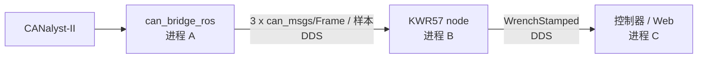
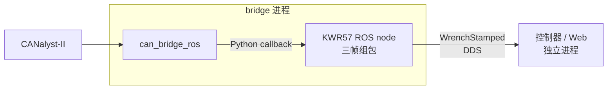

# `kwr57_ros`

坤维 KWR57 六轴力/力矩传感器的 ROS 2 驱动。`can_bridge_ros` 独占物理 CAN，KWR57 协议、三帧组包、控制服务和 `WrenchStamped` 发布由本包负责。

## 两种结构

### 方案 A：ROS Frame 转发



方案 A 使用标准 `can_msgs/Frame` 连接 bridge 与独立设备进程，模块边界直观，也便于替换 bridge、检查原始 CAN 话题和单独调试设备节点，因此仍由 `web_demo.launch.py use_frame_handler:=false` 与 `ft_sensor.launch.py` 保留；生产 `robot_bringup` 不使用该路径。

### 方案 B：进程内组包



增加方案 B 是因为 KWR57 每个样本由三帧 CAN 组成，设为 1 kHz 时 bridge 与设备进程之间需要处理约 3000 条 ROS Frame/s；序列化、内存复制、DDS 调度和两个 Python 进程的执行器开销使 Unitree G1 PC2 上的方案 A 只能得到约 500 Hz。方案 B 让通用 bridge 按 `(channel, CAN ID)` O(1) 查找 handler，再用普通 Python 调用把原始帧交给 KWR57，组包后只发布一次 `WrenchStamped`，同机可达到设定的 1 kHz。

方案 B 没有把设备协议写进 bridge：bridge 只加载 `module:function` 工厂并验证注册结果，KWR57 的协议、参数、ROS node、话题和服务仍归 `kwr57_ros` 所有。CAN 命令直接进入 bridge 的 TX 队列；有效 KWR57 帧不会创建或发布中间 `can_msgs/Frame`。

## PC2 实测

测试条件为 Unitree G1 PC2、CANalyst-II、CAN0、1 Mbps、一个 KWR57、`sample_rate_hz=1000`、`period_ms=1`、CycloneDDS 和一个 Web 订阅者。CPU 来自多次 `ps` 瞬时快照，`100%` 表示占满一个逻辑核，适合比较架构开销但不是跨机器基准。

| 数据路径 | Web 接收频率 | 进程 | CPU 瞬时范围 | CPU 合计 |
|---|---:|---|---:|---:|
| 方案 A：专属 ROS Frame 话题 | 约 `500 Hz` | bridge + KWR57 + Web | bridge `93-102%`，KWR57 `127-136%`，Web `63-64%` | 约 `283-302%` |
| 方案 B：进程内 handler | 约 `1000 Hz` | bridge/KWR57 + Web | bridge/KWR57 `74-90%`，Web `72-82%` | 约 `146-172%` |

方案 B 在输出频率翻倍的同时减少了一个进程，并将观测到的总 CPU 占用降低约 `40-50%`。数值会随 Web、测频工具和系统负载波动，性能复测时不要同时运行多个 `topic echo`、`topic hz` 或可视化订阅者。

## 启动

```bash
cd ~/Unitree_G1_Workspace
colcon build --symlink-install
source scripts/env.sh

# 当前台架：CAN0 上一个 KWR57 + Web，默认使用方案 B
ros2 launch kwr57_ros web_demo.launch.py

# 最终机器人拓扑：始终使用方案 B
bash scripts/run.sh single
bash scripts/run.sh dual
```

方案 A 只用于兼容和诊断：

```bash
# bridge + 独立 KWR57 + Web
ros2 launch kwr57_ros web_demo.launch.py use_frame_handler:=false

# 连接一个已经运行的 bridge
ros2 launch kwr57_ros ft_sensor.launch.py rx_topic:=/can0/rx tx_topic:=/can0/tx
```

## ROS 接口

每个 KWR57 在两种结构下都保持相同的 node 名称、Wrench 话题、命令话题和服务；`rx_topic`、`tx_topic` 只在方案 A 中承载 `can_msgs/Frame`。

| 方向 | 名称 | 类型 | 说明 |
|---|---|---|---|
| 订阅 | `<rx_topic>` | `can_msgs/Frame` | 仅方案 A |
| 发布 | `<tx_topic>` | `can_msgs/Frame` | 仅方案 A |
| 发布 | `<topic>` | `geometry_msgs/WrenchStamped` | BEST_EFFORT, KEEP_LAST(32) |
| 订阅 | `~/command` | `std_msgs/String` | `start`、`stop`、`tare`、`reset_tare` |

服务均为 `std_srvs/Trigger`：`~/start`、`~/stop`、`~/tare` 和 `~/reset_tare`。`tare` 是软件调零，下一组完整样本会成为偏置。

| 参数 | 默认 | 说明 |
|---|---:|---|
| `cmd_id` | `0x10` | 传感器命令 CAN ID |
| `data_base_id` | `0x15` | 三个数据 ID 的起点：base、base+1、base+2 |
| `topic` | `~/wrench_raw` | 输出 Wrench 话题 |
| `frame_id` | `kwr57_ft_sensor_link` | 输出坐标系 |
| `period_ms` | `1` | 上传周期，1 ms 对应目标 1 kHz |
| `sample_rate_hz` | `1000` | 内部采样率 |
| `publish_rate` | `0.0` | `0` 表示每个完整样本都发布 |
| `use_si` | `false` | 是否换算为 N 和 N*m |
| `autostart` | `true` | 启动后自动配置并起流 |
| `tare_on_start` | `false` | 启动后用首个完整样本调零 |

## 部署约束

最终 `robot_bringup` 的设备清单仍描述两台 KWR57 和两台 Gloria-M。当前台架只有 CAN0 上的一台 KWR57，不能据此删减最终硬件清单；实机验证当前使用 `web_demo.launch.py`，完整 bringup 通过构建、参数生成和拓扑测试验证。

同一条 CAN 上的 KWR57 必须使用不同的命令 ID 和数据 ID。修改硬件 ID 时一次只连接一个传感器：

```bash
python sdk/KWR57-SDK/examples/set_id.py --interface canalystii --channel 0 \
  --host-id 0x11 --sensor-id 0x18 --verify
```

handler 连续异常三次后会被禁用，bridge 随后把帧发布到默认 ROS RX 话题，避免故障 handler 阻塞总线线程；生产系统不会动态创建独立 KWR57 进程，修复配置后应重启 bringup。

## 工具

- `ros2 run kwr57_ros wrench_echo`：低频打印六轴值和接收频率。
- `ros2 run kwr57_ros web_wrench`：只启动 Web 订阅端。
- `ros2 run kwr57_ros read_kwr57 ...`：停止 bridge 后直接打开 CAN 的台架工具。
