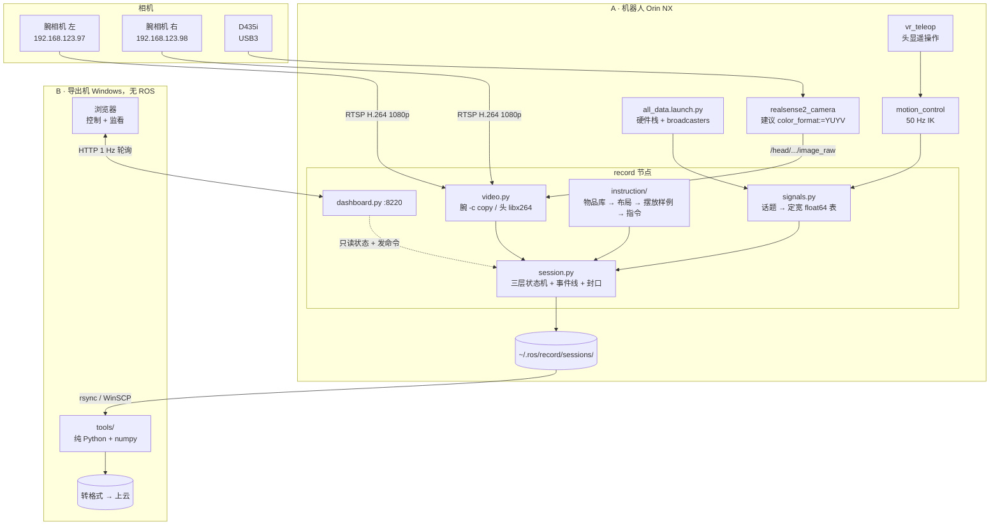

# record — 上肢 VR 遥操作数据采集

三路视频 + 全量信号 + 随机指令生成 + 采集面板。采集端只落原始数据，格式转换与上云
全部在导出机上做。

---

## 架构



**架构铁律：录制逻辑全在 ROS 节点里，面板只是观察者 + 命令入口。** 没人开页面、HTTP
线程崩了，录制照常。

### 三层时间粒度

```
session   一次连续录制。视频与信号表全程连续写
 └ round  一次摆桌。一组物品 + 一张摆放样例 + 一串有状态依赖的指令
    └ episode  一个原子动作（一个 verb）。这是交付单位
```

**episode 不切文件**，只是 `events.jsonl` 里的一对时间戳。每条 episode 重开 ffmpeg
会让每段开头 1.2 s 全废（RTSP 冷启动实测值）。

交付粒度的依据：上游 `pp_g1` 的 skeleton 计数逐项相加恰好等于 episode 数
（`807+188+181+218+230+75+34+4 = 1737`，`pp_g1_v2` 同样对得上 1986），
所以对面口径是「一条 episode = 一个 verb」。

---

## 快速开始

```bash
# 1. 硬件栈与控制栈
ros2 launch robot_bringup all_data.launch.py scope:=whole_body topology:=dual
ros2 launch g1_motion_control motion_control.launch.py
ros2 launch g1_motion_control vr_teleop.launch.py

# 2. 头部相机。YUYV 直出省掉一次色彩转换，720p 编码从 98% 降到 60% 单核
ros2 launch head_sensors head_camera.launch.py \
    color_profile:=1280x720x30 color_format:=YUYV

# 3. 采集节点 + 面板
ros2 launch record record.launch.py
```

在导出机浏览器打开 `http://<机器人IP>:8220`。

### 面板上的四件事

1. **数据一览** — 每路的话题、类型、实时频率、已收/已写。开录前先确认没有哑掉的流
2. **勾选要录哪些** — 默认全勾**除深度图**；点「开始 session」后整块置灰，
   勾选结果冻结进 `manifest.json`
3. **生成新一轮摆放** — 出一张摆放样例图，照着把真实桌面摆好
4. **逐条执行 episode** — 开始 → 操作 → 标注成功/失败/丢弃

结束时点「结束 session」，会收尾所有文件、算全目录 sha256、写 `DONE`。
同步脚本只搬带 `DONE` 的目录。

---

## 落盘格式

```
~/.ros/record/sessions/<时间戳>/
  manifest.json      开录瞬间冻结的流勾选 + 时间基准
  meta.json          camera_info、桌面几何、关节顺序、备注
  schema.json        每张 .bin 的列名/列数/dtype
  events.jsonl       唯一的时间线，只追加
  video/
    wrist_left.mkv       H.264 1080p 原码流，-c copy
    wrist_left.pts.bin   每帧一个 float64（收包墙钟）
    wrist_right.* / head.*
  signals/
    joint_states.bin     [t_recv, t_header, 31×pos, 31×vel, 31×eff]
    motion_control_command.bin  [t_recv, t_header, 20]
    ...
  rounds/
    round_000.json     物品 + 布局 + seed + 全部 episode 的结构化指令
    round_000.svg      摆放样例
  DONE               全目录 sha256
```

**信号表是无表头的裸 float64 矩阵**，列信息全在 `schema.json`。采集机是 Orin NX、
导出机是没有 ROS 的 Windows，两边唯一都有的只有 numpy，所以读一张表必须能退化成：

```python
np.fromfile(p, np.float64).reshape(-1, ncol)
```

带表头的格式（parquet / hdf5）都要装库，而这台机器连 pyarrow 都没有。

### 指令为什么不只存一个字符串

`instruction_en` 是对面要的契约字段，但每条 episode 同时存结构化的一坨：

```
scene / round / instruction_id / step_index / step_total
verb / obj{id,en,zh} / target{id,en,zh} / prep / arm / arm_to
instruction_en / instruction_zh / lint_warnings[] / outcome
```

字符串是给模型看的，结构化字段是给自己看的 —— 后者决定了以后能不能筛数据、按动作
切分、改名、查错。方向不可逆：结构化 → 字符串是纯函数，反过来有损。

---

## 导出机侧

把 `tools/` 整个拷过去，只要 Python + numpy（视频对齐额外需要 ffprobe）：

```bash
python inspect_session.py <session 目录>            # 概览
python inspect_session.py <session 目录> --verify   # 逐文件核对 sha256
python inspect_session.py <session 目录> --align    # 估视频时间偏移
```

```python
from session_reader import Session
s = Session(r'D:\data\20260821_101500')

t, q = s.table('joint_states')                # 时间列 + 数据列
for ep in s.episodes():                       # 默认不含 discard
    print(ep['instruction_en'], ep['outcome'])
    t, q = s.slice_table('joint_states', ep['t0'], ep['t1'])
    frames = s.slice_frames('head', ep['t0'], ep['t1'])
```

`tools/` 里**禁止 import rclpy**，有测试用正则守着这条。

---

## 时间对齐

所有数据落在同一个 `CLOCK_REALTIME` 上。信号表每行同时存 `t_recv` 与 `t_header`。
头部相机用 RealSense 的时间戳，**只有腕部需要额外处理**——它是网络设备，没有可用时钟。

腕部三步：

1. **收包打戳** — `-use_wallclock_as_timestamps 1 -copyts`，每包到达时打主机墙钟
2. **等间隔重建** — `fitted_pts()` 丢掉到达时刻，换成一条直线。依据是 `-c copy` 下
   包数严格等于帧数、帧率由硬件恒定。RTSP over TCP 成簇到达，逐帧时刻不可用，
   但「第 i 帧采于 t0 + i/fps」可用
3. **按时间取帧** — `slice_frames` 与 `slice_table` 用同一对时间戳

| 误差来源 | 量级 | 状态 |
|---|---|---|
| 网络排队 + 内核缓冲 + ffmpeg 调度 | 单帧 p5..p95 跨 23 ms | 第 2 步已消除，残余 ±10 ms |
| 相机管线（曝光 + ISP + 编码） | 腕部 **约 60 ms** / 头部 **约 30 ms** | **未标定，是估计值** |

第二项让视频时间轴整体偏晚一个固定量，两路相机**都没有标定**。`tools/align_video.py`
是标它的工具（图像运动强度 × 该臂关节角速度做互相关，运动信号用 H.264 包大小，
零解码），但还没在真实运动数据上跑过。因为它固定，一次 session 标一次即可。

> **RTCP 这条路不通。** RTP 标准的 Sender Report 会把媒体时钟映射到发送端 NTP 墙钟，
> 有它就不需要互相关。实测这两台相机不实现：抓 30 秒收到 4070 个 RTP 包、SR 一个没有，
> 主动发接收报告催也没用。换成支持 RTCP SR + NTP 的相机可以让整个问题消失。

---

## 桌面几何

桌面尺寸**不能照抄对面 A2D**：G1 肩→夹爪 0.508 m vs A2D 0.914（1.80 倍），
肩间距 0.200 vs 0.426（2.13 倍），两个比值不同，不存在单一缩放系数。

用 pinocchio 逐格 IK + 邻格热启动洪水填充实测（腰锁死、工具轴垂直向下 30° 内、
含自碰撞过滤）：

```
可达区外接矩形  275 mm(纵深) x 900 mm(横向)   其中 80% 可达
桌高            0.80 m（离地）时面积最大 0.198 m²，约为对面的 1/4
近边            x = 0.100（torso_link 系）—— 经验值，实机要拿尺子核
```

掩码固化在 `record/data/reach_mask.npz`。**布局与落点一律对掩码判**——用矩形近似会
得出「5 件承载面全放不下」的假结论，对掩码判则 220 mm 的盘子还有 5 个可放位置。

物品库 91 件 active，可达域内可用 83 件。一个 round 建议 **3–5 件**（对面是 5–10 件）。

---

## 为什么这样选（实测依据）

| 决策 | 依据 |
|---|---|
| 腕部 `-c copy` 录 1080p | 1.33% 单核/路；解码转 720p 是 103.8%，**贵 78 倍且画质更差**。720p 留到导出机离线降 |
| 时间戳那路也要 `-c copy` | 漏了它 ffmpeg 走默认编码器，把 1080p 整个解码一遍：1.0% → 25.1% 单核 |
| 头部走 ROS 不走 v4l2 | 贵约 1.5 倍，换 `header.stamp`（p50=p95=33.4 ms）与 `camera_info` |
| 头部用 YUYV | 编码 98.0% → 60.3% 单核，且 RGB8 会丢帧、YUYV 不会 |
| `-crf 26` | ultrafast 默认码率虚高 14.99 Mbps，加 crf 后 6.18 且 CPU 还少 15 个点 |
| 不录 `/tf` | 665 列/条、96 KB/s，且能从 `joint_states` + URDF 离线重算 |
| 不录 `/lowstate` | 1046 Hz、6.8 GB/h，而 `joint_states` 是它的重打包 |
| 关节按 `msg.name` 重排 | `joint_state_broadcaster` 的 `joints` 是空数组，顺序每次启动都可能变 |

容量约 **6.5 GB/h**，1.8 T 可录 250 小时以上。

---

## 已知限制

- **相机管线延迟未标定**，两路都是估计值。需要机器人真动起来跑一次 `--align`
- **两台腕相机配置不同**（`.97` 30 fps / `.98` 25 fps）且经常轮流掉线
- **A→B 自动同步没接**。`DONE` 已经写了，rsync/WinSCP 还要人工触发
- **导出脚本没写**，等对面给格式口径。中间格式设计成零依赖可读，届时只加导出脚本
- 头部深度图默认不录：16UC1 压不了，424x240@30 就是 21 GB/h，比三路彩色加起来还大

---

## 测试

```bash
python3 -m pytest src/record/test -q          # 124 条，约 55 s
python3 src/record/test/smoke_record.py       # 真机烟测，不接相机也能跑
```

其中几条是钉契约的：只有 numpy 也能读出落盘数据、录制中 `kill -9` 后已落盘部分仍是
整行的整数倍、关节必须按名字重排、以及 Instruction Spec §1.5 要求的发布前批量验收
（120 个 round、1000+ 条指令、lint 命中必须为 0）。
