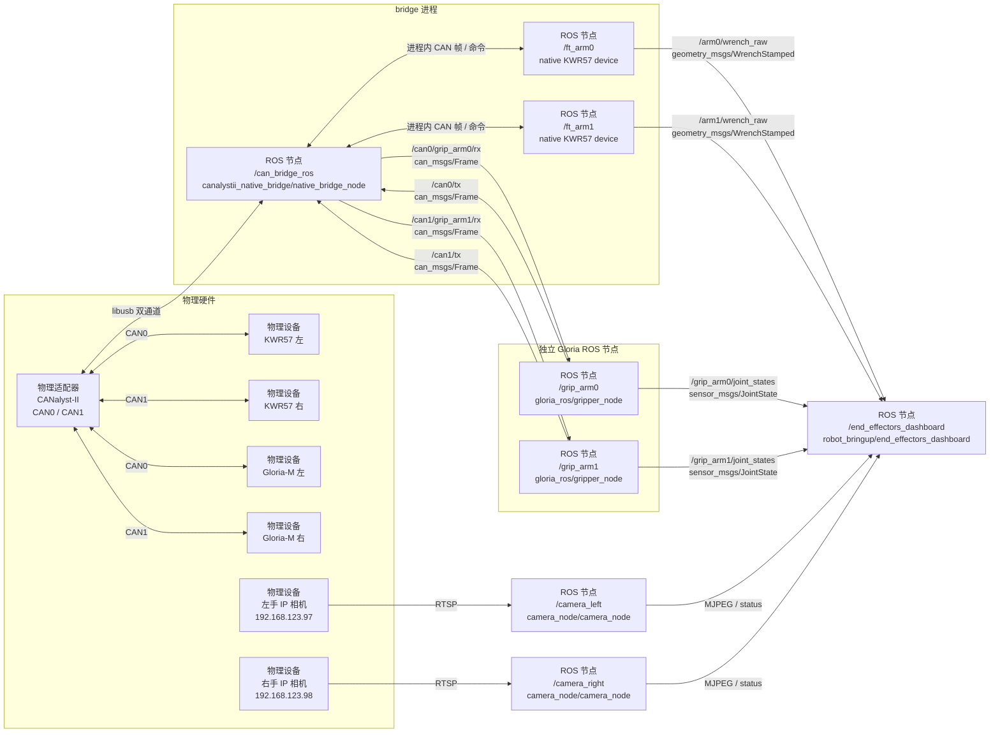
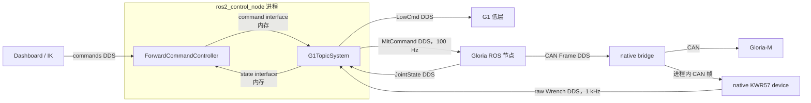

# `robot_bringup`
`robot_bringup` 负责组合本仓库已有节点，不实现 CAN 协议、视频处理或控制器。生产硬件与控制栈统一由 `all_data.launch.py` 启动，Dashboard 按需单独启动：

| 入口 | 实际启动 |
|---|---|
| `all_data.launch.py scope:=end_effectors` | 末端拓扑：bridge、进程内 KWR57、Gloria-M、左右相机 |
| `all_data.launch.py scope:=whole_body` | 末端拓扑，再增加唯一真实 `controller_manager`、统一硬件插件、broadcaster、URDF 和互斥 inactive FPC/JTC |
| `end_effectors_single_bus.launch.py` | `all_data topology:=single` 使用的底层单通道末端拓扑 |
| `end_effectors_dual_bus.launch.py` | `all_data topology:=dual` 使用的底层双通道末端拓扑 |
| `end_effectors_dashboard.launch.py` | 仅端口 `8770` 的末端联调网页；不启动数据节点 |
| `whole_body_dashboard.launch.py` | 仅端口 `8200` 的 controller 测试网页；连接已有 manager，不启动数据或控制节点 |

末端设备实现集中在 `robot_bringup/end_effectors/`。`unitree_g1_description` 只提供模型资源；`unitree_g1_ros2_control` 提供真实 Foxy `SystemInterface`、C++ controller 与 broadcaster。

## 末端设备结构
`all_data.launch.py scope:=end_effectors topology:=dual` 的实际数据流如下；8770 Dashboard 是独立进程，用户需要时再手动启动：



图中每个写有“ROS 节点”的方框都对应一个实际 ROS 2 node。`/can_bridge_ros`、`/ft_arm0` 和 `/ft_arm1` 是同一原生 C++ bridge 进程中的三个节点；两个 KWR57 节点直接接收进程内 CAN 帧并完成严格三帧组包。`/grip_arm0` 和 `/grip_arm1` 是独立的 Gloria 节点，bridge 将命中的 CAN 帧改发到各自的专属 RX 话题，节点完成协议解码后再分别发布 `JointState`。`can_bridge_ros` 与 `kwr57_ros` 只保留为独立调试和兼容入口，不参与上图生产路径。

每个 `Kwr57Device` 生成一个 native JSON spec、三个 `(channel, CAN ID)` 注册、Wrench 输出参数和 ROS 服务；每个 `GloriaDevice` 生成专属 RX 路由和夹爪节点参数。启动前会检查总线、节点名、Wrench 话题以及同通道 CAN ID 冲突。

`scope:=whole_body` 在上述设备路径旁增加唯一 `ros2_control_node`，不会在 controller 与硬件插件之间增加 DDS：



G1 的 LowCmd 编码在 C++ 硬件插件内完成；Gloria 协议仍由独立 `gloria_ros` 节点负责；KWR57 三帧协议仍在 bridge 进程内完成。这样保留各设备独立 launch 和诊断能力，同时避免 controller-manager facade、状态重发节点及 KWR57 中间 CAN Frame 流。

## 末端设备清单
`end_effectors_single_bus.launch.py` 描述 CAN0 上的最终四设备拓扑：

| 设备 | 命令 ID | 数据/反馈 ID | 输出或 RX |
|---|---:|---|---|
| `ft_left` | `0x10` | `0x15/0x16/0x17` | `/ft_left/wrench_raw` |
| `ft_right` | `0x11` | `0x18/0x19/0x1A` | `/ft_right/wrench_raw` |
| `grip_left` | `0x01` | `0x101/0x01/0x000` | `/can0/grip_left/rx` |
| `grip_right` | `0x02` | `0x102/0x02/0x000` | `/can0/grip_right/rx` |

网络相机不占用 CAN，总线接线模式变化时仍启动同一组相机：

| 设备 | IP | Web 端口 | ROS 图像话题 |
|---|---|---:|---|
| `camera_left` | `192.168.123.97` | `8010` | `/camera_left/image_raw` |
| `camera_right` | `192.168.123.98` | `8011` | `/camera_right/image_raw` |

两台相机当前均使用 `rtsp://admin:123456@<IP>/stream0`，详细接口和排障方式见 [`camera_node/README.zh.md`](../camera_node/README.zh.md)。

`end_effectors_dual_bus.launch.py` 描述每条总线一台 KWR57 和一台 Gloria-M；不同物理通道可以复用相同 CAN ID。

当前联调台架使用 `end_effectors_dual_bus.launch.py` 的完整四设备拓扑：CAN0 和 CAN1 各接一台 KWR57 与一台 Gloria-M。默认 1 kHz 力传感器流、100 Hz 夹爪往返运动的总线占用与实测见 [`CAN_BUS_LOAD.md`](CAN_BUS_LOAD.md)。

2026-07-23 的 30 秒生产验收使用双 KWR57、双 Gloria-M、active FPC、默认 8 个异步 RX transfer/通道并关闭 `io_diagnostics`。左右 KWR57 ROS receive 最大 gap 为 `7.027/7.433 ms`，实际 CAN TX 为 `99.999/100.001 Hz`；四设备正常负载目标通过。该结果未包含相机并发，详细边界和空 USB 包根因见 [`canalystii_native_bridge/README.md`](../canalystii_native_bridge/README.md)。

## 数据启动
```bash
source scripts/env.sh
# 推荐整机入口：设备 + 唯一 manager + inactive FPC/JTC
ros2 launch robot_bringup all_data.launch.py scope:=whole_body topology:=dual

# 仅设备和原始话题，不启动 ros2_control
ros2 launch robot_bringup all_data.launch.py scope:=end_effectors topology:=dual
```

两个 scope 都启动末端设备；`whole_body` 额外 include `unitree_g1_ros2_control/control.launch.py`，启动唯一的真实 `controller_manager`、500 Hz 硬件循环、100 Hz JointState/IMU broadcaster、一份展开 URDF 和一个 TF 发布器。夹爪节点显式把状态命名为 `left_eccentric_joint`、`right_eccentric_joint`。两种 scope 均不启动 8770/8200 Dashboard。左右相机节点按现有一体化设计同时提供 ROS Image 和 8010/8011 内置页面；相机主机必须具备到 `192.168.123.0/24` 的路由。

生产拓扑默认在启动后自动配置并使能两只 Gloria-M。需要上电保持失能时传入 `enable_grippers_on_start:=false`；这不会改变 `gloria_ros` 独立调试入口默认失能的安全行为，也不会改变 controller 默认保持 `inactive` 的行为。

`scope:=whole_body` 已 include `unitree_g1_ros2_control/control.launch.py`。不要在同一 ROS graph 再启动该 launch，也不要同时运行任何会独占 CANalyst-II 的 `*_debug.launch.py`。

`bash scripts/run_end_effectors.sh single|dual` 是 `scope:=end_effectors` 的快捷入口，并在 Ctrl-C 时清理设备进程。

## 双手 Web 联调
先按上一节启动数据，再单独启动统一网页；`topology` 必须一致：
```bash
source scripts/env.sh
ros2 launch robot_bringup end_effectors_dashboard.launch.py topology:=dual
```

8770 始终创建 `/grip_*/mit_command` publisher 和夹爪生命周期服务客户端，可直接执行 enable/disable、单次 MIT 目标和往返控制。该页面必须用于 `scope:=end_effectors`；不要与 `scope:=whole_body` 的 ros2_control 夹爪 controller 同时作为命令源。

Dashboard 以 BEST_EFFORT、`KEEP_LAST(64)` raw 订阅接收原有两路 `WrenchStamped`，高频回调只保存最新序列化样本并计数，HTTP 快照时才反序列化。页面显示 3 秒平均接收频率；最大负载实测左右均约 1 kHz，且没有修改 KWR57 话题或消息。该平均值不代表每个样本都满足 1 ms deadline。

### ROS 夹爪消息发布
8770 始终开放直接 MIT、往返和 enable/disable。往返控制会在反馈位置进入目标 ±0.10 rad 或最长 3 秒后换向。该路径绕过 controller manager 的 resource claim，**不能与整机 ros2_control 同时使用**。消息、服务和安全参数见 [`gloria_ros/README.md`](../gloria_ros/README.md)。

浏览器打开 `http://<机器人 IP>:8770`。页面固定为 CAN0 左手、CAN1 右手两栏，每栏同时显示手部相机画面、KWR57 六轴数据、Gloria-M 位置/速度/力矩以及设备在线状态。夹爪只开放 MIT 单次目标和 MIT 往返；往返会先调用设备现有的 `enable` 服务，停止时自动调用 `disable`。

网页节点通过同源 URL `/api/cameras/<left|right>/video_feed` 代理两台相机的 MJPEG，因此远程访问只需转发 `8770`。网页后台独立探测相机 `/status`；相机未连接、启动失败或中途断流时，对应栏显示离线占位，KWR57、夹爪及另一台相机不受影响。`camera_node` 默认每 5 秒在后台尝试恢复期望运行的 RTSP 流，相机后接入或网络恢复后页面会自动重新加载画面；通过相机 Web 的“停止”操作主动停流时不会自动拉起。

也可以不经过 launch，直接追加网页节点：

```bash
ros2 run robot_bringup end_effectors_dashboard
```

单独启动网页节点时，默认仍连接本机 `8010/8011`。相机服务在其他主机或端口时可设置 `left_camera_url`、`right_camera_url`；`end_effectors_dashboard.launch.py` 还暴露 `camera_timeout_s` 和 `camera_poll_period_s`。

远程机器可使用 SSH 端口转发：

```bash
ssh -L 8770:127.0.0.1:8770 user@robot
```

双总线四设备接线下，页面左右两栏都应在线；单侧离线时按页面显示的总线和设备节点检查对应通道。

`robot_bringup` 生产拓扑固定使用 KWR57 进程内 handler。ROS Frame 回退只保留在单设备调试入口 `kwr57_ros/ft_sensor_debug.launch.py use_frame_handler:=false` 和外部 bridge 入口 `kwr57_ros/ft_sensor.launch.py`，原因与 PC2 性能数据见 [`kwr57_ros/README.md`](../kwr57_ros/README.md)。

## 整机 ros2_control 与测试面板
先启动全部硬件与真实控制栈，再单独启动测试网页：
```bash
source scripts/env.sh
ros2 launch robot_bringup all_data.launch.py scope:=whole_body topology:=dual
ros2 launch robot_bringup whole_body_dashboard.launch.py
```

第一条命令启动唯一 `/controller_manager`，将 `/lowstate`、双 Gloria-M、双 KWR57 和 pelvis IMU 接入 `hardware_interface`，发布 `/robot_description`、TF 与统一 `/joint_states`；第二条命令只在 `http://<机器人 IP>:8200` 提供网页。`forward_position_controller`（FPC）和 `joint_trajectory_controller`（JTC）均已加载但保持 `inactive`，且 claim 相同的 29 个 G1 关节和两只 Gloria，因此只能由 controller_manager 激活其中一个。夹爪采用独立、更宽的 `0.75 s` feedback timeout，单侧 stale 只停止该侧，不切断本体 LowCmd。

Dashboard wrapper 处理 Foxy 字段兼容、inactive controller 关节元数据发现和 30 秒切换等待，不代理任何 controller-manager 服务。Web 快照还会按 URDF joint limit 一次性重算 Gloria-M 的受限分段 mimic FK，并隐藏 `internal_*` 虚拟 link/joint；浏览器中的夹爪部分只显示物理连杆和两个 `eccentric_joint`，不改变 `/joint_states`、TF 或 ros2_control 控制链。Engage/Disengage 的 MotionSwitcher、夹爪生命周期、状态 freshness 和回滚由 C++ 硬件插件执行，详见 [`unitree_g1_ros2_control/README.md`](../unitree_g1_ros2_control/README.md)。实机 Disengage 后仍建议独立确认 controller 为 `inactive`、命令接口为 `unclaimed`、两只夹爪已失能且 MotionSwitcher 模式已恢复。

`robot_test_dashboard` 不是 controller 实现。它只是通用测试客户端：对 JTC 生成单点 `JointTrajectory`，对 FPC 生成限速后的 `Float64MultiArray`。真正的 JTC 是 ROS 2 `joint_trajectory_controller` 包提供的标准插件；本工作区只在 `unitree_g1_ros2_control` 中保存其实例配置。IK 也不属于 Dashboard 或硬件插件，它由 `ikt_core` 求解、由 Pose Commander 选择目标并调用 FPC/JTC。

Gloria-M 使用 `kp=10`、`kd=5`。`kd=5` 是 SDK `pack_mit_command()` 将 12 bit 字段映射到 `[0,5]` 后的最大值；输入 10 会在 SDK 层被夹到 5，因此统一节点启动时拒绝超出该范围的配置。

默认模型根帧为 `pelvis`，TCP 为 `right_gripper_base`。没有 `all_data scope:=whole_body` 或等价真实 ros2_control 栈时，页面会等待 `/robot_description`、`/joint_states`、TF 和 `/controller_manager`。

### 接入 IK Pose Commander
保持上面的整机数据与控制栈运行，再启动 G1 适配入口：
```bash
ros2 launch robot_bringup ikt_pose_commander.launch.py
```

该入口连接两个真实 ros2_control controller：自定义
`forward_position_controller`（FPC）用于 **Track robot** 连续跟踪，Foxy 标准
`joint_trajectory_controller`（JTC）用于 **Snap robot**、Disable 后持位和
`return_to_start`。两者配置完全相同的 31 个 position command interface；Commander
通过 `/controller_manager/switch_controller` 一启一停，manager 的资源 claim 保证它们
不能同时 active。JTC 和 FPC 最终都只写 `G1TopicSystem` 的 position command
interface，实际 G1/Gloria MIT 命令仍由现有硬件插件生成，没有第二条底层下发通道。

FPC 使用一个 200 Hz control timer 完成“读取最新 Cartesian 目标、必要时求解 IK、更新
全关节 target 缓存并发布”的完整周期。缓存按 controller 的 31 个关节名建立，首次缺失项
才从实测位置初始化；每次 IK 结果只覆盖本次动态 active-joint 区间，区间外关节继续使用
上次设定的 target，而不是用实时反馈回填。FPC 和 JTC 都按各自关节顺序从同一缓存生成
全量命令，因此切换控制手或 controller 后仍保留另一只手及其余关节的设定目标。浏览器只
允许一个目标请求在途，等待槽只保留最新姿态；每个到达 Dashboard 的 `/api/target` 会立即
发布一次 ROS 目标，100 Hz 定时器只负责保活。Commander 目标订阅和 FPC 命令链均使用
`KEEP_LAST(1)`，不会在恢复后回放拖动期间的旧 setpoint。

网页选择的 base/target 同时定义本次 IK 的活动关节区间。适配层从完整 Pinocchio 模型创建
动态 active-joint 视图，只向未修改的 `ikt_core.solve()` 暴露该区间的 Jacobian 列，再把
结果散射回完整关节向量；因此求解矩阵维度随选择变化，而不是固定 10 或整机 95。当前模型
中 `pelvis -> right_gripper_base` 为 10 维，`torso_link -> right_gripper_base` 为 7 维，
`right_shoulder_yaw_link -> right_gripper_base` 为 4 维。base 与 target 位于不同分支时，
区间沿两端到最近公共祖先的唯一链路建立，并使用 base 到 target 的相对位姿误差与 Jacobian；
例如 `torso_link -> left_ankle_roll_link` 包含 3 个腰关节和 6 个左腿关节，共 9 维。

G1 入口的默认跟踪参数为 `control_rate_hz=200`、`stream_rate_hz=100`、
`max_joint_speed=2 rad/s`。G1 FPC 适配路径使用
`max_joint_speed` 限制 active-joint target 缓存每周期的推进量；默认单步上限为
`2 / 200 = 0.01 rad`。这是 Commander 对 active-joint target 缓存的上游限速，不是 C++
FPC 自身的限位。C++ FPC 只接受宽度正确且全部有限的全量 target，并原样写入 hardware
position interface；它不添加目标-反馈误差窗、相邻目标跳变、速度/加速度或命令超时回填。
`G1TopicSystem` 在生成 MIT 消息时再按 URDF position command interface 的 `min/max` 对
每个有限目标做最终 clamp；本体出现 `NaN/Inf` 时跳过整帧 `LowCmd`，夹爪出现
`NaN/Inf` 时只跳过对应侧。G1 launch 不再声明或传入上游 FPC 轨迹生成器专用的
`max_joint_accel`。

不可达或奇异目标保持 `best-effort`：IK 每次只从当前实测关节 seed 求解并发送最接近配置，
不切换中立 seed、不保存“最后可达解”，也不需要恢复服务。后续目标回到可达区域时会在同一
控制周期链上自然恢复为普通跟踪。

适配入口只处理动态模型视图、Foxy 的 controller-manager 字段、inactive controller
关节元数据和最长 30 秒的硬件接管等待，不修改 toolkit submodule。默认控制帧为
`right_gripper_base`、参考帧为 `torso_link`，Dashboard 位于
`http://<机器人 IP>:8180`；可通过 `controlled_frame:=left_gripper_base` 切换左手，
或传入 `enable_dashboard:=false` 仅启动 Commander。

8180 Dashboard 复用整机测试页面的 Gloria-M 受限分段 mimic FK 与虚拟节点过滤；
`internal_*` link/joint 不进入 3D 标签、关节面板、控制帧下拉框或 fixed-joint 列表，
但仍作为计算中间量保证物理 slider 和 connecting rod 的模型联动。

启动仍默认 disabled。先在页面确认模型、关节状态、控制帧和
两个 controller 均已识别，再 Engage。任一控制器都会按既有设计同时 claim G1
本体与双夹爪；力传感器不参与 Commander 的命令闭环。

## 修改拓扑
CAN 设备部署只修改 `robot_bringup/end_effectors/topology.py` 中的
`deployed_topology()`。不要把设备 ID 写入 bridge 的物理 YAML，也不要为生产 KWR57 增加
`rx_routes`；同一份清单会生成 handler、Gloria 路由、设备节点参数和 Dashboard 连接参数。
兄弟包仍只接收普通 launch 参数，不导入该部署清单。左右相机部署仍由
`robot_bringup/end_effectors/nodes.py` 中的两个 `camera(...)` 调用定义。

| 文件 | 职责 |
|---|---|
| `robot_bringup/end_effectors/topology.py` | 末端部署清单、设备模型、参数生成和冲突检查 |
| `robot_bringup/end_effectors/nodes.py` | 生成 bridge、Gloria 与左右相机 launch actions |
| `robot_bringup/end_effectors/dashboard_node.py` | 双手末端设备 HTTP/ROS 联调节点 |
| `launch/all_data.launch.py` | 统一数据入口，按 scope/topology 组合数据节点 |
| `launch/end_effectors_*_bus.launch.py` | 选择单/双总线部署并生成硬件 actions |
| `launch/end_effectors_dashboard.launch.py` | 纯末端 Web Dashboard |
| `launch/whole_body_dashboard.launch.py` | 纯整机控制器测试 Dashboard |
| `launch/ikt_pose_commander.launch.py` | 对接互斥 FPC/JTC 的 Foxy IK Commander 入口 |
| `test/test_end_effectors_*.py` | 末端设备无硬件回归测试 |
