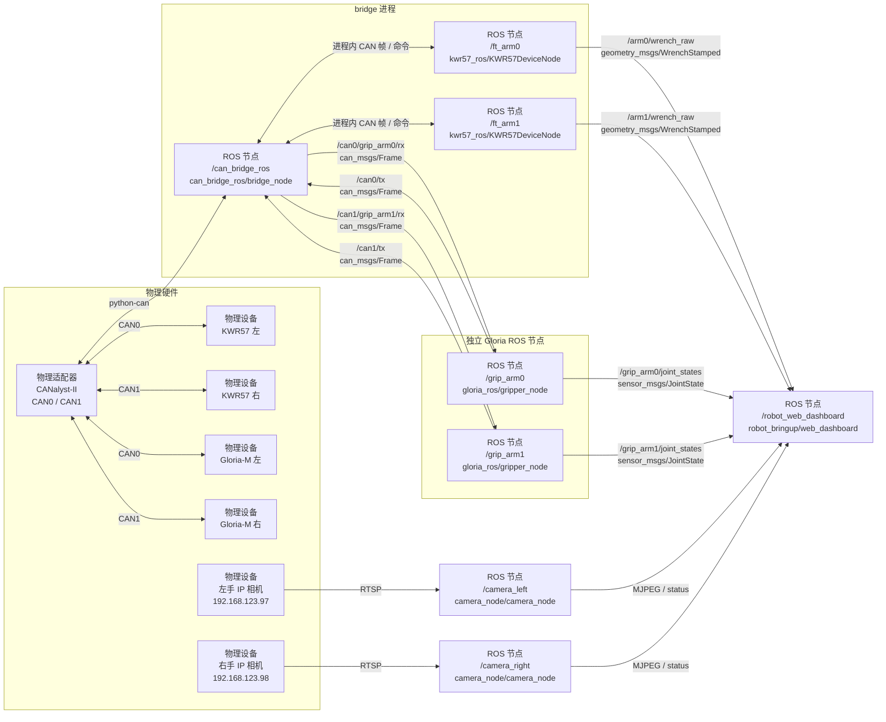

# `robot_bringup`

`robot_bringup` 只负责最终硬件拓扑和启动编排，不实现 CAN、设备协议或视频处理。生产 KWR57 固定使用进程内 handler；Gloria-M 使用专属 `can_msgs/Frame` 话题；左右 IP 相机分别由独立的 `camera_node` 进程处理。物理适配器参数来自 `can_bridge_ros/config/*.yaml`，CAN 设备 ID、输出和路由来自 launch 中的声明式清单，相机部署参数集中在 `robot_bringup/nodes.py`。

## 生产结构

`dual_bus.launch.py`（也是 `web_demo.launch.py` 使用的设备拓扑）的实际数据流如下：



图中每个写有“ROS 节点”的方框都对应一个实际 ROS 2 node。`/can_bridge_ros`、`/ft_arm0` 和 `/ft_arm1` 是同一 bridge 进程中的三个节点；两个 KWR57 节点通过进程内 handler 直接收发 CAN 帧。`/grip_arm0` 和 `/grip_arm1` 是独立的 Gloria 节点，bridge 将命中的 CAN 帧改发到各自的专属 RX 话题，节点完成协议解码后再分别发布 `JointState`。连线文字表示传输方式或 ROS 话题，不表示节点。

每个 `Kwr57Device` 生成一个 handler JSON、三个 `(channel, CAN ID)` 注册、Wrench 输出参数和 ROS 服务；每个 `GloriaDevice` 生成专属 RX 路由和夹爪节点参数。启动前会检查总线、节点名、Wrench 话题以及同通道 CAN ID 冲突。

## 最终硬件清单

`single_bus.launch.py` 描述 CAN0 上的最终四设备拓扑：

| 设备 | 命令 ID | 数据/反馈 ID | 输出或 RX |
|---|---:|---|---|
| `ft_left` | `0x10` | `0x15/0x16/0x17` | `/ft_left/wrench_raw` |
| `ft_right` | `0x11` | `0x18/0x19/0x1A` | `/ft_right/wrench_raw` |
| `grip_left` | `0x01` | `0x101/0x01/0x000` | `/can0/grip_left/rx` |
| `grip_right` | `0x02` | `0x102/0x02/0x000` | `/can0/grip_right/rx` |

网络相机不占用 CAN，总线接线模式变化时仍启动同一组相机：

| 设备 | IP | Web 端口 | ROS 图像话题 |
|---|---|---:|---|
| `camera_left` | `192.168.123.97` | `8010` | `/camera_left/image_raw` |
| `camera_right` | `192.168.123.98` | `8011` | `/camera_right/image_raw` |

两台相机当前均使用 `rtsp://admin:123456@<IP>/stream0`，详细接口和排障方式见 [`camera_node/README.zh.md`](../camera_node/README.zh.md)。

`dual_bus.launch.py` 描述每条总线一台 KWR57 和一台 Gloria-M；不同物理通道可以复用相同 CAN ID。

当前联调台架只接入 CAN0 左手设备，CAN1 右手暂未连接。这个临时接线不改变上述最终硬件清单；实测 Web demo 时只要求左栏的 KWR57 和 Gloria-M 数据在线，右栏无数据或服务调用失败可以忽略。

## 启动

```bash
source scripts/env.sh
bash scripts/run.sh single
bash scripts/run.sh dual
```

以上两个入口都会同时启动左右相机。浏览器通过 `http://<机器人 IP>:8010` 和 `http://<机器人 IP>:8011` 查看视频；左右相机均位于 `192.168.123.0/24`，相机主机必须具备到该子网的路由。

## 双手 Web 联调

从干净环境一次启动双总线四设备和统一网页：

```bash
source scripts/env.sh
ros2 launch robot_bringup web_demo.launch.py
```

浏览器打开 `http://<机器人 IP>:8770`。页面固定为 CAN0 左手、CAN1 右手两栏，每栏同时显示手部相机画面、KWR57 六轴数据、Gloria-M 位置/速度/力矩以及设备在线状态。夹爪只开放 MIT 单次目标和 MIT 往返；往返会先调用设备现有的 `enable` 服务，停止时自动调用 `disable`。

网页节点通过同源 URL `/api/cameras/<left|right>/video_feed` 代理两台相机的 MJPEG，因此远程访问只需转发 `8770`。网页后台独立探测相机 `/status`；相机未连接、启动失败或中途断流时，对应栏显示离线占位，KWR57、夹爪及另一台相机不受影响。`camera_node` 默认每 5 秒在后台尝试恢复期望运行的 RTSP 流，相机后接入或网络恢复后页面会自动重新加载画面；通过相机 Web 的“停止”操作主动停流时不会自动拉起。

如果 `dual_bus.launch.py` 或四个设备节点已经启动，只追加网页节点，不要再次启动 bridge：

```bash
ros2 run robot_bringup web_dashboard
```

单独启动网页节点时，默认仍连接本机 `8010/8011`。相机服务在其他主机或端口时可设置 `left_camera_url`、`right_camera_url`；`web_demo.launch.py` 还暴露 `camera_timeout_s` 和 `camera_poll_period_s`。

远程机器可使用 SSH 端口转发：

```bash
ssh -L 8770:127.0.0.1:8770 user@robot
```

当前只接 CAN0 时，页面右栏保持离线是预期状态，不影响左侧发送夹爪控制并同时观察力传感器与夹爪反馈。

`robot_bringup` 不提供 KWR57 ROS Frame 回退开关。兼容结构只保留在 `kwr57_ros/web_demo.launch.py use_frame_handler:=false` 和 `kwr57_ros/ft_sensor.launch.py`，原因与 PC2 性能数据见 [`kwr57_ros/README.md`](../kwr57_ros/README.md)。

## 修改拓扑

CAN 拓扑只修改 `launch/single_bus.launch.py` 或 `launch/dual_bus.launch.py` 中的 `CanBus`、`Kwr57Device` 和 `GloriaDevice` 清单。不要把设备 ID 写入 bridge 的物理 YAML，也不要为生产 KWR57 增加 `rx_routes`；同一份清单会生成 handler、Gloria 路由和节点参数。左右相机的 IP、RTSP URL、Web 端口和图像话题由 `robot_bringup/nodes.py` 中的两个 `camera(...)` 调用定义。

| 文件 | 职责 |
|---|---|
| `robot_bringup/topology.py` | 设备模型、参数生成和冲突检查 |
| `robot_bringup/nodes.py` | 生成 bridge、Gloria 与左右相机 launch actions |
| `launch/*.launch.py` | 最终硬件清单 |
| `test/test_topology.py` | 无硬件拓扑回归测试 |
| `test/test_camera_bringup.py` | 左右相机节点参数与 bringup 清单回归测试 |
