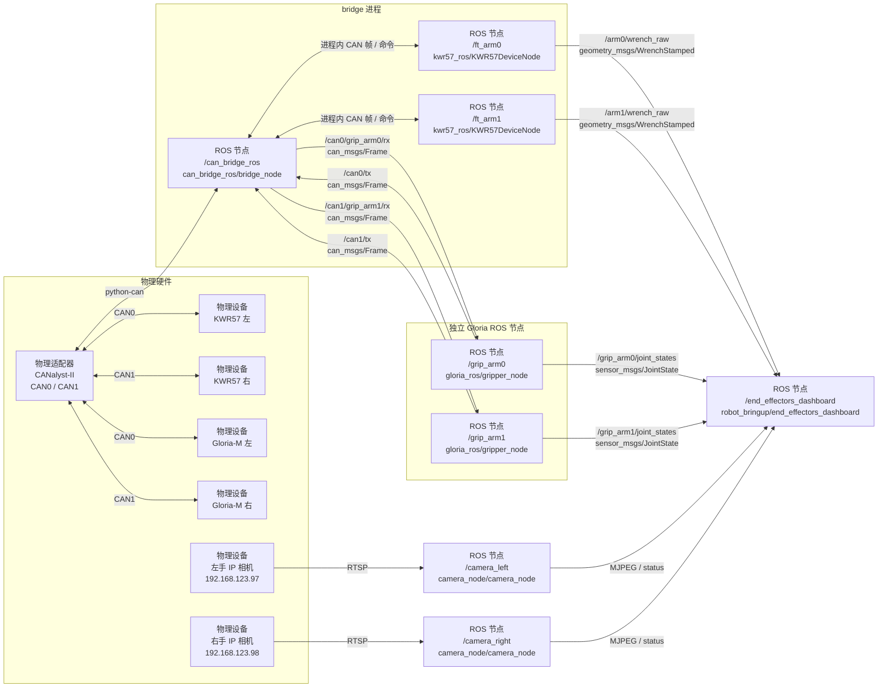

# `robot_bringup`
`robot_bringup` 负责组合本仓库已有节点，不实现 CAN 协议或视频处理。生产数据统一由 `all_data.launch.py` 启动，Dashboard 和受限 MIT 位置控制必须单独手动启动：

| 入口 | 实际启动 |
|---|---|
| `all_data.launch.py scope:=end_effectors` | 末端拓扑：bridge、进程内 KWR57、Gloria-M、左右相机 |
| `all_data.launch.py scope:=whole_body` | 末端拓扑，再增加 LowState/夹爪最新状态缓存、唯一 URDF、`/robot_description` 和 TF |
| `end_effectors_single_bus.launch.py` | `all_data topology:=single` 使用的底层单通道末端拓扑 |
| `end_effectors_dual_bus.launch.py` | `all_data topology:=dual` 使用的底层双通道末端拓扑 |
| `end_effectors_dashboard.launch.py` | 仅端口 `8770` 的末端联调网页；不启动数据节点 |
| `whole_body_dashboard.launch.py` | `unitree_g1_description` 统一 MIT 控制节点与端口 `8200` 的测试网页；不启动数据节点 |

末端设备实现集中在 `robot_bringup/end_effectors/`。`unitree_g1_description` 将 `/lowstate` 转换为 `/joint_states`，并提供只面向测试 Dashboard 的 MIT 位置适配器；它不是通用 `ros2_control` 硬件接口。

## 末端设备结构
`all_data.launch.py scope:=end_effectors topology:=dual` 的实际数据流如下；8770 Dashboard 是独立进程，用户需要时再手动启动：



图中每个写有“ROS 节点”的方框都对应一个实际 ROS 2 node。`/can_bridge_ros`、`/ft_arm0` 和 `/ft_arm1` 是同一 bridge 进程中的三个节点；两个 KWR57 节点通过进程内 handler 直接收发 CAN 帧。`/grip_arm0` 和 `/grip_arm1` 是独立的 Gloria 节点，bridge 将命中的 CAN 帧改发到各自的专属 RX 话题，节点完成协议解码后再分别发布 `JointState`。连线文字表示传输方式或 ROS 话题，不表示节点。

每个 `Kwr57Device` 生成一个 handler JSON、三个 `(channel, CAN ID)` 注册、Wrench 输出参数和 ROS 服务；每个 `GloriaDevice` 生成专属 RX 路由和夹爪节点参数。启动前会检查总线、节点名、Wrench 话题以及同通道 CAN ID 冲突。

## 末端设备清单
`end_effectors_single_bus.launch.py` 描述 CAN0 上的最终四设备拓扑：

| 设备 | 命令 ID | 数据/反馈 ID | 输出或 RX |
|---|---:|---|---|
| `ft_left` | `0x10` | `0x15/0x16/0x17` | `/ft_left/wrench_raw` |
| `ft_right` | `0x11` | `0x18/0x19/0x1A` | `/ft_right/wrench_raw` |
| `grip_left` | `0x01` | `0x101/0x01/0x000` | `/can0/grip_left/rx` |
| `grip_right` | `0x02` | `0x102/0x02/0x000` | `/can0/grip_right/rx` |

网络相机不占用 CAN，总线接线模式变化时仍启动同一组相机：

| 设备 | IP | Web 端口 | ROS 图像话题 |
|---|---|---:|---|
| `camera_left` | `192.168.123.97` | `8010` | `/camera_left/image_raw` |
| `camera_right` | `192.168.123.98` | `8011` | `/camera_right/image_raw` |

两台相机当前均使用 `rtsp://admin:123456@<IP>/stream0`，详细接口和排障方式见 [`camera_node/README.zh.md`](../camera_node/README.zh.md)。

`end_effectors_dual_bus.launch.py` 描述每条总线一台 KWR57 和一台 Gloria-M；不同物理通道可以复用相同 CAN ID。

当前联调台架使用 `end_effectors_dual_bus.launch.py` 的完整四设备拓扑：CAN0 和 CAN1 各接一台 KWR57 与一台 Gloria-M。默认 1 kHz 力传感器流、100 Hz 夹爪往返运动的总线占用与实测见 [`CAN_BUS_LOAD.md`](CAN_BUS_LOAD.md)。

## 数据启动
```bash
source scripts/env.sh
ros2 launch robot_bringup all_data.launch.py scope:=end_effectors topology:=dual
# or
ros2 launch robot_bringup all_data.launch.py scope:=whole_body topology:=dual
```

两个 scope 都启动末端设备；`whole_body` 额外在进程内维护 `/lowstate` 的 29 轴本体状态以及左右 Gloria-M 首个关节状态的最新缓存，并默认以 100 Hz 发布一条统一 `/joint_states`。夹爪状态分别映射到整机 URDF 的 `left_eccentric_joint` 和 `right_eccentric_joint`，整机只启动一份 description 和一个 TF 发布器。两者均不启动 8770/8200 Dashboard。左右相机节点按现有一体化设计同时提供 ROS Image 和 8010/8011 内置页面；相机主机必须具备到 `192.168.123.0/24` 的路由。

生产拓扑默认在启动后自动配置并使能两只 Gloria-M。需要上电保持失能时传入 `enable_grippers_on_start:=false`；这不会改变 `gloria_ros` 独立调试入口默认失能的安全行为。统一状态发布频率可通过 `joint_state_publish_rate_hz` 调整。

`bash scripts/run_end_effectors.sh single|dual` 是 `scope:=end_effectors` 的快捷入口，并在 Ctrl-C 时清理设备进程。

## 双手 Web 联调
先按上一节启动数据，再单独启动统一网页；`topology` 必须一致：
```bash
source scripts/env.sh
ros2 launch robot_bringup end_effectors_dashboard.launch.py topology:=dual
```

Dashboard 以 BEST_EFFORT、`KEEP_LAST(64)` raw 订阅接收原有两路 `WrenchStamped`，高频回调只保存最新序列化样本并计数，HTTP 快照时才反序列化。页面显示 3 秒平均接收频率；最大负载实测左右均约 1 kHz，且没有修改 KWR57 话题或消息。该平均值不代表每个样本都满足 1 ms deadline。

### ROS 夹爪消息发布
双总线生产拓扑中的 `/grip_arm0` 和 `/grip_arm1` 默认使用 MIT 模式。往返控制在反馈位置进入目标 ±0.10 rad 时立即换向，否则最迟 3 秒换向。夹爪节点不会自动重发上一次运动命令，停止发布后仍须显式调用对应的 `disable` 服务。消息、服务和安全参数见 [`gloria_ros/README.md`](../gloria_ros/README.md)。

浏览器打开 `http://<机器人 IP>:8770`。页面固定为 CAN0 左手、CAN1 右手两栏，每栏同时显示手部相机画面、KWR57 六轴数据、Gloria-M 位置/速度/力矩以及设备在线状态。夹爪只开放 MIT 单次目标和 MIT 往返；往返会先调用设备现有的 `enable` 服务，停止时自动调用 `disable`。

网页节点通过同源 URL `/api/cameras/<left|right>/video_feed` 代理两台相机的 MJPEG，因此远程访问只需转发 `8770`。网页后台独立探测相机 `/status`；相机未连接、启动失败或中途断流时，对应栏显示离线占位，KWR57、夹爪及另一台相机不受影响。`camera_node` 默认每 5 秒在后台尝试恢复期望运行的 RTSP 流，相机后接入或网络恢复后页面会自动重新加载画面；通过相机 Web 的“停止”操作主动停流时不会自动拉起。

也可以不经过 launch，直接追加网页节点：

```bash
ros2 run robot_bringup end_effectors_dashboard
```

单独启动网页节点时，默认仍连接本机 `8010/8011`。相机服务在其他主机或端口时可设置 `left_camera_url`、`right_camera_url`；`end_effectors_dashboard.launch.py` 还暴露 `camera_timeout_s` 和 `camera_poll_period_s`。

远程机器可使用 SSH 端口转发：

```bash
ssh -L 8770:127.0.0.1:8770 user@robot
```

双总线四设备接线下，页面左右两栏都应在线；单侧离线时按页面显示的总线和设备节点检查对应通道。

`robot_bringup` 生产拓扑固定使用 KWR57 进程内 handler。ROS Frame 回退只保留在单设备调试入口 `kwr57_ros/ft_sensor_debug.launch.py use_frame_handler:=false` 和外部 bridge 入口 `kwr57_ros/ft_sensor.launch.py`，原因与 PC2 性能数据见 [`kwr57_ros/README.md`](../kwr57_ros/README.md)。

## 整机模型与控制器测试面板
先启动全部数据，再单独启动测试网页：

```bash
source scripts/env.sh
ros2 launch robot_bringup all_data.launch.py scope:=whole_body topology:=dual
ros2 launch robot_bringup whole_body_dashboard.launch.py
```

第一条命令把 `/lowstate` 和两只 Gloria-M 的状态汇入 `/joint_states`，并发布 `/robot_description` 和 TF；第二条命令启动统一 MIT 位置控制节点，并在 `http://<机器人 IP>:8200` 提供网页。控制节点在页面 Engage 前保持不活动。

统一节点提供 `/controller_manager/list_controllers`、`switch_controller` 和 `/whole_body_controller/commands`，再将 29 个本体目标与两个夹爪目标分别转换为 MIT 命令。`robot_bringup` 的启动 wrapper 在进程内将 Dashboard 使用的新版本 controller-manager 字段映射到 Foxy 的字段，`robot_test_dashboard` submodule 保持原状。Engage 的 controller start 服务会通过 `/api/motion_switcher/*` 释放当前运动模式并等待旧 `/lowcmd` 静默，成功后才返回并开始 MIT 输出；Disengage 会先停止并排空低层命令，在默认 10 秒窗口内重试恢复原模式，并以 CheckMode 的实际状态确认结果。若仍无法确认，低层输出保持停止，`switch_controller` 返回失败，避免与迟到的 SelectMode 请求并发。当前 Dashboard 的 Disengage 接口不会透传该失败；实机操作后需独立确认 controller 为 `inactive` 且 CheckMode 已恢复预期模式。若已有外部控制项目，使用 `use_mit_controller:=false`，避免两个控制器管理服务同时存在。控制器切换和页面操作见 [`robot_test_dashboard/README.md`](../robot_test_dashboard/README.md)。

Gloria-M 使用 `kp=10`、`kd=5`。`kd=5` 是 SDK `pack_mit_command()` 将 12 bit 字段映射到 `[0,5]` 后的最大值；输入 10 会在 SDK 层被夹到 5，因此统一节点启动时拒绝超出该范围的配置。

默认模型根帧为 `pelvis`，TCP 为 `right_gripper_base`。没有 `all_data scope:=whole_body` 或等价外部数据源时，页面会等待 `/robot_description`、`/joint_states` 和 TF；没有外部 `/controller_manager` 时只能查看模型，不能测试控制器。

## 修改拓扑
CAN 拓扑只修改 `launch/end_effectors_single_bus.launch.py` 或 `launch/end_effectors_dual_bus.launch.py` 中的 `CanBus`、`Kwr57Device` 和 `GloriaDevice` 清单。不要把设备 ID 写入 bridge 的物理 YAML，也不要为生产 KWR57 增加 `rx_routes`；同一份清单会生成 handler、Gloria 路由和节点参数。左右相机的 IP、RTSP URL、Web 端口和图像话题由 `robot_bringup/end_effectors/nodes.py` 中的两个 `camera(...)` 调用定义。

| 文件 | 职责 |
|---|---|
| `robot_bringup/end_effectors/topology.py` | 末端设备模型、参数生成和冲突检查 |
| `robot_bringup/end_effectors/nodes.py` | 生成 bridge、Gloria 与左右相机 launch actions |
| `robot_bringup/end_effectors/dashboard_node.py` | 双手末端设备 HTTP/ROS 联调节点 |
| `launch/all_data.launch.py` | 统一数据入口，按 scope/topology 组合数据节点 |
| `launch/end_effectors_*_bus.launch.py` | 单/双总线末端硬件清单 |
| `launch/end_effectors_dashboard.launch.py` | 纯末端 Web Dashboard |
| `launch/whole_body_dashboard.launch.py` | 纯整机控制器测试 Dashboard |
| `test/test_end_effectors_*.py` | 末端设备无硬件回归测试 |
