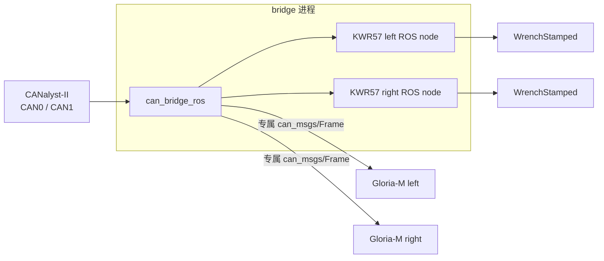

# `robot_bringup`

`robot_bringup` 只负责最终硬件拓扑和启动编排，不实现 CAN 或设备协议。生产 KWR57 固定使用进程内 handler；Gloria-M 使用专属 `can_msgs/Frame` 话题。物理适配器参数来自 `can_bridge_ros/config/*.yaml`，设备 ID、输出和路由来自 launch 中的声明式清单。

## 生产结构



每个 `Kwr57Device` 生成一个 handler JSON、三个 `(channel, CAN ID)` 注册、Wrench 输出参数和 ROS 服务；每个 `GloriaDevice` 生成专属 RX 路由和夹爪节点参数。启动前会检查总线、节点名、Wrench 话题以及同通道 CAN ID 冲突。

## 最终硬件清单

`single_bus.launch.py` 描述 CAN0 上的最终四设备拓扑：

| 设备 | 命令 ID | 数据/反馈 ID | 输出或 RX |
|---|---:|---|---|
| `ft_left` | `0x10` | `0x15/0x16/0x17` | `/ft_left/wrench_raw` |
| `ft_right` | `0x11` | `0x18/0x19/0x1A` | `/ft_right/wrench_raw` |
| `grip_left` | `0x01` | `0x101/0x01/0x000` | `/can0/grip_left/rx` |
| `grip_right` | `0x02` | `0x102/0x02/0x000` | `/can0/grip_right/rx` |

`dual_bus.launch.py` 描述每条总线一台 KWR57 和一台 Gloria-M；不同物理通道可以复用相同 CAN ID。

当前台架没有安装夹爪，并且 CAN0 只连接一台 KWR57。这个临时接线只影响验证方法，不改变上述最终硬件清单；当前实机使用 `ros2 launch kwr57_ros web_demo.launch.py`，完整 bringup 只做构建、launch 生成和拓扑测试，避免向不存在的设备发送命令。

## 启动

```bash
source scripts/env.sh
bash scripts/run.sh single
bash scripts/run.sh dual
```

`robot_bringup` 不提供 KWR57 ROS Frame 回退开关。兼容结构只保留在 `kwr57_ros/web_demo.launch.py use_frame_handler:=false` 和 `kwr57_ros/ft_sensor.launch.py`，原因与 PC2 性能数据见 [`kwr57_ros/README.md`](../kwr57_ros/README.md)。

## 修改拓扑

只修改 `launch/single_bus.launch.py` 或 `launch/dual_bus.launch.py` 中的 `CanBus`、`Kwr57Device` 和 `GloriaDevice` 清单。不要把设备 ID 写入 bridge 的物理 YAML，也不要为生产 KWR57 增加 `rx_routes`；同一份清单会生成 handler、Gloria 路由和节点参数。

| 文件 | 职责 |
|---|---|
| `robot_bringup/topology.py` | 设备模型、参数生成和冲突检查 |
| `robot_bringup/nodes.py` | 生成 bridge 与 Gloria launch actions |
| `launch/*.launch.py` | 最终硬件清单 |
| `test/test_topology.py` | 无硬件拓扑回归测试 |
