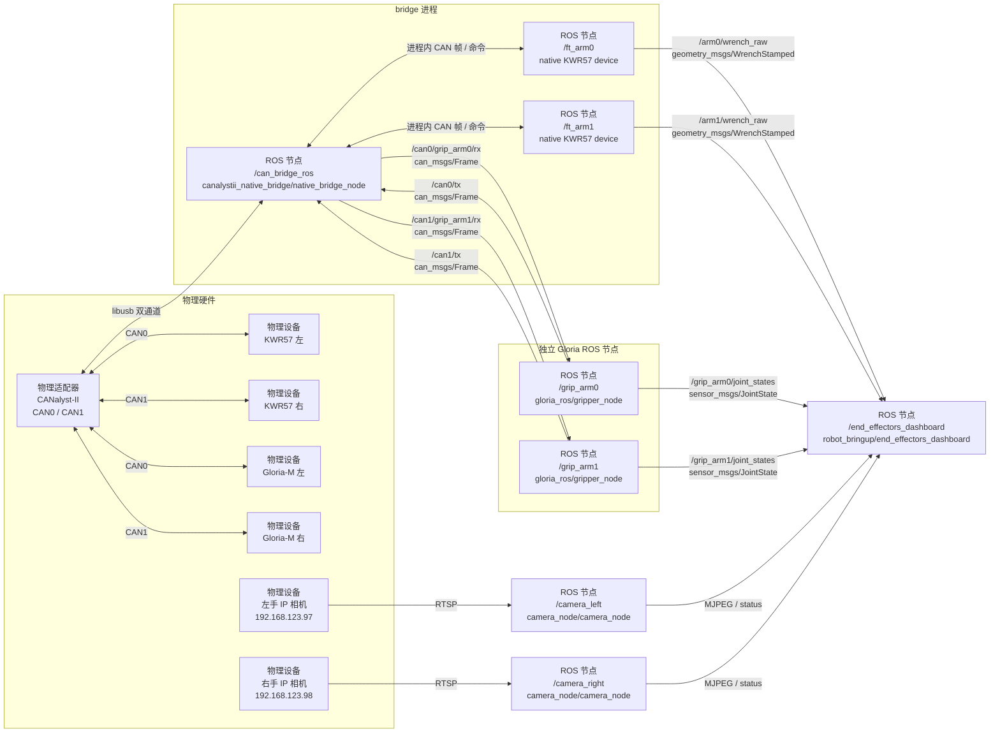
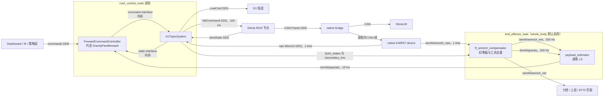

# `robot_bringup`
`robot_bringup` 只组合本仓库已有节点，不实现 CAN 协议、视频处理或控制器。末端设备实现在 `robot_bringup/end_effectors/`；`unitree_g1_description` 提供模型资源，`unitree_g1_ros2_control` 提供真实的 ros2_control `SystemInterface`、C++ controller 与 broadcaster。

## 全部入口
每个终端先 `source scripts/env.sh`，下表命令可直接复制运行。硬件与控制栈只由 `all_data.launch.py` 启动，Dashboard 一律单独起。

| 命令 | 实际启动 |
|---|---|
| `ros2 launch robot_bringup all_data.launch.py scope:=whole_body topology:=dual` | **推荐整机入口**（同时也是全部默认值）：末端拓扑 + 唯一真实 `controller_manager` + 统一硬件插件 + broadcaster + URDF + 互斥 inactive FPC/JTC + 末端负载链 |
| `ros2 launch robot_bringup all_data.launch.py scope:=end_effectors topology:=dual` | 只启末端拓扑：bridge、进程内 KWR57、Gloria-M、左右相机 |
| `ros2 launch robot_bringup all_data.launch.py scope:=whole_body end_effector_load:=false` | 整机但不启净力/负载估计，重力补偿退回标称工具重量 |
| `ros2 launch robot_bringup all_data.launch.py enable_grippers_on_start:=false` | 同上，但两只 Gloria-M 上电保持失能 |
| `ros2 launch robot_bringup end_effectors_single_bus.launch.py` | `all_data topology:=single` 使用的底层单通道末端拓扑 |
| `ros2 launch robot_bringup end_effectors_dual_bus.launch.py` | `all_data topology:=dual` 使用的底层双通道末端拓扑 |
| `ros2 launch robot_bringup end_effector_load.launch.py` | KWR57 净力补偿 + 末端负载估计；`scope:=whole_body` 已默认 include |
| `ros2 launch robot_bringup end_effectors_dashboard.launch.py topology:=dual` | 末端联调网页 `8770`；不启动任何数据节点 |
| `ros2 run robot_bringup end_effectors_dashboard` | 同上，不经过 launch，全用默认参数 |
| `ros2 launch robot_bringup whole_body_dashboard.launch.py` | controller 测试网页 `8200`；连接已有 manager |
| `ros2 launch robot_bringup lowlevel_dashboard.launch.py` | `LowState` 只读监控页 `8210`；不依赖本仓库任何东西 |
| `ros2 launch robot_bringup lowlevel_dashboard.launch.py lowstate_topic:=/lowstate secondary_imu_topic:=/secondary_imu` | 同上，改订 1040 Hz 高频流，代价接近一个核 |
| `ros2 launch robot_bringup ikt_pose_commander.launch.py` | IK Pose Commander + 网页 `8180`；连接已有 FPC/JTC，默认控右手 |
| `ros2 launch robot_bringup ikt_pose_commander.launch.py controlled_frame:=left_gripper_base` | 同上，改控左手 |
| `ros2 launch robot_bringup ikt_pose_commander.launch.py enable_dashboard:=false` | 只启 Commander，不开网页 |
| `ros2 launch robot_bringup gravity_float_demo.launch.py` | 激活 FPC 并让双臂进入可徒手推动的失重状态；连接已有 manager |
| `ros2 control switch_controllers --stop forward_position_controller` | 停掉 demo 遗留的 active FPC |
| `ros2 param set /forward_position_controller compensation_scale 0.0` | 临时关掉手臂重力补偿 |
| `ros2 run robot_bringup enter_debug_mode` | 释放运控模式、交出 `/lowcmd`；走 ros2_control 时不需要 |
| `ros2 run robot_bringup exit_debug_mode` | 卸力斜坡 + 交还 `ai` 模式；控制栈被强杀后的兜底 |
| `kill -INT "$(pgrep -f 'ros2 launch robot_bringup all_data' \| head -1)"` | 正确停控制栈；**绝不要 `pkill`**，原因见下文 |

网页端口：`8770` 末端联调、`8200` 整机 controller、`8210` 底层只读、`8180` IK Commander、`8010`/`8011` 相机自带页。**本机访问用 `127.0.0.1` 而不是 `localhost`**：节点只绑 IPv4 `0.0.0.0`，`localhost` 常先解析到 IPv6 `::1`，表现为页面能开、数据不来。远程转发 `ssh -L 8770:127.0.0.1:8770 user@robot`，其余端口同理。

## 末端设备结构
`all_data.launch.py scope:=end_effectors topology:=dual` 的实际数据流如下；8770 Dashboard 是独立进程，用户需要时再手动启动：


```mermaid
flowchart LR
  subgraph HW["物理硬件"]
    CAN["物理适配器<br/>CANalyst-II<br/>CAN0 / CAN1"]
    KF1["物理设备<br/>KWR57 左"]
    KF2["物理设备<br/>KWR57 右"]
    GM1["物理设备<br/>Gloria-M 左"]
    GM2["物理设备<br/>Gloria-M 右"]
    CL["物理设备<br/>左手 IP 相机<br/>192.168.123.97"]
    CR["物理设备<br/>右手 IP 相机<br/>192.168.123.98"]
    CAN <-->|"CAN0"| KF1
    CAN <-->|"CAN1"| KF2
    CAN <-->|"CAN0"| GM1
    CAN <-->|"CAN1"| GM2
  end

  subgraph BP["bridge 进程"]
    B["ROS 节点<br/>/can_bridge_ros<br/>canalystii_native_bridge/native_bridge_node"]
    K1["ROS 节点<br/>/ft_arm0<br/>native KWR57 device"]
    K2["ROS 节点<br/>/ft_arm1<br/>native KWR57 device"]
    B <-->|"进程内 CAN 帧 / 命令"| K1
    B <-->|"进程内 CAN 帧 / 命令"| K2
  end

  subgraph GP["独立 Gloria ROS 节点"]
    G1["ROS 节点<br/>/grip_arm0<br/>gloria_ros/gripper_node"]
    G2["ROS 节点<br/>/grip_arm1<br/>gloria_ros/gripper_node"]
  end

  CAN <-->|"libusb 双通道"| B
  B -->|"/can0/grip_arm0/rx<br/>can_msgs/Frame"| G1
  B -->|"/can1/grip_arm1/rx<br/>can_msgs/Frame"| G2
  G1 -->|"/can0/tx<br/>can_msgs/Frame"| B
  G2 -->|"/can1/tx<br/>can_msgs/Frame"| B

  WEB["ROS 节点<br/>/end_effectors_dashboard<br/>robot_bringup/end_effectors_dashboard"]
  K1 -->|"/arm0/wrench_raw<br/>geometry_msgs/WrenchStamped"| WEB
  K2 -->|"/arm1/wrench_raw<br/>geometry_msgs/WrenchStamped"| WEB
  G1 -->|"/grip_arm0/joint_states<br/>sensor_msgs/JointState"| WEB
  G2 -->|"/grip_arm1/joint_states<br/>sensor_msgs/JointState"| WEB

  CN1["ROS 节点<br/>/camera_left<br/>camera_node/camera_node"]
  CN2["ROS 节点<br/>/camera_right<br/>camera_node/camera_node"]
  CL -->|"RTSP"| CN1
  CR -->|"RTSP"| CN2
  CN1 -->|"MJPEG / status"| WEB
  CN2 -->|"MJPEG / status"| WEB
```

图中每个写有“ROS 节点”的方框都是一个实际 ROS 2 node。`/can_bridge_ros`、`/ft_arm0`、`/ft_arm1` 是同一原生 C++ bridge 进程中的三个节点，两个 KWR57 节点直接吃进程内 CAN 帧并完成严格三帧组包；`/grip_arm0`、`/grip_arm1` 是独立 Gloria 节点，bridge 把命中的帧改发到各自专属 RX 话题，解码后再发 `JointState`。`can_bridge_ros` 与 `kwr57_ros` 只作为独立调试入口保留，不在上图生产路径里。

启动前会检查总线、节点名、Wrench 话题以及同通道 CAN ID 冲突。

`scope:=whole_body` 在上述设备路径旁增加唯一 `ros2_control_node`，不会在 controller 与硬件插件之间增加 DDS：


```mermaid
flowchart LR
  D["Dashboard / IK / 策略层"] -->|"commands DDS"| C
  subgraph RP["ros2_control_node 进程"]
    C["ForwardCommandController<br/>内含 GravityFeedforward"] -->|"command interface\n内存"| H["G1TopicSystem"]
    H -->|"state interface\n内存"| C
  end
  H -->|"LowCmd DDS"| G1["G1 低层"]
  H -->|"MitCommand DDS，100 Hz"| GL["Gloria ROS 节点"]
  GL -->|"CAN Frame DDS"| B["native bridge"]
  B -->|"CAN"| GH["Gloria-M"]
  B -->|"进程内 CAN 帧"| K["native KWR57 device"]
  K -->|"raw Wrench DDS，1 kHz"| H
  GL -->|"JointState DDS"| H

  subgraph EL["end_effector_load（whole_body 默认启用）"]
    FT["ft_wrench_compensator<br/>扣零偏与工具自重"]
    PE["payload_estimator<br/>递推 LS"]
  end
  K -->|"/armN/wrench_raw，1 kHz"| FT
  H -->|"/joint_states 与 /secondary_imu"| FT
  FT -->|"/armN/wrench_net，200 Hz"| PE
  FT -->|"/armN/gravity，200 Hz"| PE
  FT -->|"/armN/wrench_net"| USE["力控 / 上层 / 8770 页面"]
  PE -->|"/armN/payload，10 Hz"| C
```

LowCmd 编码在 C++ 硬件插件内完成，Gloria 协议在独立 `gloria_ros` 节点，KWR57 三帧协议在 bridge 进程内。这样保留各设备独立 launch 和诊断能力，同时避免 controller-manager facade、状态重发节点和 KWR57 中间 CAN Frame 流。

## 末端设备清单
`end_effectors_single_bus.launch.py` 描述 CAN0 上的最终四设备拓扑：

| 设备 | 命令 ID | 数据/反馈 ID | 输出或 RX |
|---|---:|---|---|
| `ft_left` | `0x10` | `0x15/0x16/0x17` | `/ft_left/wrench_raw` |
| `ft_right` | `0x11` | `0x18/0x19/0x1A` | `/ft_right/wrench_raw` |
| `grip_left` | `0x01` | `0x101/0x01/0x000` | `/can0/grip_left/rx` |
| `grip_right` | `0x02` | `0x102/0x02/0x000` | `/can0/grip_right/rx` |

网络相机不占用 CAN，总线接线模式变化时仍启动同一组相机：

| 设备 | IP | Web 端口 | ROS 图像话题 |
|---|---|---:|---|
| `camera_left` | `192.168.123.97` | `8010` | `/camera_left/image_raw` |
| `camera_right` | `192.168.123.98` | `8011` | `/camera_right/image_raw` |

两台相机均使用 `rtsp://admin:123456@<IP>/stream1` 子码流（640x360，限 15 fps），接口和排障见 [`camera_node/README.zh.md`](../camera_node/README.zh.md)。

`end_effectors_dual_bus.launch.py` 每条总线一台 KWR57 和一台 Gloria-M；不同物理通道可以复用相同 CAN ID。这也是当前联调台架的接线。

KWR57 一律以 **SI 发布**（`use_si=True`）：`geometry_msgs/Wrench` 就定义在 N 与 N·m，发出厂默认的 kgf 等于把一个 9.8 倍的陷阱留给每一个下游。

总线占用实测见 [`CAN_BUS_LOAD.md`](CAN_BUS_LOAD.md)。2026-07-23 的 30 秒生产验收（双 KWR57 + 双 Gloria-M + active FPC，无相机并发）左右 ROS receive 最大 gap `7.027/7.433 ms`、CAN TX `99.999/100.001 Hz`，四设备正常负载目标通过；边界与空 USB 包根因见 [`canalystii_native_bridge/README.md`](../canalystii_native_bridge/README.md)。

生产拓扑固定用 KWR57 进程内 handler。ROS Frame 回退只留在单设备调试入口 `kwr57_ros/ft_sensor_debug.launch.py use_frame_handler:=false` 和外部 bridge 入口 `kwr57_ros/ft_sensor.launch.py`，原因与 PC2 性能数据见 [`kwr57_ros/README.md`](../kwr57_ros/README.md)。

## 数据启动
```bash
source scripts/env.sh
# 推荐整机入口：设备 + 唯一 manager + inactive FPC/JTC
ros2 launch robot_bringup all_data.launch.py scope:=whole_body topology:=dual

# 仅设备和原始话题，不启 ros2_control
ros2 launch robot_bringup all_data.launch.py scope:=end_effectors topology:=dual
```

两个 scope 都启动末端设备；`whole_body` 额外 include `unitree_g1_ros2_control/control.launch.py`，启动唯一真实 `controller_manager`、500 Hz 硬件循环、100 Hz JointState/IMU broadcaster、一份展开 URDF 和一个 TF 发布器。夹爪状态显式命名为 `left_eccentric_joint`、`right_eccentric_joint`。两种 scope 都不启 Dashboard。

相机节点同时提供 ROS Image 和 8010/8011 内置页，但两条路都是**按需拉流**，没人订阅就不连相机；主机必须具备到 `192.168.123.0/24` 的路由。

生产拓扑默认启动后自动配置并使能两只 Gloria-M（`enable_grippers_on_start:=false` 关掉）；这不改变 `gloria_ros` 独立调试入口默认失能的安全行为，也不改变 controller 默认保持 `inactive`。

**不要在同一 ROS graph 重复启动 `control.launch.py`**（`scope:=whole_body` 已 include），也不要同时跑任何会独占 CANalyst-II 的 `*_debug.launch.py`。

### 末端负载（净力 + 自适应重力补偿）
`scope:=whole_body` 默认拉起这条链，链路见上方架构图里的 `end_effector_load` 子图，两个节点各自做什么见 [`arm_gravity_compensation/README.md`](../arm_gravity_compensation/README.md)。

```bash
# 默认已含；传感器拔了、或标定过期想回到标称工具重量时才关掉
ros2 launch robot_bringup all_data.launch.py scope:=whole_body end_effector_load:=false
# 已有整机栈时单独补上
ros2 launch robot_bringup end_effector_load.launch.py
```

**只在 `whole_body` 下有意义**：补偿节点要关节角和躯干 IMU。它依赖仓库里已导出的 `ft_calibration.yaml`；该文件缺失或不合法时只有这两个节点退出，整机栈照常跑，重力补偿在 `payload_timeout_s` 后退回标称工具重量。起来后 8770 页面会自动多画一组净力六轴条。

## 双手 Web 联调
先启数据再启网页，`topology` 必须一致：
```bash
source scripts/env.sh
ros2 launch robot_bringup end_effectors_dashboard.launch.py topology:=dual

# 或者不经过 launch，全用默认参数
ros2 run robot_bringup end_effectors_dashboard
```

浏览器打开 `http://<机器人 IP>:8770`：页面固定为 CAN0 左手、CAN1 右手两栏，每栏同时显示手部相机画面、KWR57 六轴、Gloria-M 位置/速度/力矩以及在线状态。

8770 始终创建 `/grip_*/mit_command` publisher 和夹爪生命周期服务客户端，开放 enable/disable、单次 MIT 目标和往返（反馈位置进入目标 ±0.10 rad 或最长 3 秒后换向，开始前调 `enable`、停止时调 `disable`）。这条路径绕过 controller manager 的 resource claim，**必须配 `scope:=end_effectors`，不能与整机 ros2_control 同时作为命令源**。消息和安全参数见 [`gloria_ros/README.md`](../gloria_ros/README.md)。

Dashboard 以 BEST_EFFORT、`KEEP_LAST(64)` raw 订阅两路 `WrenchStamped`，高频回调只存最新序列化样本并计数，HTTP 快照时才反序列化。页面显示 3 秒平均接收频率，实测左右均约 1 kHz；该平均值不代表每个样本都满足 1 ms deadline。

网页节点通过同源 URL `/api/cameras/<left|right>/video_feed` 代理相机 MJPEG，因此远程只需转发 `8770`。后台独立探测相机 `/status`；某台相机断流时只有对应栏显示离线占位，KWR57、夹爪及另一台相机不受影响。没人看页面时 `/status` 报 `idle` 但仍算在线；页面一打开流就自己起来，断流后每秒自动重连。

代理用两个不同的超时：`camera_timeout_s`（默认 1.0）只管 `/status` 轮询，MJPEG 流用 `camera_stream_timeout_s`（默认 10.0）。相机是按需拉流，从代理接上到第一帧要经过 1 Hz 监管轮询 + RTSP 握手，冷启动 1~3 秒，**拿 1 秒去等首帧会每次都在首帧前超时断开**，表现为相机日志里「开始拉流」后恰好 2 秒就「没人要图，停止拉流」，页面永远白着。

单独跑网页节点时默认仍连本机 `8010/8011`；相机服务在其他主机或端口时设置 `left_camera_url`、`right_camera_url`，`end_effectors_dashboard.launch.py` 还暴露 `camera_timeout_s`、`camera_stream_timeout_s` 和 `camera_poll_period_s`。双总线四设备接线下两栏都应在线；单侧离线时按页面显示的总线和设备节点查对应通道。

## 底层数据监控页
把 `LowState` 的每一个字段铺出来，包括 `g1_motion_control` 那个页面没有的力矩、电压、`sensor` 和 `mode`：
```bash
source scripts/env.sh
ros2 launch robot_bringup lowlevel_dashboard.launch.py
```

浏览器打开 `http://<机器人 IP>:8210`。**本机访问用 `127.0.0.1` 而不是 `localhost`**：节点只绑 IPv4 `0.0.0.0`，而 `localhost` 常先解析到 IPv6 `::1`，表现为页面能打开、数据却一直不来。

这个页面**不依赖本工作区的任何东西**：它直接订阅 G1 固件发的话题，不需要 `all_data`、`/controller_manager`、`/robot_description` 或 TF。控制栈没起来也能看，正好用来判断"是机器人没数据还是我们的栈有问题"。

| 页面区域 | 内容 |
|---|---|
| 左上表格 | 35 个电机槽（29 本体 + 6 宇树预留，预留默认折叠），每行 `mode`、`q`、`dq`、`ddq`、`tau_est`、外壳/绕组温度、`vol`、`motorstate`、`sensor` |
| 左下 IMU | 盆骨（`LowState.imu_state`）与躯干（`/lf/secondary_imu`）对照。四元数按固件的 **`w x y z`** 原样显示，不是 ROS 的 `xyzw` |
| 右侧曲线 | 勾表格**列头**决定画哪些信号，勾表格**行**决定画哪些电机；每列一张图、各自的量纲与 Y 轴。单张窄于 600 px 就自动折行并把图均分到各行 |
| 顶部 | `mode_pr`、`mode_machine`、`tick`、实测总线频率 |

`wireless_remote`（40 字节遥控器原始数据）和 `crc`、`version` 折叠在 IMU 下方。

**纯只读**：不发布任何话题、不调用任何服务，`ros2 node info /lowlevel_dashboard` 的 Publishers 只有 `/rosout` 和 `/parameter_events`。没人看页面时会退订，页面重开自动订回。

默认订阅固件的 `/lf/*` 低频版。`/lf/lowstate` 与 `/lowstate`、`/lf/secondary_imu` 与 `/secondary_imu` 都由 G1 固件直发（ROS 图里显示为 `_CREATED_BY_BARE_DDS_APP_`，因为它用裸 CycloneDDS 而不是 rclcpp），内容逐字段相同，只差频率：

| 话题 | 实测频率 | 何时用 |
|---|---|---|
| `/lf/lowstate` + `/lf/secondary_imu`（默认） | 20 Hz | 日常监控，够用 |
| `/lowstate` + `/secondary_imu` | 1040 Hz | 看高频细节时换过去，代价是接近一个核 |

```bash
ros2 launch robot_bringup lowlevel_dashboard.launch.py \
  lowstate_topic:=/lowstate secondary_imu_topic:=/secondary_imu
```

两路都用 `raw=True` 订阅，回调只存字节串，反序列化（实测 712 µs，占整条链路 79%）推迟到浏览器真的来问的那一刻——所以开销跟的是页面轮询频率，不是总线频率。不这么做时 spin 线程握着 GIL 不放，HTTP 单次响应会被饿到 200 ms。页面固定 20 Hz 轮询，和总线对齐，再快只会拿到重复帧。

## 整机 ros2_control 与测试面板
先启动全部硬件与真实控制栈，再单独启动测试网页：
```bash
source scripts/env.sh
ros2 launch robot_bringup all_data.launch.py scope:=whole_body topology:=dual
ros2 launch robot_bringup whole_body_dashboard.launch.py
```

第一条启动唯一 `/controller_manager`，将 `/lowstate`、双 Gloria-M、双 KWR57 和 pelvis IMU 接入 `hardware_interface`，发布 `/robot_description`、TF 与统一 `/joint_states`；第二条只在 `http://<机器人 IP>:8200` 提供网页。FPC 和 JTC 均已加载但保持 `inactive`，且 claim 相同的 29 个 G1 关节和两只 Gloria，因此只能激活其中一个。夹爪采用独立、更宽的 `0.75 s` feedback timeout，单侧 stale 只停该侧，不切断本体 LowCmd。

Dashboard wrapper 只把切换超时放宽到 30 秒并做切换后状态校验，不代理任何 controller-manager 服务。Web 快照还会按 URDF joint limit 一次性重算 Gloria-M 的受限分段 mimic FK，并隐藏 `internal_*` 虚拟 link/joint，不改变 `/joint_states`、TF 或控制链。Engage/Disengage 的 MotionSwitcher、夹爪生命周期、状态 freshness 和回滚由 C++ 硬件插件执行，详见 [`unitree_g1_ros2_control/README.md`](../unitree_g1_ros2_control/README.md)。实机 Disengage 后仍建议独立确认 controller 为 `inactive`、命令接口为 `unclaimed`、两只夹爪已失能且 MotionSwitcher 模式已恢复。

手臂重力补偿已内置在 FPC 里，不是第三个 controller，页面上只看得到 FPC 和 JTC 两个互斥项：

```bash
# 临时不要补偿
ros2 param set /forward_position_controller compensation_scale 0.0
```

`robot_test_dashboard` 不是 controller 实现，只是通用测试客户端：对 JTC 生成单点 `JointTrajectory`，对 FPC 生成限速后的 `Float64MultiArray`。真正的 JTC 是 ROS 2 `joint_trajectory_controller` 标准插件，本工作区只在 `unitree_g1_ros2_control` 中保存其实例配置。IK 也不属于 Dashboard 或硬件插件，它由 `ikt_core` 求解、由 Pose Commander 选择目标并调用 FPC/JTC。

Gloria-M 使用 `kp=10`、`kd=5`。`kd=5` 是 SDK `pack_mit_command()` 将 12 bit 字段映射到 `[0,5]` 后的最大值；输入 10 会在 SDK 层被夹到 5，因此统一节点启动时拒绝超出该范围的配置。

默认模型根帧为 `pelvis`，TCP 为 `right_gripper_base`。没有真实 ros2_control 栈时，页面会等待 `/robot_description`、`/joint_states`、TF 和 `/controller_manager`。

### 接入 IK Pose Commander
保持上面的整机数据与控制栈运行，再启动 G1 适配入口：
```bash
source scripts/env.sh
ros2 launch robot_bringup ikt_pose_commander.launch.py

# 改控左手
ros2 launch robot_bringup ikt_pose_commander.launch.py controlled_frame:=left_gripper_base
# 只要 Commander，不要 8180 网页
ros2 launch robot_bringup ikt_pose_commander.launch.py enable_dashboard:=false
```

该入口连接两个真实 controller：自定义 FPC 用于 **Track robot** 连续跟踪，上游标准 JTC 用于 **Snap robot**、Disable 后持位和 `return_to_start`。两者配置完全相同的 31 个 position command interface，Commander 通过 `/controller_manager/switch_controller` 一启一停，manager 的资源 claim 保证它们不能同时 active。两者最终都只写 `G1TopicSystem` 的 position command interface，实际 MIT 命令仍由硬件插件生成，没有第二条底层下发通道。Stop/Disengage 在同一次 `switch_controller` 里把两者一起停掉。

FPC 那条全量位置流直接发到 `/forward_position_controller/commands`，它自己把标定后的手臂重力偏移加在每个 setpoint 上（每拍重算、跟随躯干姿态），手臂因此停在指令位姿上而不是沉在它下方。

FPC 用一个 200 Hz control timer 完成“读取最新 Cartesian 目标、必要时求解 IK、更新全关节 target 缓存并发布”的完整周期。缓存按 controller 的 31 个关节名建立，首次缺失项才从实测位置初始化；每次 IK 结果只覆盖本次动态 active-joint 区间，区间外关节继续用上次设定的 target，而不是用实时反馈回填。因此切换控制手或 controller 后仍保留另一只手及其余关节的设定目标。浏览器只允许一个目标请求在途，等待槽只保留最新姿态；每个到达的 `/api/target` 立即发布一次 ROS 目标，100 Hz 定时器只负责保活。目标订阅和 FPC 命令链均为 `KEEP_LAST(1)`，不会在恢复后回放拖动期间的旧 setpoint。

网页选择的 base/target 同时定义本次 IK 的活动关节区间。适配层从完整 Pinocchio 模型创建动态 active-joint 视图，只向未修改的 `ikt_core.solve()` 暴露该区间的 Jacobian 列，再把结果散射回完整关节向量，因此求解矩阵维度随选择变化：`pelvis -> right_gripper_base` 10 维，`torso_link -> right_gripper_base` 7 维，`right_shoulder_yaw_link -> right_gripper_base` 4 维。base 与 target 在不同分支时沿两端到最近公共祖先的唯一链路建立并用相对位姿误差，例如 `torso_link -> left_ankle_roll_link` 为 3 腰 + 6 左腿共 9 维。

默认跟踪参数 `control_rate_hz=200`、`stream_rate_hz=100`、`max_joint_speed=2 rad/s`，即单步上限 `2 / 200 = 0.01 rad`。这是 Commander 对 target 缓存的**上游**限速，不是 C++ FPC 自身的限位：C++ FPC 只接受宽度正确且全部有限的全量 target 并原样写入 hardware interface，不加误差窗、跳变、速度/加速度或命令超时回填。`G1TopicSystem` 同样**不读 URDF position command interface 的 `min/max`、不对目标做任何限幅**：MIT 阻抗控制靠目标与反馈的偏移产生力矩，在这一层裁剪会直接改变期望的恢复力矩。本体 `NaN/Inf` 时跳过整帧 `LowCmd`，夹爪 `NaN/Inf` 时只跳过对应侧。

不可达或奇异目标保持 `best-effort`：IK 每次只从当前实测关节 seed 求解并发送最接近配置，不切中立 seed、不保存“最后可达解”，也不需要恢复服务。目标回到可达区域时会在同一控制周期链上自然恢复。

适配入口只处理动态模型视图、固定的 G1 控制器名和最长 30 秒的硬件接管等待，不修改 toolkit submodule。默认控制帧 `right_gripper_base`、参考帧 `torso_link`，Dashboard 在 `http://<机器人 IP>:8180`，并复用整机测试页面的 Gloria-M 受限分段 mimic FK 与 `internal_*` 虚拟节点过滤。

启动仍默认 disabled。先在页面确认模型、关节状态、控制帧和两个 controller 均已识别，再 Engage。任一控制器都会同时 claim G1 本体与双夹爪；力传感器不参与 Commander 的命令闭环。

### 手臂失重 demo
先按上面启动整机数据与控制栈，再单独启动 demo：
```bash
source scripts/env.sh
ros2 launch robot_bringup gravity_float_demo.launch.py
```

它做两件事：把 `forward_position_controller` 切到 active（重力补偿已内置在它里，不需要第二个 controller），然后启动 `gravity_float_demo` 节点。

该节点把 **14 个手臂关节**的目标持续跟随 `/joint_states` 的实测值。controller 随后写出 `q_cmd = q_meas + G(q_meas)/kp`，电机实际施加：
```
tau = kp*(q_cmd - q_meas) - kd*dq = G(q_meas) - kd*dq
```

位置项恰好抵消，只剩重力项和阻尼：手臂在任意姿态都能自撑自重，你只需克服阻尼就能推动它。

**其余 17 个关节（腿、腰、夹爪）只在启动时快照一次，之后锁死。** 重力前馈对非手臂关节是透传的，如果它们也跟随实测值，力矩就只剩 `-kd*dq`，腿会发软。浮动关节列表由 launch 从重力表 `left.joints` / `right.joints` 读出，与 controller 实际补偿的范围严格一致。

启动瞬间有 2 s 斜坡（controller 的 `offset_ramp_s`），在此期间手臂会从下垂位置逐渐抬起到持平。

**不要让手臂长时间停在水平位附近。** 肩 pitch 没有减速自锁，保持姿态全靠持续电流，手臂水平伸出时约 20 N·m，是最恶劣的持续工况。实测悬停数分钟后 `left_shoulder_pitch` 绕组到 97 °C。补偿越准电机越会老实地一直顶着，热负荷比标定时高一个量级。用完及时退出调试模式，玩的时候优先把手臂放低。

电机失去命令后不再接受位置指令，`tau_est` 掉到约 0，只剩绕组阻尼——**手感是“紧”而不是“软”**，很容易误判成软件把命令锁死了。字段含义见 [G1.md](../../G1.md) 的「MotorState.mode 与故障字段」。

停止：`Ctrl-C` 结束 demo 后，controller 仍是 active，需要显式停回去。
```bash
ros2 control switch_controllers --stop forward_position_controller
```

### 进入调试模式
用 ros2_control 时不需要这一步：`G1TopicSystem` 在 Engage 时自己走 MotionSwitcher `CheckMode`(1001) → `ReleaseMode`(1003)。**只有绕开 controller、自己发 `/lowcmd` 时才需要显式切换**。

待机的 `ai` **自己就在以 1 kHz 发 `/lowcmd`**，内容全零（`mode=1`，`q`/`dq`/`tau`/`kp`/`kd` 都是 0）——使能但不出力。这些零帧不把关节拉向别的目标，所以运控没释放时外部 `/lowcmd` **看起来能动**，实际是两条流交替、命令被稀释。释放后 `/lowcmd` 掉到 **0 Hz**，那才是独占。

```bash
source scripts/env.sh
ros2 run robot_bringup enter_debug_mode
```

它只释放运控模式，**不发任何 `/lowcmd`**：切换后机器人处于无人接管状态，谁开始发 `/lowcmd` 谁接管，且必须自己把增益从零升上来（运控模式不做交接）。日志会打印 `mode_machine`，写 `LowCmd` 时必须原样填回去，并且每帧都要算 CRC——直接用 `arm_gravity_compensation.lowcmd` 的 `populate_arm_command()`，它同时处理 `mode`/`mode_pr`/CRC。

| 参数 | 默认 | 说明 |
|---|---|---|
| `--allow-from` | `ai` | 允许从哪些模式释放；空模式名恒定允许 |
| `--force` | — | 释放任意模式，**正在撑着机器人的模式会直接瘫倒** |
| `--call-timeout` | 3.0 | 单次 MotionSwitcher 应答超时 |
| `--release-timeout` | 10.0 | 等待模式清空的总时长 |

唯一的拦截是 `--allow-from`，用来避免"从站立模式释放导致瘫倒"。遥控器上 `L2+B` 可以先切到阻尼再挂起机器人，模式表见 [G1.md](../../G1.md)。

**这里不检查 `/lowcmd` 是否静默。** 这个工具一帧都不发，抢不了总线；而释放前总线上那 1 kHz 本来就是 `ai` 自己的，查了必然误报。防双 publisher 是接管程序的责任，且只有在释放**之后**查才有意义。

### 退出调试模式
正常用 `Ctrl-C` 关闭 `all_data.launch.py scope:=whole_body` 时，`G1TopicSystem::stop()` 会自动花 2s 把关节增益降到零，再把机器人交还给 `ai`（零力矩）模式，**不需要额外命令**。

> **不要用 `pkill` 停控制栈。** 各节点的清理逻辑都挂在 SIGINT 上，`pkill` 默认发 SIGTERM，rclpy 不处理它，rclcpp 也来不及跑完关闭序列。本仓库已经因此踩过三次坑：
>
> | 被跳过的清理 | 后果 |
> |---|---|
> | `G1TopicSystem::stop()` 的卸力斜坡 | 关节保持最后一帧命令持续吃电流，肩部绕组升到 97 °C |
> | `gloria_ros` 的 `disable_on_shutdown` | 两只 Gloria-M 一直留在使能态 |
> | `native_bridge_node` 的 USB 传输取消 | CANalyst-II 固件卡死，之后每次启动都报 `LIBUSB_ERROR_TIMEOUT`，**只能物理拔插复位** |
>
> 必须用信号时也要发 SIGINT，且**只发给 launch 进程**，由它按依赖顺序转发：
>
> ```bash
> kill -INT "$(pgrep -f 'ros2 launch robot_bringup all_data' | head -1)"
> ```
>
> 发给整个进程组（`kill -INT -- -PID`）会让子进程被直接杀死，launch 来不及编排关闭，效果和 `pkill` 一样。

控制栈被强杀、崩溃或从未启动时该路径不会执行，关节会保持最后一帧命令持续吃电流。用这个工具兜底：
```bash
source scripts/env.sh
ros2 run robot_bringup exit_debug_mode
```

它不走 ros2_control，直连 `/lowcmd` 与 MotionSwitcher，所以控制栈是否存在都能用。

| 参数 | 默认 | 说明 |
|---|---|---|
| `--ramp-s` | 2.0 | 力矩淡出时长 |
| `--damping` | 1.5 | 下降全程保持的 `kd`，调大可以降得更慢 |
| `--motion-mode` | `ai` | 交还的运动服务，`ai` 即零力矩模式 |
| `--keep-debug-mode` | — | 只卸力，不交还运控服务 |

交还给 `ai` 之后 `/lowcmd` 会立刻恢复那 1 kHz 零帧流，所以再要自己控制必须重新 `enter_debug_mode`。

手臂最终一定停在自然下垂位——把它举着本身就要力矩，任何卸力都以下垂告终；斜坡只决定它是缓降还是硞下来。原理见 [G1.md](../../G1.md) 的「退出低层控制必须主动卸力」。

## 修改拓扑
CAN 设备部署只改 `robot_bringup/end_effectors/topology.py` 的 `deployed_topology()`。不要把设备 ID 写进 bridge 的物理 YAML，也不要为生产 KWR57 增加 `rx_routes`——同一份清单会生成 handler、Gloria 路由、设备节点参数和 Dashboard 连接参数。兄弟包只接收普通 launch 参数，不导入该清单。左右相机部署由 `end_effectors/nodes.py` 中的两个 `camera(...)` 调用定义。

```text
robot_bringup/
├── launch/
│   ├── all_data.launch.py               统一数据入口，按 scope/topology 组合数据节点
│   ├── end_effectors_single_bus.launch.py  单总线末端部署，生成硬件 actions
│   ├── end_effectors_dual_bus.launch.py    双总线末端部署，生成硬件 actions
│   ├── end_effector_load.launch.py      净力补偿 + 负载估计两节点
│   ├── end_effectors_dashboard.launch.py   纯末端 Web Dashboard（8770）
│   ├── whole_body_dashboard.launch.py   纯整机控制器测试 Dashboard（8200）
│   ├── lowlevel_dashboard.launch.py     纯底层只读监控页（8210）
│   ├── ikt_pose_commander.launch.py     对接互斥 FPC/JTC 的 IK Commander（8180）
│   └── gravity_float_demo.launch.py     激活 FPC 并跟随实测值的失重 demo
├── robot_bringup/
│   ├── end_effectors/
│   │   ├── topology.py                  末端部署清单、设备模型、参数生成和冲突检查
│   │   ├── nodes.py                     生成 bridge、Gloria 与左右相机 launch actions
│   │   ├── dashboard_node.py            双手末端设备 HTTP/ROS 联调节点
│   │   └── dashboard.html               8770 页面
│   ├── lowlevel/
│   │   ├── dashboard_node.py            LowState 只读监控节点
│   │   └── static/                      8210 页面（HTML/CSS/JS + 曲线组件）
│   ├── ik_model_view.py                 完整 Pinocchio 模型的动态 active-joint 视图
│   ├── ikt_pose_commander_compat.py     IK Commander 与其 Dashboard 的 G1 适配层
│   ├── dashboard_compat_node.py         8200 页面的 controller 切换 wrapper
│   ├── gravity_float_demo.py            失重 demo 节点
│   ├── enter_debug_mode.py              释放运控模式
│   └── exit_debug_mode.py               卸力斜坡 + 交还运控模式
└── test/                                无硬件回归测试（拓扑、launch 边界、各 Dashboard）
```

