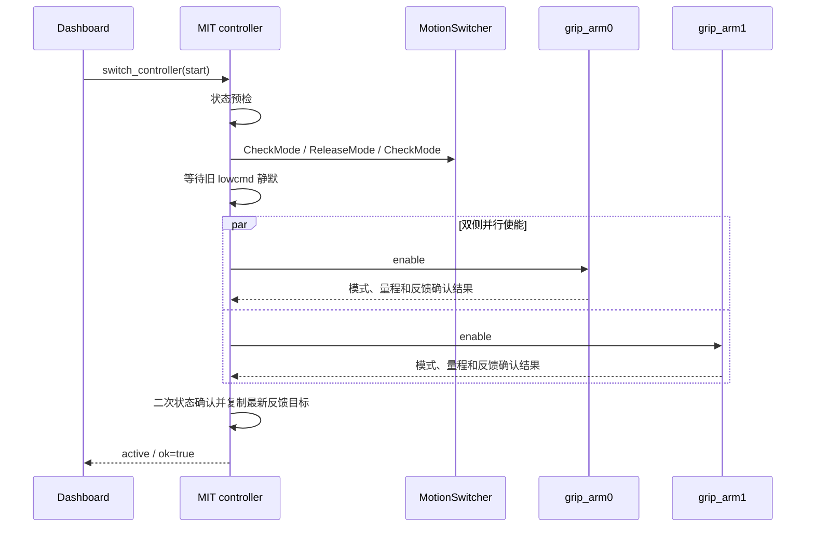

# unitree_g1_description
`unitree_g1_description` 提供 Unitree G1 全身模型、状态适配和统一 MIT 位置控制能力。该包把 G1 的 29 路本体关节与两只 Gloria-M 夹爪组合成标准的 31 路 `/joint_states`，并可将同一顺序的 31 个位置目标拆分为：
- G1 前 29 路 `/lowcmd` MIT 命令；
- 左、右 Gloria-M 各一路 MIT 命令。

控制节点只在 controller 已激活、反馈新鲜且目标通过限位与连续性检查时发送命令。默认由 MotionSwitcher 在 Engage 时释放当前高层运动模式、等待原 `/lowcmd` 流静默，再并行调用左右 Gloria-M 的 `enable` 服务；两侧均成功后才激活命令输出。Disengage、状态故障和节点正常退出时先停止本节点的命令流，再并行调用左右 `disable`，最后恢复接管前的运动模式。任一 Engage 步骤失败都会失能双夹爪并恢复原模式，controller 保持 `inactive`。

## 主要内容

| 路径 | 用途 |
| --- | --- |
| `model/` | G1、Gloria-M 及组合后的 URDF/Xacro 模型 |
| `config/default_29dof_param.yaml` | G1 本体 29 轴 MIT `kp`、`kd` 默认值 |
| `unitree_g1_description/lowstate_to_joint_states_node.py` | 将 `/lowstate` 与双夹爪状态合并为 31 路 `/joint_states` |
| `unitree_g1_description/mit_position_controller_node.py` | controller-manager facade 和 31 路统一 MIT 位置控制节点 |
| `unitree_g1_description/motion_switcher.py` | Unitree MotionSwitcher topic 客户端 |
| `unitree_g1_description/mit_command.py` | 增益与 URDF 限位加载、G1 `LowCmd` CRC |

## 启动
仅启动模型、状态合并和 TF，不发送运动命令：
```bash
source scripts/env.sh
ros2 launch unitree_g1_description g1_data.launch.py
```

在已有 `/lowstate`、双夹爪状态和 `/joint_states` 数据源时，启动统一 MIT 控制节点：
```bash
source scripts/env.sh
ros2 launch unitree_g1_description mit_control.launch.py
```

节点提供以下 controller-manager 兼容接口：
- `/controller_manager/list_controllers`
- `/controller_manager/switch_controller`
- `/whole_body_controller/commands`

`/whole_body_controller/commands` 使用 `std_msgs/msg/Float64MultiArray`，必须包含 31 个位置目标，并严格采用 `/joint_states` 中定义的控制顺序：前 29 项为 G1 本体关节，最后两项依次为 `left_eccentric_joint` 和 `right_eccentric_joint`。

完整数据链与测试 Dashboard 的启动方式见工作区根目录的 [README](../../README.md) 和 [robot_bringup/README](../robot_bringup/README.md)。

## Engage 事务

Dashboard 的 Engage 最终调用 `/controller_manager/switch_controller`，请求启动 `whole_body_controller`。整个切换由控制节点的切换锁串行化；同一请求同时包含 start 和 stop 会被拒绝。若 controller 已经是 `active`，重复 Engage 直接返回成功，不重新执行硬件切换。

首次 Engage 严格按以下顺序执行：

1. **状态预检**：确认 G1 命令发布线程仍正常，`/lowstate` 与统一 `/joint_states` 未超过 `state_timeout_s`，`mode_pr` 满足要求，并且 29 个本体关节与两个夹爪主关节的反馈都存在。预检失败时不会接管本体运动模式，但仍会向两只夹爪发送 `disable`，controller 保持 `inactive`。
2. **接管本体低层控制**：调用 MotionSwitcher `CheckMode` 记录当前模式；若存在活动模式，则调用 `ReleaseMode`，每次释放后重新 `CheckMode`，最多尝试 `motion_release_attempts` 次。确认没有活动模式后，继续等待已有 `/lowcmd` 流至少静默 `lowcmd_quiet_period_s`。首次 `CheckMode` 失败时因无法确定原模式而直接终止；记录到原模式后的释放、确认或静默等待失败，会按配置尝试恢复原模式并终止 Engage。
3. **使能双夹爪**：并行调用 `/grip_arm0/enable` 和 `/grip_arm1/enable`。每侧调用共享一个 `gripper_service_timeout_s` 总期限，包含等待服务和等待响应。Gloria-M 的 `enable` 服务内部还会配置并确认 MIT 模式、核验 PMAX/VMAX/TMAX，并等待使能后的新反馈；两侧都返回成功才继续。
4. **二次状态确认**：夹爪使能可能持续数秒，因此再次执行与第 1 步相同的状态检查，避免使用 Engage 开始前已经过期的反馈。
5. **从反馈建立保持目标**：按固定的 31 路控制顺序复制最新反馈位置，设置为初始目标，然后才把 controller 标记为 `active`。只有从这一刻起，500 Hz G1 `/lowcmd` 和 100 Hz 双夹爪 MIT 命令才允许发布。



### Engage 失败回滚

| 失败位置 | 回滚行为 | 最终状态 |
| --- | --- | --- |
| 初始状态预检 | 并行请求双夹爪 `disable`；尚未接管本体模式 | `inactive`，不发布命令 |
| MotionSwitcher 接管 | 尽可能恢复接管前模式，并行请求双夹爪 `disable` | `inactive`，不发布命令 |
| 任一夹爪 Enable | 对两侧都调用 `disable`，包括已经成功或客户端已超时的一侧；再恢复原模式 | `inactive`，不发布命令 |
| 二次状态确认 | 对两侧调用 `disable`，恢复原模式 | `inactive`，不发布命令 |

Gloria-M 的 `disable` 服务可取消仍在执行的 Enable，并在返回前发送失能帧；但固件没有独立的失能确认响应，因此服务成功表示失能命令已经发出，不表示硬件另行确认。实机失败回滚后仍应检查两只夹爪状态和现场安全条件。

`enable_grippers_on_start:=true` 与 Engage 是两个独立阶段：生产数据拓扑可在启动时预先使能夹爪，Engage 仍会显式调用两侧 `enable`；设备已经使能、模式正确且反馈新鲜时，该服务按幂等成功处理。设置 `manage_motion_mode:=false` 只跳过 MotionSwitcher 的释放与恢复，双夹爪 Enable/Disable 和其余状态检查仍然执行。设置 `restore_motion_mode:=false` 时仍会释放原模式并执行夹爪生命周期，但失败回滚和 Disengage 不会重新选择运动模式；启用恢复时，恢复目标为 Engage 前记录的模式，记录值为空则使用 `fallback_motion_mode`。

相关默认时限如下：

| 参数 | 默认值 | 作用 |
| --- | ---: | --- |
| `state_timeout_s` | `0.25 s` | Engage 前后判定状态是否新鲜 |
| `motion_switch_timeout_s` | `1.0 s` | 单次 MotionSwitcher 请求时限 |
| `motion_release_attempts` | `3` | 释放原活动模式的最大尝试次数 |
| `motion_release_retry_s` | `0.2 s` | 每次 ReleaseMode 后再次 CheckMode 前的等待时间 |
| `lowcmd_quiet_period_s` | `0.1 s` | 接管前要求旧 `/lowcmd` 连续静默时间 |
| `lowcmd_quiet_timeout_s` | `2.0 s` | 等待旧 `/lowcmd` 静默的总时限 |
| `gripper_service_timeout_s` | `3.0 s` | 每侧夹爪 Enable/Disable 的总服务时限 |
| `motion_select_timeout_s` | `10.0 s` | 失败回滚或 Disengage 时恢复运动模式的总确认窗口 |

`robot_bringup` 的 Dashboard 兼容 wrapper 将网页等待 `switch_controller` 的时间扩展为 30 秒，以覆盖 Engage 成功路径和失败后的完整回滚；该 30 秒不是控制器内部单步超时。

## `default_29dof_param.yaml`

### 出处
G1 29 轴默认增益整理自 Unitree 官方 `unitree_rl_mjlab` 仓库的部署参数：
[unitree_rl_mjlab/deploy/robots/g1/config/policy/velocity/v0/params/deploy.yaml](https://github.com/unitreerobotics/unitree_rl_mjlab/blob/main/deploy/robots/g1/config/policy/velocity/v0/params/deploy.yaml)

上游文件通过 `joint_ids_map: [0, ..., 28]` 标识 29 路关节，并将 `stiffness`、`damping` 用作部署时的关节 PD 增益；它们不是策略网络的权重。本包保留这两组数值，将其分别映射为 G1 MIT 命令的 `kp`、`kd`，并增加显式的 `joint_names` 列表，用于防止增益数组因关节顺序变化而错配。该文件只描述 G1 本体 29 轴，不包含两只 Gloria-M 夹爪；夹爪增益由 `mit_control.launch.py` 的 `gripper_kp`、`gripper_kd` 参数独立配置，默认分别为 `10` 和 `5`。

### 字段含义

| 字段 | 长度 | 含义 |
| --- | ---: | --- |
| `joint_names` | 29 | 每组增益对应的 G1 关节名及固定顺序，必须与代码中的 `G1_JOINT_NAMES` 完全一致 |
| `stiffness` | 29 | MIT 命令的比例增益 `kp`，表示位置刚度，近似单位为 `N·m/rad` |
| `damping` | 29 | MIT 命令的微分增益 `kd`，表示速度阻尼，近似单位为 `N·m·s/rad` |

统一控制节点对每个 G1 关节发送：
$$
\tau_{cmd} = k_p(q_{target} - q) + k_d(\dot q_{target} - \dot q) + \tau_{ff}
$$

当前实现设置 $\dot q_{target}=0$、$\tau_{ff}=0$，因此：
- `stiffness` 越大，关节对位置误差的纠正越强，表现为更“硬”；
- `damping` 越大，对关节速度的抑制越强，可减小振荡，但过大会使响应迟钝或产生较大的阻尼力矩；
- 每个数组下标必须始终对应同一 `joint_names` 下标，不能只调整列表顺序而不同时调整两组增益。

节点启动时会校验三个数组均为 29 项、数值有限且 `joint_names` 顺序完全匹配；任一条件不满足都会拒绝启动。修改增益后应先在机器人可靠支撑、目标保持当前反馈位姿且现场可急停的条件下验证，避免直接用未经验证的高增益驱动实机。

## 默认发布频率与安全参数
- G1 `/lowcmd`：500 Hz；
- 双 Gloria-M MIT 命令：100 Hz；
- Gloria-M：`kp=10`、`kd=5`，其中 `kd=5` 是 SDK/固件 12 bit MIT 编码范围的上限；
- Dashboard 命令超时：0.25 s，超时后保持最新反馈姿态；
- 运动模式恢复确认窗口：10 s；
- 未激活、反馈过期、目标越界或状态异常时不发送新的低层命令。

具体参数及默认值见 [mit_control.launch.py](launch/mit_control.launch.py)。