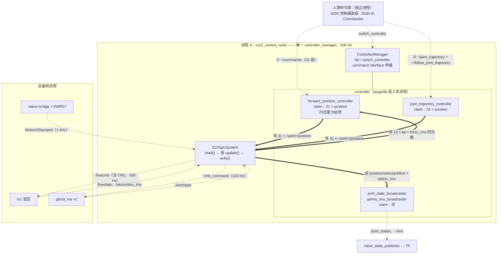
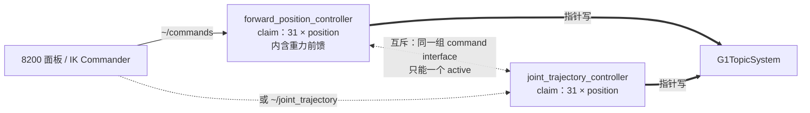
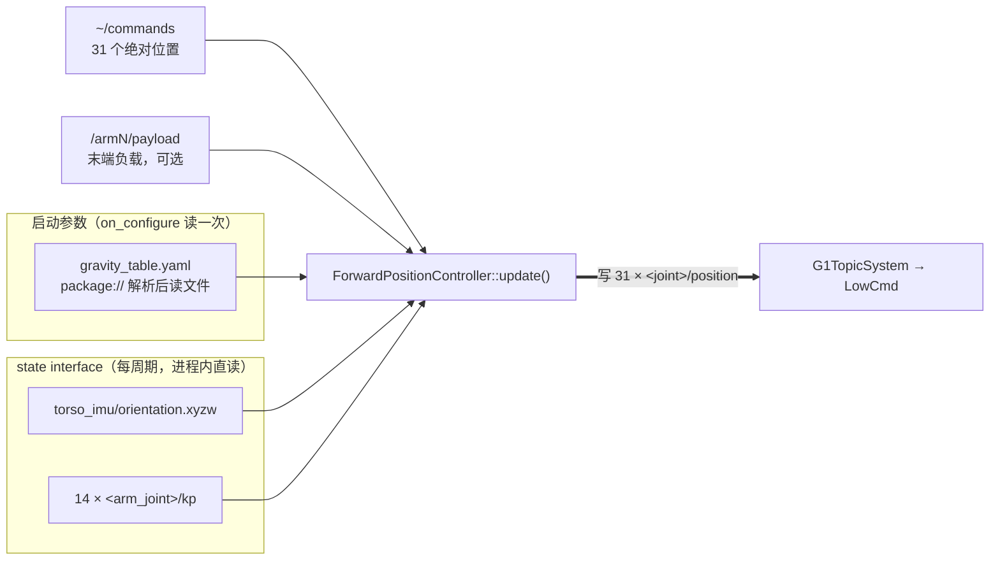

# unitree_g1_ros2_control

## 概览
本包负责把 ros2_control 的**关节位置命令**变成设备真正接收的 **MIT 命令**，并把 G1、双夹爪、双 FT 和 IMU 的反馈变成 ros2_control 状态。

> 简单理解：FPC/JTC 只写目标位置；`G1TopicSystem` 再填齐 MIT 命令所需的其他字段，然后发布 G1 `LowCmd` 或夹爪 `MitCommand`。

具体来说，`q` 来自 position interface，`kp/kd` 来自[默认增益表](config/default_31dof_param.yaml)，`dq/tau` 固定为 `0`，`mode` 固定为 MIT 模式，`mode_machine` 跟随 `/lowstate`，CRC 在发布前计算。夹爪的 `q` 同样来自 position interface，后两项增益分别写入左右夹爪命令。实际位置闭环由设备底层完成。

| 组件 | 负责 |
|---|---|
| `G1TopicSystem` | 生成 MIT 命令，执行控制权与反馈安全检查 |
| `ForwardPositionController` | 校验全量命令的维度与有限值，合法目标原样写入 position interface |
| `JointTrajectoryController` | 使用标准 JTC 执行离散关节轨迹 |
| broadcasters | 按需发布关节、IMU 和 FT 状态 |
| `control.launch.py` | 启动唯一 controller manager、硬件插件、RSP 和 controllers |

本包不负责 IK、动作规划、网页交互或设备 CAN 协议。命令链为 `Dashboard / IK -> FPC 或 JTC -> position interface -> G1TopicSystem -> LowCmd / MitCommand`；FPC 与 JTC 互斥使用同一组 position interface。

## 系统结构

### 先看懂 ros2_control 的三个概念
不熟悉 ros2_control 的话，只需要这三个：

- **hardware interface（硬件插件）**——唯一碰真实设备的东西。它把设备"能读的量"导出成 **state interface**、"能写的量"导出成 **command interface**；每个 interface 就是一个具名的 `double`，例如 `left_elbow_joint/position`。本包的实现是 `G1TopicSystem`。
- **controller**——读 state interface、写 command interface 的算法插件。它不知道下面是真机还是仿真，也不知道 `LowCmd` 长什么样。
- **controller_manager**——把上面两者装进**同一个进程**，按固定频率跑 `read() → 所有 active controller 的 update() → write()`，并**仲裁**谁能写哪个 command interface：同一个 command interface 在任意时刻只能被一个 controller claim。FPC 与 JTC 的互斥完全来自这条规则，没有任何额外代码。

关键一点：**controller 与硬件插件之间没有话题**，是同进程的指针读写。只有"外部节点 → controller"这一段才走 DDS。

### 进程布局
下面这张图是**从外朝里**读的：上游客户端在最上面，往下依次是 controller、硬件插件、真实设备。箭头上标的就是各自的接口名。



读图三条规则：

- **虚线 `-.->` 是 DDS**（跨进程或同进程回环都算），**粗实线 `==>` 是同进程指针读写**——后者不经过任何序列化，也不会丢帧。
- **①② 是两个互斥入口**，上游同一时刻只能用其中一个：FPC/JTC claim 同一组 command interface，manager 强制互斥。
- 只有 `G1TopicSystem` 碰真实设备；FPC/JTC 从头到尾不知道 `LowCmd` 长什么样。

下面几节把图上每条边的消息类型、QoS 和数量展开。

### 每个部件由哪个 launch 启动

| 部件 | 启动它的 launch | 启动后状态 |
|---|---|---|
| `ros2_control_node`（含 manager + 全部 controller + `G1TopicSystem`） | [control.launch.py](launch/control.launch.py)，被 `robot_bringup/all_data.launch.py scope:=whole_body` include | 唯一 manager，500 Hz |
| `robot_state_publisher` | 同上 | 发 `/robot_description` 与 TF |
| `joint_state_broadcaster`、`pelvis_imu_broadcaster` | 同上，`spawner` | **active**，各 100 Hz |
| `forward_position_controller`、`joint_trajectory_controller` | 同上，`spawner --inactive` | **inactive**，用谁激活谁 |
| `left_ft_broadcaster`、`right_ft_broadcaster` | 已在 `controllers.yaml` 注册，默认不 spawn | 未加载（KWR57 raw 话题已存在，避免 1 kHz 重复发布） |
| CAN bridge、KWR57、Gloria-M、相机 | `robot_bringup/all_data.launch.py`（两个 scope 都启动） | 独立进程 |
| 8200 控制器测试网页 | `robot_bringup/whole_body_dashboard.launch.py` | 独立进程，纯客户端 |
| 8180 IK Commander + 网页 | `robot_bringup/ikt_pose_commander.launch.py` | 独立进程 |

`all_data.launch.py scope:=whole_body` 已经 include 本包的 `control.launch.py`——**不要再起第二个 manager**。

### 两个 controller 的对外接口

| | `forward_position_controller`（FPC） | `joint_trajectory_controller`（JTC） |
|---|---|---|
| plugin type | `unitree_g1_forward_command_controller/ForwardCommandController` | `unitree_g1_joint_trajectory_controller/JointTrajectoryController`（上游官方类的子类） |
| **输入**（DDS） | 话题 `~/commands`<br/>`std_msgs/Float64MultiArray`，31 个绝对位置<br/>BEST_EFFORT · KEEP_LAST(1) | 话题 `~/joint_trajectory`<br/>+ action `~/follow_joint_trajectory`<br/>（`control_msgs/FollowJointTrajectory`） |
| **输出** | 写 command interface（含重力偏移） | 写 command interface（含重力偏移） |
| claim 的 command interface | 31 × `<joint>/position` | 31 × `<joint>/position`（同一组） |
| 读的 state interface | 31 × `<joint>/position`<br/>+ 4 × `torso_imu/orientation.{x,y,z,w}`<br/>+ 14 × `<arm_joint>/kp` | 31 × `position`、`velocity`<br/>+ 同样 4 + 14 个 |
| 运行时可调参数 | `compensation_scale`（无锁写，active 时可改） | 同左，另加标准 JTC 容差等 |

两个 broadcaster 方向相反——它们只读 state interface，往外发话题：`joint_state_broadcaster` → `/joint_states`（100 Hz），`pelvis_imu_broadcaster` → `sensor_name: pelvis_imu` / `frame_id: pelvis`（100 Hz）。

### controller 之间的关系：互斥



- **互斥（FPC ↔ JTC）**：两者从 `default_31dof_param.yaml` 的 `/**.ros__parameters.joints` 读取同一组 31 个 `<joint>/position`。ResourceManager 拒绝重复 claim，所以 `switch_controller` 激活其中一个时必须同时停掉另一个。这不是约定，是硬约束。
- **重力补偿不是第三个 controller**，而是这两个 controller 内部各自的一段前馈（见下节），参数名和含义完全一致。「要不要补偿」是 `compensation_scale` 参数，不是「激活哪个 controller」。

### `G1TopicSystem` 的接口

它有上下两个面。**对上（面向 controller，同进程指针）**就是[硬件资源](#硬件资源)那张表里的 state / command interface；简言之只有 31 个 position **可写**，其余全部只读。

**对下（面向设备，DDS）**：

| 方向 | 话题 / 服务 | 类型 | QoS | 说明 |
|---|---|---|---|---|
| 发布 | `/lowcmd`（`lowcmd_topic`） | `unitree_hg/LowCmd` | RELIABLE · KEEP_LAST(5) | 每个 `write()` 一帧，含 CRC |
| 发布 | 左右夹爪 `~/mit_command` | `gloria_ros/MitCommand` | RELIABLE · KEEP_LAST(5) | 固定相位降采样到 100 Hz |
| 订阅 | `/lowstate` | `unitree_hg/LowState` | BEST_EFFORT · KEEP_LAST(1) | 29 关节 + **盆骨** IMU |
| 订阅 | `/secondary_imu`（`torso_imu_topic`） | `unitree_hg/IMUState` | 同上 | **躯干** IMU，重力补偿用的就是它 |
| 订阅 | 左右夹爪 `JointState` | `sensor_msgs/JointState` | 同上 | 两个 `eccentric_joint` |
| 订阅 | 左右 KWR57 `WrenchStamped` | `geometry_msgs/WrenchStamped` | BEST_EFFORT · KEEP_LAST(64) | 1 kHz raw，原子快照读取 |
| 订阅 | `/lowcmd`（自订阅） | `unitree_hg/LowCmd` | BEST_EFFORT · KEEP_LAST(1) | 只记录时间戳，用于确认交还控制权后总线上确实没人再发 |
| 收发 | `/api/motion_switcher/request` `/response` | `unitree_api/Request` `/Response` | RELIABLE · KEEP_LAST(1) | 接管/交还运控模式 |
| 服务客户端 | `<gripper_node>/enable`、`/disable` | `std_srvs/Trigger` | — | Engage/Disengage 时的夹爪生命周期 |

这些收发都跑在插件自建的 `<hw_name>_topic_bridge` 节点 + 独立 `SingleThreadedExecutor` 线程上，**不占用 500 Hz 控制线程**；回调只更新缓存或完成事务，`read()` 再把缓存拷进 state 数组。这里刻意不加并发 callback worker，避免在 PC2 上为这些高频订阅引入额外调度竞争。

## 实现细节

### 硬件资源
`unitree_g1_ros2_control/G1TopicSystem` 导出：

| 资源 | 数量 | 输入/输出 |
|---|---:|---|
| 关节 position command | 31 | G1 `/lowcmd`，双 Gloria-M `~/mit_command` |
| 关节 position/velocity/effort state | 93 | `/lowstate` 与双 Gloria-M `JointState` |
| 关节 `kp`/`kd` state | 62 | 插件实际写入命令的增益 |
| 双 FT state | 12 | 左右 KWR57 原始 `WrenchStamped` |
| `pelvis_imu` state | 10 | `/lowstate.imu_state`（**盆骨**） |
| `torso_imu` state | 10 | `/secondary_imu`（**躯干**，`torso_imu_topic` 可改） |

G1 有两颗 IMU，中间隔着三个腰关节，弯腰时重力方向相差可达 10°（实测依据见 [`G1.md`](../../G1.md)）。以 `torso_link` 为根的计算必须用 `torso_imu`。因为 `unitree_g1_description/model` 是 submodule，`torso_imu` 直接由插件导出，未写入 URDF 的 `<ros2_control>` 标签；接口名与 `pelvis_imu` 完全一致，可用 `torso_imu_sensor` 参数重命名，置空 `torso_imu_topic` 则不订阅也不导出。

manager 以 500 Hz 调用 `read()`/`write()`。G1 命令直接从 `write()` 发布；Gloria-M 在同一路径内用 steady clock 固定相位 deadline 降采样到 100 Hz。若一次 `write()` 错过一个或多个时隙，deadline 直接前移到下一个未来时隙，不补发过期命令，也不按“当前时刻 + 10 ms”累积漂移。KWR57 raw 保持设备节点原有 1 kHz 话题，插件用每侧原子快照读取，不增加转发节点。FT 数值按 `9.80665` 从 kgf/kgf m 转为 SI；Unitree 四元数从 `w,x,y,z` 转为 ROS `x,y,z,w` 并归一化。

`default_31dof_param.yaml` 是 31 轴顺序的唯一来源：`/**.ros__parameters.joints` 由 ROS 2 wildcard 同时注入 FPC 和 JTC，`/g1_gain_table.ros__parameters` 保存同序的 `stiffness`/`damping`。Humble 的 spawner 依次加载这份公共文件和 controller 专属文件；后者只保留各自不同的参数。前 29 项保持 G1 物理电机顺序，最后两项分别是 `left_eccentric_joint` 和 `right_eccentric_joint`。`arm_stiffness_scale` 只缩放双臂 15–28 号关节的 `kp`，夹爪、腿、腰和全部 `kd` 不变。唯一数值默认值由底层 `G1TopicSystem` 持有，为 `1.0`；上层 launch/xacro 的默认值为空，因此默认生成的 URDF 不包含该字段。需要覆盖时显式传入（例如 `arm_stiffness_scale:=2.5`），xacro 才会把它写入 ros2_control hardware 参数；允许范围为 `(0, 4]`。

**缩放后的最终增益以 `<joint>/kp`、`<joint>/kd` state interface 导出**。它们也是 `write()` 写入本体 `LowCmd` 和左右夹爪 `MitCommand` 的同一份数据，所以任何需要知道增益的 controller（如重力补偿）都不必重复声明增益文件，也不会遗漏同步。

硬件导出的 31 个 command interface 由 `forward_position_controller`（FPC）或 `joint_trajectory_controller`（JTC）互斥 claim。ros2_control 的 claim 只提供命令资源互斥，不检查反馈是否新鲜；feedback freshness 是 `G1TopicSystem` 自己实现的安全策略。G1 使用 `state_timeout_s=0.25 s`，Gloria 使用独立的 `gripper_state_timeout_s=0.75 s`。单侧夹爪 stale 时只跳过该侧 MIT 输出，G1 LowCmd 和另一侧不受影响；反馈恢复后该侧自然恢复。

启动反馈到达前，对外 joint state 使用有限零值，IMU 使用单位四元数，避免 `robot_state_publisher` 产生 NaN TF。控制安全仍由独立的 `received` 标志和 freshness 检查决定，中性启动值不能使 controller 通过 Engage。

### 手臂重力补偿（内置于两个运动 controller）
重力前馈不是单独的 controller，而是 [`GravityFeedforward`](include/unitree_g1_ros2_control/gravity_feedforward.hpp) 这个类：FPC 和 JTC 各持有一个成员，参数名、state interface 和数值行为完全相同。它只改写 14 个手臂位，其余位原样透传，之后直接写 command interface。纯数学部分（`load_gravity_table` / `update_torso_gravity` / `arm_offsets`）不碰任何 ROS 类型，可单独做数值单测。



除 31 个位置反馈外另读 18 个 state interface（4 个 IMU 四元数 + 14 个 `kp`），全部是同进程内的 `double` 直读，无序列化。state interface 不互斥，所以多 claim 这 18 个不影响任何其他 controller。

电机内部执行 $\tau = k_p(q_{cmd}-q) - k_d\dot q$，想让手臂停在 $q_{target}$ 就需要
$$q_{cmd} = q_{target} + s\,\frac{G(q_{target})}{k_p}$$

其中 $s$ 是 `compensation_scale`（默认 1.0），可运行时调：

```bash
ros2 param set /forward_position_controller compensation_scale 0.95
```

标定残留的共模误差只有手臂浮起来后才看得出（表现为缓慢上飘或下沉），靠手感拧到位比重新辨识快得多。写入是无锁的，可在 controller 活动时随时改；**设为 `0.0` 就是纯转发行为**（代替了以前「不激活重力补偿 controller」这个用法），下一拍即生效，不用等新指令。

> 设为 `0.0` 时激活斜坡也会**回到 0 并按住**，所以重新拧回 `1.0` 是按 `offset_ramp_s` 重新爬升的。否则斜坡早就满了，一开就是整个 ~0.4 rad 阶跃——正是斜坡要防的那个冲击。順带跳过了每拍的 28 次 sin/cos，但那只是 0.9 µs，不是重点（见下）。

> 这个倍率曾是在替一个缺陷擦屁股：单向逼近的静态标定把静摩擦当成了质量，系统性抬高约 5%。
> **2026-08-19 已改成双向逼近标定**，摩擦项在两个方向的平均里恒等消去，这一项系统偏差不再存在。
> 重新标定后应先把 $s$ 放回 **1.0** 再看需不需要拧；仍需大幅偏离 1.0 就不是摩擦了，
> 该查零空间漂移（尚未修复）。两个缺陷的现状见
> [arm_gravity_compensation/README.md](../arm_gravity_compensation/README.md)，
> 数学推导见 [CALIBRATION.md](../arm_gravity_compensation/CALIBRATION.md)。

三个关键选择：
- **$G$ 在目标位置求值**，不是实测位置。目标无噪声、天然领先于测量，且这本就是平衡条件要求的。用速度外推测量位置反而会引入系数为 $K_g\Delta t$ 的负阻尼。
- **不补偿 `kd`**。阻尼是稳定项，且稳态下 $\dot q \to 0$ 本就不进入偏移量。
- **$k_p$ 从 `<joint>/kp` state interface 读**，不在 controller 配置里重写。增益不一致会把每一个补偿力矩按同比例算错而没有任何外部症状，所以只允许一个数据源。

#### 自适应末端负载
`left_payload_topic` / `right_payload_topic`（默认 `/arm0/payload`、`/arm1/payload`，`geometry_msgs/InertiaStamped`）上的质量与质心会经 `gravity_table.yaml` 里的 `payload_origin_*` 变换到腕 yaw 关节系，与最后一个刚体合成，然后照常走那一次反向遍历——所以上游七个关节自动全都吃到了它，`arm_offsets` 仍然只有七个刚体。

发布者是 `payload_estimator`（见 [arm_gravity_compensation/README.md](../arm_gravity_compensation/README.md)）。这里只做三道防线，都在 `advance_payload`：

| 参数 | 默认 | 作用 |
|---|---|---|
| `maximum_payload_mass` | 3.0 | 超限的消息整条丢弃（质心离传感器超过 1 m 也丢） |
| `payload_filter_tau_s` | 1.0 | 一阶滤波。负载一拍出现就会把命令阶跃整个偏移量 |
| `payload_timeout_s` | 2.0 | 发布者不说话就衰减回零。**死掉的估计器不该留一个幻影负载把手臂顶着** |

没有 payload 发布者时行为与改动前逐位相同：`activate` 把负载清零，超时立即生效。表里没有 `payload_origin_*`（旧导出）时整条负载通路自动关闭。

#### 它到底多贵（实测）
Jetson 上实测一次完整求值（IMU 滤波 + 两条链共14 个刚体）：

| 构建方式 | 每拍耗时 | 占 500 Hz 周期 |
|---|---|---|
| colcon 默认（`CMAKE_BUILD_TYPE` 为空，**无 -O**） | 21.7 µs | 1.09% |
| `RelWithDebInfo` | 0.89 µs | 0.045% |

**差 24 倍。** 所以真正值得做的不是给重力补偿加快速通道，而是把这个包编进优化——`CMakeLists.txt` 现在在未指定时默认 `RelWithDebInfo`（保留符号以便 profile，命令行显式传 `-DCMAKE_BUILD_TYPE=` 仍优先）。同一个 24 倍也作用在 `G1TopicSystem` 的 `read()`/`write()` 上。

> 工作区其他包仍是默认无优化。要全局打开用
> `colcon build --cmake-args -DCMAKE_BUILD_TYPE=RelWithDebInfo`。

#### 为什么必须内置，而不是另起一个 controller
这段逻辑曾经是一个独立的 `arm_gravity_compensation` controller，通过 DDS 把改写后的 31 个 `double` 转发给 FPC。那个结构有个**正确性**问题，不只是多激活一次：

- 重力偏移必须**每拍**跟随躯干姿态和激活斜坡重算，所以它每拍都重发；而 FPC 用 `RealtimeBuffer` + 序号去重，**只在 executor 投递消息的那一拍才更新**。订阅回调由 `MultiThreadedExecutor` 派发，不在 500 Hz 控制线程上——于是一个 500 Hz 的重力跟随被 executor 抖动重采样（某一拍 0 条，下一拍 2 条只用最后一条）。站着不动看不出来，躯干持续俯仰翻滚时就是相位滞后 → 手臂下坠和振荡。
- 顺带的开销：订阅回调里每拍一次 `make_shared` + vector 拷贝，500 Hz 就是每秒 1000 次堆分配 + 500 次序列化/反序列化/executor 唤醒，只为在同一个进程里传 31 个 `double`。

Foxy 和 Humble 都没有办法让一个 controller 直接调另一个 controller 的接口。Humble 的 `ChainableControllerInterface` 也不行——它解决的是进程内交接和依赖管理，**依旧要同时 activate 两个**。合并是唯一能做到只激活一个、且偏移量与写硬件同拍的办法。

#### 轨迹控制器怎么拿到同一份偏移
`joint_trajectory_controller` 是上游包的类，不能改它的代码，所以本包继承出 `GravityJointTrajectoryController`，在它的 `update()` 外面加偏移。关键在于上游 controller **在保持位置时根本不写 command interface**，直接“读回来再加偏移”会把自己的输出当成输入，每拍累加一次，手臂直接飞走。因此顺序是：

1. 先把上一拍的**裸** setpoint 写回 command interface；
2. 调上游 `update()`（它不读 command interface，只可能覆写）；
3. 再读回来——无论它写了没写，拿到的都是裸 setpoint；
4. 加偏移写下去。

因为步骤 2 的前提是“不读 command interface”，`open_loop_control: true` 会让它从 command interface 取初值，那时偏移已经在里面了——所以两者**同时开启会在 `on_configure` 直接报错**。激活后到第一个轨迹到达之前不写任何命令，保持 FPC→JTC 交接时的零位移行为不变。

#### 重力表里有什么
Controller 不解析 URDF、也不依赖任何动力学库。URDF 中与静态重力有关的只有两类信息，它们已在导出时蒸馏进 `gravity_table`（默认 `package://arm_gravity_compensation/config/gravity_table.yaml`，即仓库内受版本管理的那份；参数同时接受普通绝对路径和 `~`）：

| 重力需要的 | URDF 字段 | 表里的字段 | 形状（每侧） |
|---|---|---|---|
| 运动学 | `<joint><origin>` | `origin_xyz` `origin_rotation` | 7×3、7×9 |
| 运动学 | `<joint><axis>` | `axis` | 7×3 |
| 惯性 | `<inertial><mass>` | `mass` | 7 |
| 惯性 | `<inertial><origin>` | `com` | 7×3 |

另带顶层 `imu_to_torso`（3×3）把 IMU 姿态转到躯干系。visual、collision、limit、mimic 和惯量张量全部不在表中——静态重力矩与它们无关。

每侧只有 **7 个已归并的刚体**。腕偏航下游那 8 个固连件（KWR57、夹爪基座、偏心轮、两组滑块连杆）之间没有相对运动，在**任意**姿态下它们对任何关节的力矩贡献都只通过 $\sum m_j$ 和 $\sum m_j c_j$ 进入，所以合并成一个等效体无任何精度损失。

每周期两趟循环：先沿链做正运动学
$$t_i = t_{i-1} + R_{i-1}\,\mathrm{origin\_xyz}_i,\qquad R_i = R_{i-1}\,\mathrm{origin\_rotation}_i\,\mathrm{Rot}(\mathrm{axis}_i, q_i)$$
再用下游力矩求和
$$\tau_i = -\,a_i \cdot \Big[\Big(\textstyle\sum_{j\ge i} p_j - t_i \sum_{j\ge i} m_j\Big) \times g\Big],\qquad a_i = R_i\,\mathrm{axis}_i,\quad p_j = m_j(t_j + R_j c_j)$$
7 次 3×3 矩阵乘加 7 次叉积。该实现与 Pinocchio 在 50 组随机姿态 + 随机重力方向下对拍，最大偏差 $10^{-15}$ N·m（即双精度舍入）。

#### 为什么不在 controller 里链 Pinocchio
不是因为没有 C++ 版。开发镜像里的 `ros-humble-pinocchio` 4.0.0 是正经系统包，rosdep 解析得到，`libpinocchio_*.so` 就在 `/opt/ros/humble/lib/aarch64-linux-gnu/` 下，链起来没有任何障碍。真正的理由是：

- **文件无论如何都要导**。标定出的参数总得有个载体传给 controller。既然已经在写文件，写归并后的形式不多花任何代价，反而省掉运行时重做一遍解析和归并。
- **规模差得多**。完整模型 108 link，归并后每侧 7 体；后者在 500 Hz 循环里只是几十次浮点运算，也不引入 Boost / urdfdom / Eigen 的依赖链。
- **运行时不该依赖标定输入**。链 Pinocchio 就意味着 controller 要在启动时读 URDF 并重建模型，等于把标定期的输入拖进实时路径；而它真正需要的只是标定的**输出**。

Pinocchio 仍然用在**导出那一步**：标定包里用它读 `final.urdf`、`buildReducedModel` 做归并、写出表。这和“源码 → 编译产物”是一回事，controller 拿到的是编译好的东西。

表中不包含力矩偏置。标定出的 `torque_bias` 留在 `parameters.json` 里，**仍未导出到运行时**。

原因曾经是：单向标定下它的作用是吸收静摩擦和传感器偏移以保护质量估计，而静摩擦是反抗运动方向的、不是恒定单向的。把它回放到运行时等于持续朝一个方向推关节，在位置保持模式下被 $k_p$ 吐掉看不出来，在手臂浮起来时则直接表现为单向爬行。实测 `right_shoulder_roll` 的偏置到了 0.813 N·m，而其余 13 个关节绝对值的中位数只有 0.122。

**2026-08-19 改成双向逼近后，这个阻碍已经消失**（摩擦不再被吸进 `torque_bias`），但**导出本身仍未实现**：重力表 schema 、`GravityTable` 的解析和 `arm_offsets()` 都还没有偏置项。
要加的话需要先用新标定重新确认偏置的量级（应该显著小于 0.813），再同时改导出与读取两端。

#### 安全限制
偏移量**不设人为上限**，与本包其他环节一致（见下面「安全切换」）。它是纯前馈量 $G(q_{target})/k_p$，输入只有已校验的重力表（质量有限非负）和归一化到 9.81 的重力方向，没有反馈回路，因此天然由标定时的负载定界；人为 clamp 只会在负载变重时悄悄削弱补偿。

> 整条链路（FPC → `G1TopicSystem`）都不读 URDF 关节限位。目标本就靠近机械限位时，重力偏移会把 `q_cmd` 推出限位外，关节会以 $k_p \times$ 超出量 顶在硬限位上（`arm_stiffness_scale=2` 时 $k_p$ 约 28.6 N·m/rad）。这是 MIT 阻抗控制的固有行为，不是重力前馈特有的。

激活时偏移从 0 线性升到全量（`offset_ramp_s`，默认 2 s）。肩部稳态偏移可达 0.4–0.8 rad（`arm_stiffness_scale=2` 时约 0.4 rad），若直接施加，命令会相对当前下垂位置阶跃两倍偏移量，产生接近电机上限的力矩冲击。

其余保护：IMU 四元数模长偏离 1 超过 0.1 时保持上一个有效重力方向；从未收到过有效姿态时只写裸目标（不加偏移）；没收到过 `~/commands` 就不写任何命令；激活时任一 `kp` 非正则拒绝。

> FPC 不读 `MotorState.mode`，无法感知电机已失去使能。电机不再跟随位置指令时只剩绕组阻尼，**手感是“紧”而不是“软”**——排查“手臂不听指令”时应先查 `/lowstate` 的 `mode`、`temperature` 和 `motorstate`，再查控制链路。字段含义与实测记录见 [G1.md](../../G1.md) 的「MotorState.mode 与故障字段」。

`gravity_table` 非空但文件不存在时 `on_configure` 会失败并进入 `finalized`（而不是静默地不做补偿）；按默认配置，**没标定过就起不来 FPC**。首次标定完成并导出后，需要重新加载该 controller——重启控制栈或：

```bash
ros2 control unload_controller forward_position_controller
ros2 control load_controller forward_position_controller --set-state configure
```

临时不想要补偿时把 `compensation_scale` 设为 `0.0`；彻底关闭则把 `gravity_table` 置空，那 18 个额外 state interface 也不再声明。

### 关闭时的卸力斜坡

固件没有看门狗，**停止发布 `/lowcmd` 不等于释放关节**：最后一帧的 `kp`/`kd`/`q` 会被电机一直保持，手臂停在哪就顶在哪，持续吃电流直到过热。所以 `stop()` 在 `clear_output()` 之前先调 `release_body()`。

斜坡期间命令位置固定为 `command_position_`（即含重力补偿偏移的最后一个命令），只缩放 `kp`，于是力矩 $k_p s\,(q_{cmd}-q_{meas})$ 从当前实际出力平滑淡出。**不能改成实测位置**——那样误差当场归零，手臂第一帧就掉下去。`kd` 全程保持、只在最后一帧归零。

| 参数 | 默认 | 说明 |
|---|---|---|
| `release_ramp_s` | 2.0 | 斜坡时长，上限 30 s；设 0 关闭斜坡（恢复为直接停发） |

斜坡只能让下降变缓，不能匀速：静态下垂量是 $\tau_g/k_p$，$k_p\to 0$ 时按 $1/k_p$ 发散，后半段必然更快。手臂最终一定停在自然下垂位。

斜坡帧和模式交还请求走的是 **`start_release_channel()` 建立的私有 context**，不是 `node_`。`stop()` 只会在全局 context 已关闭后被调到，而 rclcpp 会静默丢弃关闭后的发布——实测确认用 `node_` 发时总线上 **一帧都看不到**。同理不能在这里用 `release_control()`，它要等服务响应，而 executor 已停。详见 [G1.md](../../G1.md) 的「关闭时发布必须用独立 context」。

控制栈被强杀或崩溃时该路径不会执行，用 `ros2 run robot_bringup exit_debug_mode` 兜底。机制详见 [G1.md](../../G1.md) 的「退出低层控制必须主动卸力」。

### 进程与设备边界
进程划分和线程模型见[进程布局](#进程布局)：controller 与硬件插件同进程、以指针交换 interface，之间没有 topic、序列化或 DDS。

设备驱动边界保持不变：

- G1：硬件插件内部生成 `LowCmd` 和 CRC，再发布 Unitree 官方 `/lowcmd`；反馈订阅 `/lowstate`。
- Gloria-M：硬件插件发布既有 `gloria_ros/msg/MitCommand`，独立 `gloria_ros` 节点继续负责模式、量程、安全检查和 CAN 编码；反馈仍用其 `JointState`。
- KWR57：CAN 三帧协议由 `canalystii_native_bridge` 在 C++ 进程内解析；硬件插件直接订阅既有 raw `WrenchStamped`，不会创建中间节点或再次发布 raw Wrench。

所以 ros2_control 的 controller-to-hardware 路径本身不增加 DDS hop。外部 Dashboard/IK 通过 FPC commands 或 JTC action 进入当前 active controller。Gloria 保留已有 ROS 设备边界，KWR57 只增加 ros2_control 作为 raw Wrench 的订阅者。默认不启动 FT broadcaster，避免重复发布 1 kHz 状态。

2026-07-23 的四设备 30 秒实机验收中，左右 MIT 命令为 `100.000/100.000 Hz`，bridge 实际 CAN TX 为 `99.999/100.001 Hz`；同场景双 KWR57 source 最大 gap 为 `6.860/7.322 ms`，ROS receive 最大 gap 为 `7.027/7.433 ms`。完整配置、USB 空包根因和测试边界见 [canalystii_native_bridge/README.md](../canalystii_native_bridge/README.md)。

## 启动
推荐生产启动，一条命令同时启动末端设备与唯一控制栈：
```bash
source scripts/env.sh
ros2 launch robot_bringup all_data.launch.py scope:=whole_body topology:=dual
```

另开终端按需启动只作为客户端的 Dashboard：
```bash
source scripts/env.sh
ros2 launch robot_bringup whole_body_dashboard.launch.py
```

`all_data scope:=whole_body` 已经 include 本包的 `control.launch.py`。不要再启动第二个 manager，也不要重复启动 CAN bridge 或设备节点。

仅当外部已经启动匹配拓扑的 Gloria-M、KWR57 和 CAN bridge 时，才独立启动本包：

```bash
source scripts/env.sh
ros2 launch unitree_g1_ros2_control control.launch.py topology:=dual
```

这个独立入口只创建 manager、硬件插件、broadcaster、RSP 和 inactive controllers，不打开 CAN 或创建设备驱动。

启动结果：

- `/controller_manager`：唯一真实 manager，500 Hz；
- `joint_state_broadcaster`：active，默认 100 Hz；
- `pelvis_imu_broadcaster`：active，默认 100 Hz；
- `forward_position_controller`：已配置但 inactive；
- `joint_trajectory_controller`：已配置但 inactive；
- `left_ft_broadcaster`、`right_ft_broadcaster`：已注册但默认不启动。

`forward_position_controller` 类型为 `unitree_g1_forward_command_controller/ForwardCommandController`，命令话题为 `/forward_position_controller/commands`，消息类型为 `std_msgs/msg/Float64MultiArray`。`joint_trajectory_controller` 类型为上游标准 `joint_trajectory_controller/JointTrajectoryController`，动作接口为 `/joint_trajectory_controller/follow_joint_trajectory`。两者共享公共参数文件中的 31 个 `joints`，并请求同一组 position command interface；controller_manager 的 resource claim 保证它们互斥 active。两者都只写硬件 position interface，G1 和 Gloria-M 的 MIT 帧仍统一由 `G1TopicSystem::write()` 产生。

FPC 的流式命令订阅使用 BEST_EFFORT、`KEEP_LAST(1)`，实时缓冲也只暴露最新样本；短暂调度繁忙后不会依次执行过时 setpoint。可靠发布者仍可与该订阅匹配，G1 Pose Commander 则直接使用相同的 BEST_EFFORT latest-only 配置。

### 命令校验与输出

本包不对有限位置目标执行范围、误差或变化率限制。FPC 只负责样本完整性，
`G1TopicSystem` 负责将 position interface 的目标原样写入设备消息。

| 层 | 当前规则 | 非法或超限时的动作 |
|---|---|---|
| FPC 激活 | 当前配置必须获得 31 个 command interface 和 31 个 position state interface，且激活时全部位置反馈为有限值 | 条件不满足则拒绝激活；成功激活时用当前反馈初始化 31 个 command interface |
| FPC 命令样本 | `Float64MultiArray` 必须恰好包含 31 个有限值 | 任一值为 `NaN/Inf` 或宽度错误时丢弃整个样本，command interface 保持上一个已接受目标 |
| FPC 目标范围 | 不读取 URDF min/max，不限制目标与反馈误差、相邻目标跳变、速度或加速度，也没有命令超时回填 | 合法的 31 维目标原样写入 hardware position interface；没有新样本时继续保持原目标 |
| `G1TopicSystem` 本体输出 | 每个已 claim 的 G1 目标必须有限；不读取 URDF min/max，不限制目标范围、目标与反馈误差或相邻目标跳变 | 任一已 claim 本体目标为 `NaN/Inf` 时，本次 `write()` 不发布整帧 `LowCmd`，本周期后续夹爪输出也不执行；任意有限目标原样写入对应 `LowCmd.q` |
| `G1TopicSystem` 夹爪输出 | 每侧在自己的 100 Hz 输出周期内检查反馈 freshness 和目标有限性，不限制目标范围 | stale 或 `NaN/Inf` 只跳过对应侧；任意有限目标原样写入 `MitCommand.q`，不影响本体和另一侧 |

FPC 和 `G1TopicSystem` 都不读取 position command interface 的 `min/max`。
`G1TopicSystem` 不限制有限 target 的数据范围，因为 MIT 阻抗控制通过目标位置与反馈位置的
偏移产生力矩；在这一层裁剪目标会改变期望的恢复力矩。G1 本体的目标直接写入
`LowCmd.q`，夹爪目标直接写入 `MitCommand.q`，且不附加速度、加速度、步长或误差窗口。
G1 本体消息的 `dq/tau` 固定为 `0`。URDF 关节范围仍可供上层规划和界面使用，但不参与
本硬件插件的命令输出。Gloria-M 驱动仍保留独立的固件量程确认、`safe_position` 限制和
反馈超时失能，详见 [`gloria_ros/README.md`](../gloria_ros/README.md)。

`robot_test_dashboard` 中的 JTC/FPC 代码只是测试命令生成器，不应搬入本包。JTC 的插值、目标容差和 action 状态机已经由标准插件实现；重复实现会产生第二套语义。Cartesian IK 同样保持在 `ikt_core`/Pose Commander 算法层，它输出关节目标但不拥有 hardware interface。只有将来确实需要硬实时 Cartesian servo 时，才应新增独立 C++ ros2_control controller 包，并复用这里的 position interfaces，而不是把 Python IK 或网页逻辑放进硬件插件。

启动后先检查，不要直接 Engage：

```bash
ros2 control list_controllers --controller-manager /controller_manager
ros2 control list_hardware_interfaces --controller-manager /controller_manager
```

预期两个控制器都为 `inactive`，31 个 position command interface 全部 `unclaimed`；任意激活其中一个后 31 个接口都被 claim，另一个必须保持 `inactive`。

## 安全切换

controller inactive 时不 claim command interface。FPC/JTC 切换由 `controller_manager/switch_controller` 在一个请求中一停一启；二者 claim 集相同，manager 不允许同时 active。第一次从全 inactive 状态 Engage 时，硬件插件按顺序执行：

1. 检查 29 轴 G1 反馈未超过 `state_timeout_s`，两侧 Gloria 反馈未超过 `gripper_state_timeout_s`；本体还要求 `mode_pr == 0`。
2. 使用 MotionSwitcher API 1001/1003 检查并释放现有运动模式。
3. 等待外部 `/lowcmd` 连续静默，避免双 publisher 同时控制本体。
4. 调用两侧 Gloria `enable` 服务。
5. 再次检查反馈 freshness；成功后才允许硬件 `write()` 输出。

任一步失败都会关闭输出、失能相应夹爪并尝试恢复原运动模式。Disengage 先关闭输出，再调用夹爪 `disable`，最后用 MotionSwitcher API 1002 恢复 Engage 前记录的模式；若记录为空则使用 `fallback_motion_mode`。

三类超时相互独立：

| 参数 | 默认值 | 所属层 | 动作 |
|---|---:|---|---|
| `state_timeout_s` | `0.25 s` | `G1TopicSystem` | G1 `/lowstate` stale 时停止本体 LowCmd |
| `gripper_state_timeout_s` | `0.75 s` | `G1TopicSystem` | 单侧 Gloria stale 时跳过该侧 MIT，反馈恢复后继续 |
| `feedback_timeout_s` | `0.5 s` | `gloria_ros` 驱动 | 驱动自身发送 disable 并阻断夹爪命令 |

## 检查

```bash
ros2 control list_controllers --controller-manager /controller_manager
ros2 control list_hardware_interfaces --controller-manager /controller_manager
ros2 topic hz /joint_states
ros2 topic hz /pelvis_imu_broadcaster/imu
```

未 Engage 时，31 个 position command interface 应全部显示 `unclaimed`；Engage 后 31 个接口应全部为 `claimed`。标准 FT 输出如有需要可按侧手动启动：

```bash
ros2 run controller_manager spawner left_ft_broadcaster \
  --param-file install/unitree_g1_ros2_control/share/unitree_g1_ros2_control/config/left_ft_broadcaster.yaml \
  --controller-manager /controller_manager
```

不要在相同 manager 路径启动第二套控制栈，也不要在机器人未可靠支撑、现场不可急停时 Engage。Dashboard 入口 `robot_bringup/whole_body_dashboard.launch.py` 只连接此 manager，不负责启动它。